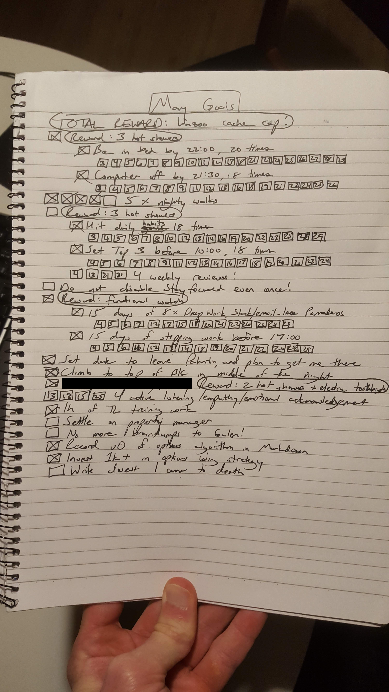

<!------------------------- REFERENCE LINKS BLOCK ----------------------------------->
[TODO]: some-link
<!----------------------- END REFERENCE LINKS BLOCK --------------------------------->

Monthly Planning: September, 2025
=========================
SUBTITLE TEXT


I'm a firm believer in the power of goals.

For years I used to set monthly goals, written in a spiral notebook that I'd lay near my apartment door.



For goals that were particularly difficult to accomplish, I'd give myself rewards like ice cream or buying something I wanted.

Yet despite their power, I fell out of this habit until I saw [this monthly check-in video](https://www.youtube.com/watch?v=yB06B07AtNU&ab_channel=MattGray) from [Matt Gray](https://www.instagram.com/matthgray/).

Gray is a rising founder/coach/influencer, and he emphasizes systems to get where you want to go.

I'm an engineer, I love building systems... natural match.

So when I saw his video, it was like, "Oh yeahh... those are really useful."

Gray's video is also instructive for how it generates useful content out of his ordinary day-to-day (running his monthly check-in system).

To take inspiration, I'm testing out this post with my August reflection and September monthly goals.

### Reflection
I'm a fan of the "What went well/what didn't go well/what can I learn" framework from the ["Kill & Survive" TED talk](https://youtu.be/rF5hDwZa7-0), and I noticed Gray uses the same.

Here's my August reflection (done in Markdown format):

```
What went well?
===============
- Had my first argument with Dé, and resolved it successfully
- Decided to trust her about Instituto Liberdade, and am doing my immersion this Friday
- I squatted 120kg for the first time ever!!!
- I'm consistently working out; it's become a pretty ingrained habit now
- I'm consistently making 82kg on the scale in the mornings now
- My shoulder is almost healed from Bravus
- I'm syncing with lots of friends, feeling very connected
    - Also, connecting more with Mom & Dad
- The Debora relationship is going very well
- I prioritized seeing Dad
- Big win in the way that I handled Dad's freakouts when I was in Florida: staying calm, not being reactive
- I've been consistently taking cold showers, not because I HAVE to but because I want to
- I've been a big help to Célia in her life, with therapy and giving her The Untethered Soul
- Dé and I had a great talk about financials together, and it was.. fine!
    - I now recognize that relationships are always a risk, you're never going to feel 100%, and you have to take that risk if you want the chance of building a life with someone
- I (mostly) stayed off Discord
- My tech protection systems are working! I'm going down rabbitholes less and less on the internet, and I now have systems to guard against it
- My singing is getting better
- I'm climbing consistently
- I did my first blue route at Casa de Pedra!!!!!
- Hernia is small; don't need surgery!

What didn't go well?
====================
- Man vs Myopia has been sort of aimless, and directionless; not enough structure & progress
- I've been stagnated on bench press
- I haven't been going to bed as early as I ought to, or as I want to get good sleep & wake up recharged (and to grow muscle!)
- I haven't been as focused & diligent with getting my books read (Poor Charlie's Almanack has been lingering for months)
- I stopped guitar practice
- I feel like my climbing is a _bit_ stagnant
- Haven't been writing very much, or prioritizing time to write
- I'm not eating enough so my weight isn't gaining as quickly as it should

What did I learn?
=================
- That protein drinks late at night cause me to pee in the middle of the night, as my kidneys have to flush the excess protein
- Dé is a little sponge for knowledge; invest in her and it will be reflected back at me
- Dé WILL play by the fair fighting rule
- I can trust Dé to guide my growth; our relationship has potential
- I need a more systematic, structured approach to Man vs Myopia
- Memento mori is USEFUL!
```


Conclusion
----------
TODO Challenge/questions to the reader

TODO SUBSCRIBE BUTTON

-----------

If you liked this post, you might enjoy my other writing:

- POST1
- POST2
- POST3

_Thank you to TODO TODO TODO for reviewing drafts of this post._

<!------------------ IG POST DESCRIPTION --------------------->
<!--
TODO

🐒 Full article at link in bio.
-->
