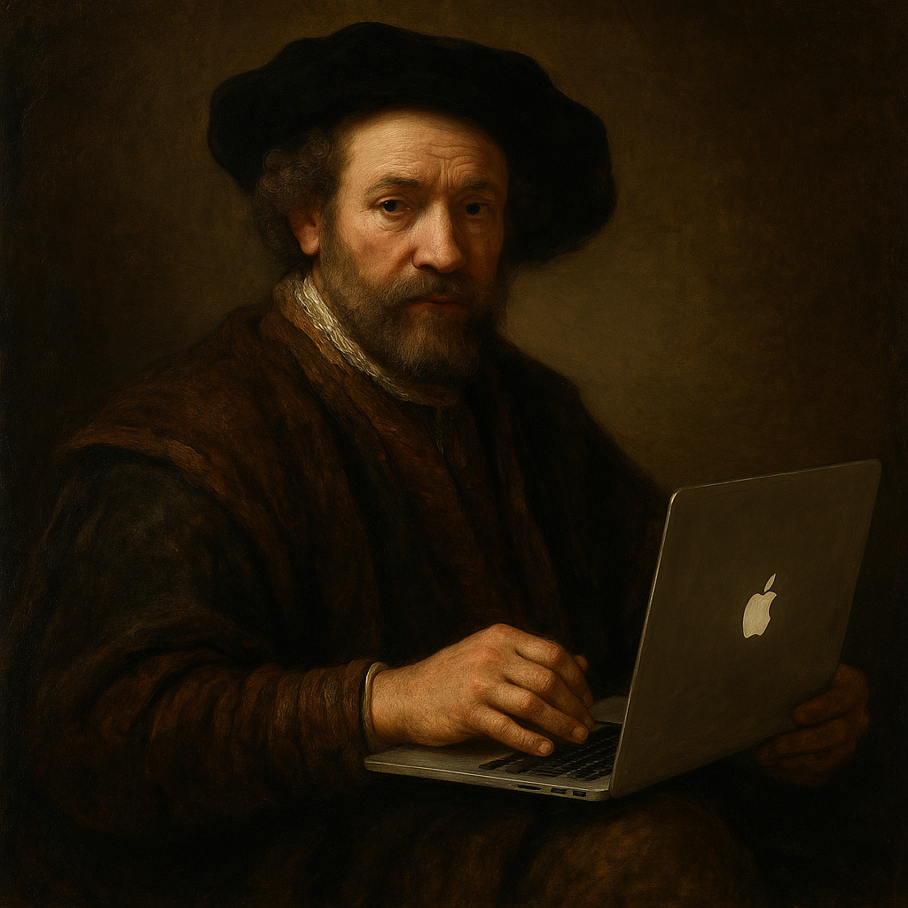

<!------------------------- REFERENCE LINKS BLOCK ----------------------------------->
[goal-is-unique-work]: https://mieubrisse.substack.com/p/the-goal-is-unique-work
<!----------------------- END REFERENCE LINKS BLOCK --------------------------------->

Be Rembrandt
============

[The Value Of AI](https://mieubrisse.substack.com/p/the-value-of-ai) talks about how LLMs are transforming computer interaction from surgery to painting.

The painting metaphor isn't coincidence.

Rembrandt was a prolific painter, with hundreds of works to his name.

Only, he didn't paint them all.

The Rembrandt Research Project was launched in 1968 to discover which paintings were actually done by the great man. The result: the number of works Rembrandt himself painted? Chopped in half.

See, Rembrandt ran a studio where he trained apprentices in his painting technique. He had so many that his pupil list has [its own Wikipedia page](https://en.wikipedia.org/wiki/List_of_Rembrandt_pupils).

Rembrandt was clever. He understood he only had 24 hours in a day, and much of the painting process didn't require him.

Need a black background? Any apprentice can cover the canvas.

Want to paint an orange? Laying down the base circle doesn't need him.

Rembrandt let his pupils handle the fundamentals so that he could devote his hours to the _je ne sais quoi_ - the little details that added all the value.

In [The Goal Is Unique Work][goal-is-unique-work] I asserted that time spent doing stuff society already knows how to do is time wasted.

We want to be Rembrandt, delegating the stuff that anyone can do, so we can focus on expressing the unique essence of us.

And now, modern tech gives us all the opportunity to have our own studio.

Want to build an app? Talk to the LLM and it'll place the rough symbols for you, to refine as you please.

Want to write a post? Dictate to the machine and polish to your taste.

_Want to build a studio for turning your ideas into output?_ The internet is overflowing with people sharing knowledge on how to do the same.

The metaskills here - the skills of the 21st century - are delegation and description.

If you can form what you want into words others can consume, your thoughts get summoned into reality while you sleep.

Master this, and the world shapes itself to reflect your will.

Every CEO knows this. Rembrandt knew it.

Be Rembrandt.

TODO SUBSCRIBE BUTTON

-------------------------

If you liked this post, you might like some of my other posts:

- [The Goal Is Unique Work][goal-is-unique-work]
- [Leveraged Judgment](https://mieubrisse.substack.com/p/leveraged-judgment)
- [You Need An Exobrain](https://mieubrisse.substack.com/p/you-need-an-exobrain)

<!------------------ IG POST DESCRIPTION --------------------->
<!--
TODO

🐒 Full article at link in bio.
-->

<!-------------------- IG STORY TEXT ------------------------->
<!--
TODO
-->
