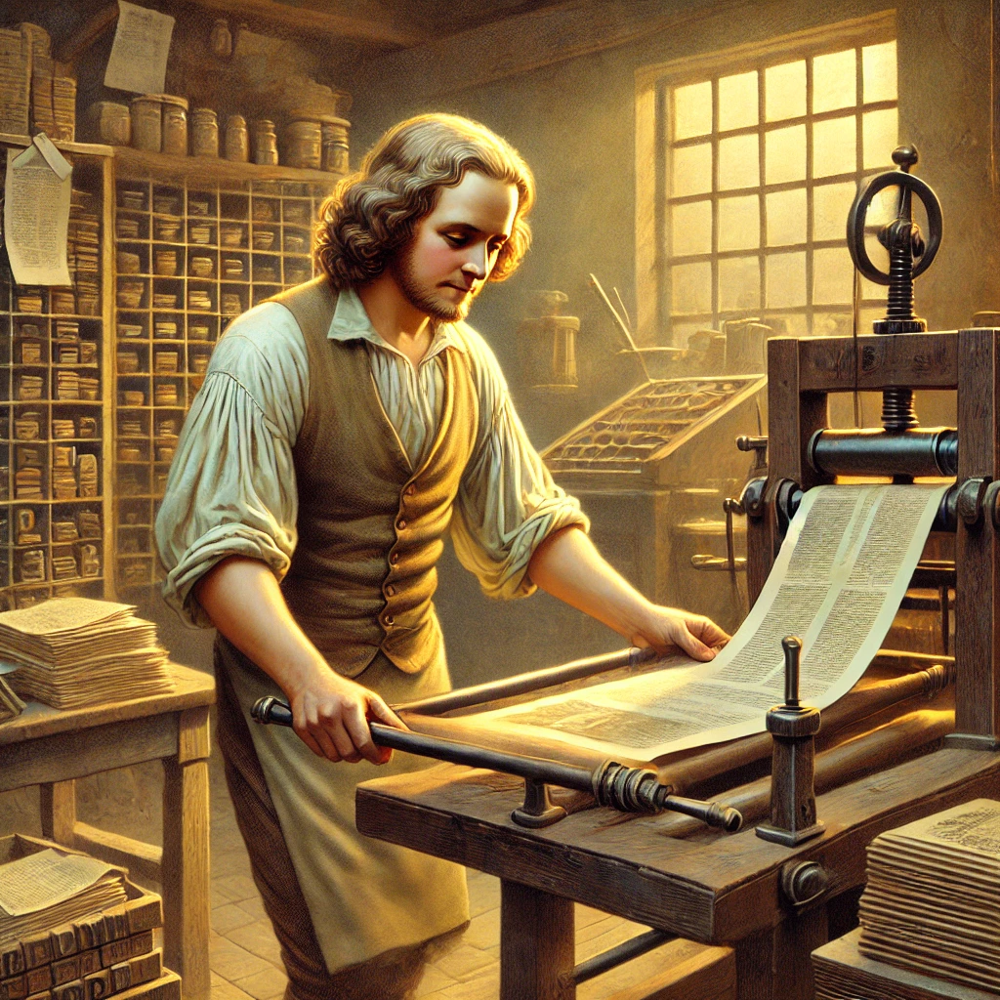
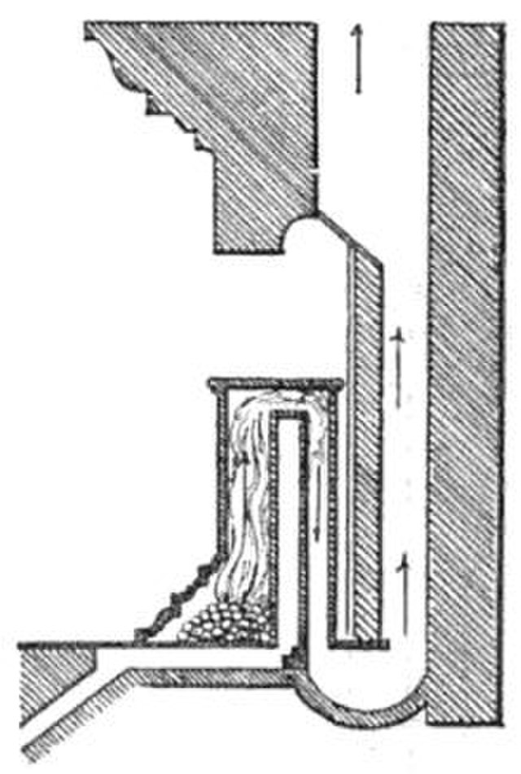
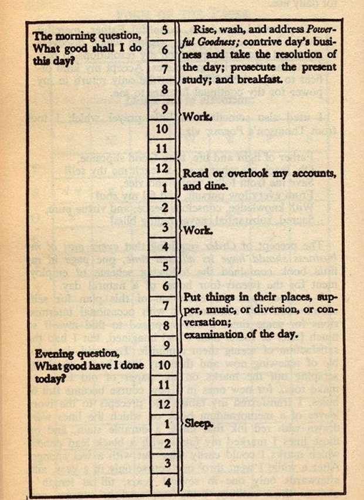

<!---- TAGLINE FOR IG POSTS: Ben Franklin was a badass. But why? Click  ----->

I just finished reading [Ben Franklin's autobiography](https://www.gutenberg.org/files/20203/20203-h/20203-h.htm).

It's unfinished. None of the Revolutionary War is included. But even without the "winning a war and starting a country" bits, the guy was a baller.

Let's break down what made him such a G.

He was a ravenous reader
------------------------
Even as a boy, [Franklin was a book fiend](https://www.gutenberg.org/files/20203/20203-h/20203-h.htm#VII:~:text=ROM%20a%20child,missed%20or%20wanted.).

As an adult, [he organized book-trading schemes with his friends](https://en.wikipedia.org/wiki/Junto_(club)) and [founded the first public library](https://en.wikipedia.org/wiki/Library_Company_of_Philadelphia):

> And now I set on foot my first project of a public nature, that for a subscription library. ... These libraries have improved the general conversation of the Americans, made the common tradesmen and farmers as intelligent as most gentlemen from other countries, and perhaps have contributed in some degree to the stand so generally made throughout the colonies in defense of their privileges.

Check out how he talks about intelligence as something that can be improved. To Ben, reading = more intelligence.

All this bookworming meant Franklin was filling his brain [mental models](https://fs.blog/mental-models/) that would later enable him to be the multidisciplinary thinker he was.

Hearing about Franklin's experience gave me a new appreciation for books. Books in the 1700s had to be written by hand, pressed by hand, and distributed by hand. One book cost several days' wages. 

Today, $20 puts the life philosophies of presidents, CEOs, and Nobel prize winners in our pocket.

Are you taking sufficient advantage of it?

He built a reputation of honor and good judgement
------------------------------------------------------
Franklin's autobiography starts by saying his father was a man "known for his judgement", and [neighbors in need of advice would seek out Franklin's father](https://www.gutenberg.org/files/20203/20203-h/20203-h.htm#:~:text=his%20great%20excellence,conduct%20of%20life).

Franklin continued this trend, famously developing his ["13 Virtues"](https://www.gutenberg.org/files/20203/20203-h/20203-h.htm#:~:text=These%20names%20of,Jesus%20and%20Socrates.). In his middle years, the governor of Pennsylvania - his greatest political rival at the time - [even sought Franklin's counsel in private](https://www.gutenberg.org/files/20203/20203-h/20203-h.htm#:~:text=Notwithstanding%20the%20continual,take%20my%20advice.).

These people often brought business opportunities. They knew Franklin was well-connected and trustworthy, so they'd ask him to do stuff for them in exchange for a cut of the profits.

In this way, **Franklin's honor became an asset**.

[I've written before that "honor" has a stuffy, antiquated flavor today](https://substack.com/home/post/p-155020167). 

Modern wisdom preaches you've got to look out for yourself, and do what you need to get ahead. Just look at the participants in Mr. Beast videos.

Yet, the internet amplifies our honor or dishonor by preserving it and spreading it to a vast audience.

So honorable people today get a double boost: they're rarer and therefore more valuable, and their positive reputation spreads farther.

Here's Naval Ravikant's take:

> Compound interest also happens in your reputation. If you have a sterling reputation and you keep building it for decades upon decades, people will notice. Your reputation will literally end up being thousands or tens of thousands of times more valuable than somebody else who was very talented but is not keeping the compound interest in reputation going. 

Are you building an honor asset, or [are you stacking up negative karma](https://substack.com/home/post/p-157909325)?

He could write well and owned a printing press
----------------------------------------------

Newspapers were the cable news networks of the 1700s, on steroids. 

They had wide reach, earned money through advertising, and carried political agendas by virtue of what they included. Because they were expensive (you needed a printing press), there wasn't much competition.

Ben Franklin owned a printing press and could write well. He used this to heavy advantage.

He'd first publish his own writing anonymously. Then he'd let the article soak in, and monitor public reaction. 

Some time later he'd propose the policy change he wanted. The policy frequently passed without complaint.

In doing so, Franklin was utilizing one of Naval Ravikant's four types of leverage, "media" (the other three being "people", "money", and "technology").

Often when we desire change we walk up to the person responsible and say, "We should do X". Often we get pushback.

Instead, learn from Ben Franklin. 

With social media, everyone has a printing press and audience in their pocket. First, try subtly influencing the responsible people to lay the groundwork for the direction you want to go.

Then, when the time is right, propose the actual change you want. It will seem like a natural evolution, rather than an abrupt direction shift.

<!--- TODO when it's ready, link to "parable of the orange", "why" not "how" -->

He was comfortable delegating to others
---------------------------------------
Franklin was definitely not a micromanager. By middle age, [Franklin had left the operation of his printing business to a business partner and his wife](https://www.gutenberg.org/files/20203/20203-h/20203-h.htm#VIII:~:text=The%20care%20and%20trouble,successfully%20for%20us%20both.). 

This pattern of delegating away the operation of things he started continued throughout his life. 

He started the University of Pennsylvania, but left the day-to-day operations to others. 

He created the first Philadelphia firefighting department, but wasn't involved in its operation. 

He proposed a colonial militia during the French and Indian War, but declined a military position so that someone more qualified could do it.

Franklin recognized the value of "people", another of Naval's four types of leverage.

He built the skill of identifying and trusting good people. This freed his time for long trips to Europe, writing, and science experiments.

If you struggle with delegating, consider that it's not only about trust.

The skill of delegating has two components:

1. **Trusting:** allowing others to do things differently than you
2. **Identifying:** sourcing candidates and filtering out those who are a bad fit

I used to think that I was a control freak. True, I needed to improve my comfort when others do things differently. But I also learned that I wasn't sourcing and filtering for the right people. 

I didn't feel comfortable letting go of control because the people I was hiring just weren't good enough.

When I improved my filtering, suddenly delegating became easy. I'd let the person run with it, and they'd do the job _better_ than me. And look at all the free time!

When you get both halves of delegation working, delegation seems like the obvious choice. 

Are you crunched for time? Do you struggle to delegate? If so, do you need to improve one or both of the halves?

<!-----------  SHARE BUTTON GOES HERE  ------------->

He constantly worked to improve himself and the world
-----------------------------------------------------
Ben Franklin wasn't satisfied with stuff that sucked. 

Colonial fireplaces wasted hot air when wood was precious, so he invented [the Franklin stove](https://en.wikipedia.org/wiki/Franklin_stove).

The globular streetlamps from England had poor ventilation and would shatter, so [he invented a four-paned streetlamp](https://www.gutenberg.org/files/20203/20203-h/20203-h.htm#:~:text=The%20honour%20of,very%20poorly%20illuminated.).

](./franklin-light.jpg)

Switching near-seeing and far-seeing glasses sucked, so he invented bifocals.

Lightning kept destroying the mostly-wooden colonial structures, so he invented the lightning rod.

And Ben Franklin himself was full of human vice, so he invented [the 13 Virtues and a system to track his progress towards embodying all of them](https://www.gutenberg.org/files/20203/20203-h/20203-h.htm#:~:text=I%20made%20a,upon%20that%20day.).

You can channel Ben Franklin's energy by not settling for the status quo.

Is the furniture layout in your house bothersome? Reorganize it to something more efficient.

Don't like how your files are organized on your computer? Design a better way.

Is your friend group not supporting the person you want to be? Find a new one.

This doctrine of constant improvement feels good and gives you back time and energy.

He cultivated likeability
-------------------------
Franklin often says throughout the autobiography, "and he was a great friend to me for the rest of his life".

This stood out to me since [I'm currently seeking freedom from my own emotional volatility](https://substack.com/home/post/p-155537355). Someone who can maintain many relationships over a lifetime is someone [who fits well with many people](https://altered.substack.com/p/charisma).

Indeed, in the research I did for this post, Franklin's peers frequently describe him as likeable.

[From John Adams, who was a rival](https://founders.archives.gov/documents/Adams/99-02-02-5574#:~:text=Franklin%20had%20a%20great%20genius%E2%80%94original%2C,the%20French%20call%20na%C3%AFvet%C3%A9%2C%20which):

> He had wit at will. He had humor that when he pleased was delicate and delightful. He had a satire that was good natured or caustic ... at his pleasure. He had talents for irony, allegory and fable, that he could adapt with great skill, to the promotion of moral and political truth. He was master of that infantine simplicity, which the French call naïveté, which never fails to charm, in Phadrus and La Fontaine, from the cradle to the grave.

In modern terms, Franklin was high on [the "Agreeableness" dimension of the Big Five personality inventory](https://en.wikipedia.org/wiki/Agreeableness#Big_Five). 

But wait, modern wisdom preaches that you've got to be tough and no-nonsense! What gives?

According to ["The New Science of Narcissism" ](https://www.amazon.com/New-Science-Narcissism-Understanding-Psychological/dp/1683644026), the lack of Agreeableness is a defining characteristic of the "dark triad" trait of narcissism. People low in Agreeableness struggle to keep relationships, while [people high in Agreeableness get better outcomes in life](https://journals.sagepub.com/doi/10.1177/10888683211073007).

We can learn from Franklin's example by increasing our own Agreeableness.

Fortunately, [Franklin was initially known for being proud and argumentative](https://www.gutenberg.org/files/20203/20203-h/20203-h.htm#:~:text=There%20was%20another,bred%20at%20Edinborough.). He worked to increase his own Agreeableness, so we get to see how he did it.

### Humility
Over the course of his life, Franklin discovered that a posture of humility was more effective for him.

In his experiments with the Socratic Method, [he found it more effective to express himself with uncertainty rather than absolutism](https://www.gutenberg.org/files/20203/20203-h/20203-h.htm#:~:text=I%20continu%27d%20this,of%20your%20error.). He [later added humility to his list of Virtues to avoid his tendency for pride](https://www.gutenberg.org/files/20203/20203-h/20203-h.htm#:~:text=My%20list%20of,in%20the%20right.).

Later, [he found that people adopted his ideas more easily when he didn't attach his name to the project](https://www.gutenberg.org/files/20203/20203-h/20203-h.htm#:~:text=The%20objections%20and,their%20right%20owner.).

Are you cultivating humility? Not because you "should", but because it will be more effective to you?

### Non-Retaliation
I noticed that Franklin often didn't retaliate against people who'd wronged him.

In one case, [a governor sent him to London on a promise and abandoned him](https://www.gutenberg.org/files/20203/20203-h/20203-h.htm#:~:text=When%20we%20came,during%20his%20administration.). Franklin was clearly irritated, but decided to focus his energy on getting a job in London rather than vengeance.

In another, a British general had arrived to defend the colonies. He lacked resources, so [Franklin fronted a significant chunk of money to him](https://www.gutenberg.org/files/20203/20203-h/20203-h.htm#:~:text=I%20received%20of,which%20more%20hereafter.). The general was killed in battle, and the treasury in London later refused to reimburse Franklin. He was indignant, but never retaliated.

He even [turned an enemy into a friend by asking to borrow a book from him](https://www.gutenberg.org/files/20203/20203-h/20203-h.htm#:~:text=I%20therefore%20did,continue%20inimical%20proceedings.). This tactic now has its own Wikipedia page: ["the Franklin effect"](https://en.wikipedia.org/wiki/Ben_Franklin_effect).

[I've written before about how anger is a prison that you make for yourself](https://substack.com/home/post/p-155024549). Ben Franklin knew this.

When someone wronged him, he didn't dwell on it. Instead, he focused on moving his life forward. The universe often brought his antagonizer to justice, and Franklin didn't waste precious time on resentment.

As the Buddhist quote goes,

> Holding on to anger is like drinking poison hoping the other person dies

He worked hard, but he also rested
----------------------------------
Throughout the autobiography I kept thinking, "How does he do so much?"

The modern answer would be, "Because he works nonstop!" 

But the daily schedule he included is impressive for how uncrowded it is:

Franklin only worked 8 hours per day, with 7 hours for sleep and 2 hours for lunch and reading.

Our modern work mindset evolved from factory work in the Industrial Revolution. It's trained us to believe that more hours = more productivity.

This was true when making widgets. But modern knowledge work is not factory work. There comes a point where more hours = negative productivity. 

Remember what happens when you're sleep-deprived:

1. You make errors you have to clean up later
1. You do work that seems good at the time, but needs to be thrown away in the morning
1. Your emotional volatility results in outbursts that you have to mend later
1. You focus on urgent, obvious problems rather than taking a step back to solve the most important ones
1. You focus on obvious solutions, missing the non-obvious ones that are better

Worse, we can't tell when we're falling into these traps. Too much sleep deprivation maxes out our ability to feel tired, even as our mental performance continues to get worse.

Are you resting enough to maximize your productivity?

Conclusion
----------
Franklin became wiser reading those who came before. And we become wiser by reading Franklin.

If this article resonated with you, then you might like my other writing:

- [Leveraging your judgment a la Naval Ravikant](https://mieubrisse.substack.com/p/leveraged-judgment)
- [The comprehensive sleep guide][sleep-guide], for securing the rest necessary to maximize your productivity
- [Building yourself into your own magnum opus](https://substack.com/home/post/p-155024549)

<!-- TODO link to the behavioural change guide when it's ready!! -->

And if you found this post valuable, you can help me make more by subscribing!

<!-- SUBSCRIBE BUTTON -->

<!----------------- ONLY LINKS BELOW HERE ------------------->
[sleep-guide]: https://substack.com/home/post/p-158617177
