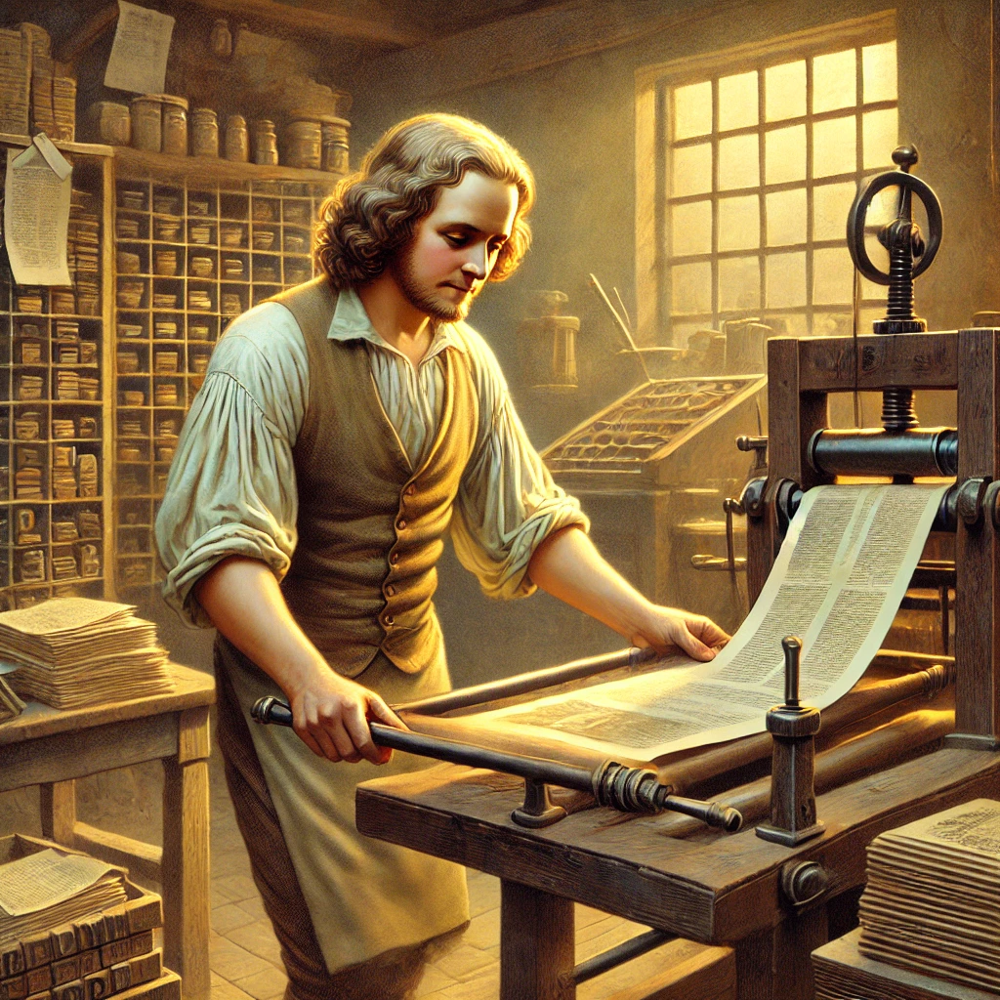
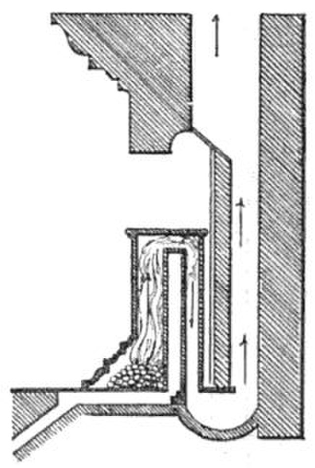
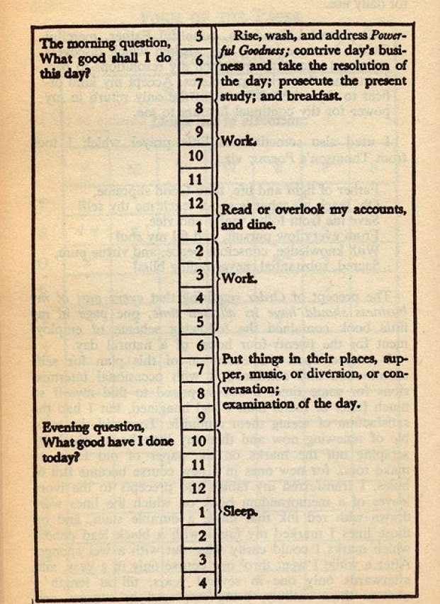

<!---- TAGLINE FOR IG POSTS: Ben Franklin was the Elon Musk of the 1700s. What made him so successful? Check it out now  ----->

I just finished reading [Ben Franklin's autobiography](https://www.gutenberg.org/files/20203/20203-h/20203-h.htm).

It's unfinished - no Revolutionary War. But even without the "winning a war and starting a country" bits, the guy was a baller.

Let's break down what made him such a colonial gangster.

He was a ravenous reader
------------------------
Even as a boy, [Franklin was a book fiend](https://www.gutenberg.org/files/20203/20203-h/20203-h.htm#VII:~:text=ROM%20a%20child,missed%20or%20wanted.).

As an adult, [he organized book-trading schemes with his friends](https://en.wikipedia.org/wiki/Junto_(club)) and [founded the first public library](https://en.wikipedia.org/wiki/Library_Company_of_Philadelphia):

> And now I set on foot my first project of a public nature, that for a subscription library. ... These libraries have improved the general conversation of the Americans, made the common tradesmen and farmers as intelligent as most gentlemen from other countries ...

Check how he talks about intelligence as something that can be improved. To Ben, reading = more intelligence.

All this bookworming packed his brain with [mental models](https://fs.blog/mental-models/) he'd use throughout life. 

It's like you wander into the grocery store and grab some chocolate syrup. Then vanilla ice cream. Then some peanuts, why not. Bam - suddenly, ice cream sundae. 

Only, the ingredients are books and the ice cream sundae is "multidisciplinary Renaissance man".

It's mindblowing when you think what books in the 1700s were like:

They had to be written by quill, hand-pressed by guys at the printing shop, and then distributed by the unfortunate souls lugging the books around. All these middlemen meant one book cost a couple days' pay. 

Proper pain in the ass. But Ben paid it gladly because he recognized the value of knowledge.

Today, $20 puts the wisdom of presidents, CEOs, and Nobel prize winners on our smartphone in seconds. You have the whole world's knowledge at our fingertips. Are you using it?

(Is that a candle in your pocket, Mr. Franklin, or are you just happy to see Kindle?)

He built a reputation of honor and good judgement
------------------------------------------------------
B. Franklin says his father was a man "known for his judgement", and [neighbors in need of advice would hit him up](https://www.gutenberg.org/files/20203/20203-h/20203-h.htm#:~:text=his%20great%20excellence,conduct%20of%20life).

Franklin followed in daddy's footsteps, famously developing his ["13 Virtues"](https://www.gutenberg.org/files/20203/20203-h/20203-h.htm#:~:text=These%20names%20of,Jesus%20and%20Socrates.) to achieve "moral perfection". 

Sounds cult-y, but it worked: he became known for wise advice. The governor of Pennsylvania - his biggest political rival at the time - [even picked his brain from time to time](https://www.gutenberg.org/files/20203/20203-h/20203-h.htm#:~:text=Notwithstanding%20the%20continual,take%20my%20advice.).

These people brought business opportunities with them. They knew Franklin was a trustworthy dude with clout, so they'd ask him to do stuff in exchange for a cut of the profits.

In this way, **Franklin's honor became an asset**.

[I wrote before that "honor" gets a bad rap, all outdated knights and chivalry](https://substack.com/home/post/p-155020167). 

Modern wisdom says you've got to look out for yourself, and do what you need to get ahead. Just watch the people in Mr. Beast videos.

But the internet's got us all living in [Big Brother](https://en.wikipedia.org/wiki/Big_Brother_(American_TV_series)). Our disgraceful and delightful deeds are captured forever, broadcast to a huge audience.

So honorable folks today get a double boost: they're rarer and therefore more valuable, and their positive reputation spreads farther.

Here's Naval Ravikant:

> Compound interest also happens in your reputation. If you have a sterling reputation and you keep building it for decades upon decades, people will notice. Your reputation will literally end up being thousands or tens of thousands of times more valuable than somebody else who was very talented but is not keeping the compound interest in reputation going. 

Are you building an honor asset in your own life, or [shitting on the floor of your apartment](https://substack.com/home/post/p-157909325)?

He could write well and owned a press
-------------------------------------

Newspapers were the cable news networks of the 1700s, on steroids.

They had wide reach, earned money through advertising, and carried political agendas by what they included. Because you needed an expensive chunk of metal called a printing press, there wasn't much competition.

Ben Franklin owned a printing press and he could write well. Sneaky Ben abused the hell out of this hack.

He'd first publish his own writing anonymously. Then he'd let the article soak in, and monitor public reaction. 

After everyone was nodding along, he'd propose the policy change he wanted. They'd often pass without problem (which Ben was a little smug about).

Franklin was utilizing one of Naval Ravikant's four types of leverage, "media" (the other three being "people", "money", and "technology").

The average human employs a real dumb "make a change" strategy. It goes like this:

1. Walk up to Person Responsible
2. Declare, "We should do X!"
3. Person Responsible says "No"
4. Commence bickering

Instead, learn from Sneaky Ben.

Thanks to Mark Zuckerberg's marvelous media machines, everyone has a printing press in their pocket.

First, try floating your ideas without claiming them as yours. Watch your audience.

When the time is right, hit 'em with your proposal. Wow, suddenly your suggestion seems like a good idea.

<!--- TODO when it's ready, link to "parable of the orange", "why" not "how" -->

He was comfortable delegating to others
---------------------------------------
You know the boss in [Office Space](https://en.wikipedia.org/wiki/Office_Space), all micromanager-y? B. Franklin was the opposite of that.

By middle age, [he'd left his printing press operations to a business partner and his wife](https://www.gutenberg.org/files/20203/20203-h/20203-h.htm#VIII:~:text=The%20care%20and%20trouble,successfully%20for%20us%20both.). 

He was like the Elon Musk of the New World, starting things and leaving others to run them:

- He started the University of Pennsylvania, but left day-to-day operations to others
- He created the first Philadelphia firefighting department, but wasn't involved in its operation
- He proposed a militia to defend the colonies during the French and Indian War, but turned down a military position so someone more qualified could do it

Franklin recognized the value of "people", another of Naval's four types of leverage.

He built the skill of identifying and trusting good people. This freed his time for long trips to Europe, writing, science experiments, and [fooling around with older women](https://en.wikipedia.org/wiki/Advice_to_a_Friend_on_Choosing_a_Mistress).

If you struggle with delegation, remember that it's not _just_ trust.

The skill of delegating has two components:

1. **Trusting:** allowing others to do things differently than you
2. **Identifying:** sourcing candidates and filtering out those who are a bad fit

I used to think I was a control freak. Which is a rational belief to have, when you're a control freak. I needed to improve my comfort with others doing things differently.

But I also learned that I wasn't sourcing and filtering for the right people. I didn't feel comfortable letting go of control because the people I was hiring just weren't good enough.

I improved my filtering, and suddenly delegation became easy. I can let a person run with a task, I don't spend time or energy, and they do a _better_ job? Don't mind if I do.

When you get both halves of delegation working, it seems more obvious than weed at a Grateful Dead concert.

Are you crunched for time? Do you struggle to delegate? If so, do you need to get better at trusting or identifying suitable candidates?

<!-----------  SHARE BUTTON GOES HERE  ------------->

He constantly worked to improve himself and the world
-----------------------------------------------------
Ben Franklin detested stuff that sucked.

Colonial fireplaces weren't good at heating homes, so Clever Ben invented [the Franklin stove](https://en.wikipedia.org/wiki/Franklin_stove).

The globe-shaped streetlamps from England broke easily, so [he dropped the four-paned streetlamp](https://www.gutenberg.org/files/20203/20203-h/20203-h.htm#:~:text=The%20honour%20of,very%20poorly%20illuminated.) real casual-like.

 for more Franklin goodness](./franklin-light.jpg)

Switching near-seeing and far-seeing glasses was annoying, so he sawed a pair of each in half and slapped them together to make bifocals.

Lightning kept trashing the wooden colonial structures, so he invented the lightning rod.

And ol' Ben himself was full of pesky human vice, so he invented [the 13 Virtues and a system to track his progress towards them](https://www.gutenberg.org/files/20203/20203-h/20203-h.htm#:~:text=I%20made%20a,upon%20that%20day.).

You can channel Clever Ben's energy by not settling for the status quo.

Is the furniture layout in your house bothersome? Move it around.

Don't like how your files are organized on your computer? Design a better way.

Is your mother-in-law driving you nuts? Find a new one.

Constant improvement feels good, and will probably earn you a Guinness World Record if you do it long enough. (Don't quote me on that)

He cultivated likeability
-------------------------
Ben has this thing he says throughout the autobiography, "and he was a great friend to me for the rest of his life".

Might be a subtle flex that he's the grandpa outliving his other grandpa bros.

But it stood out to me since [I'm currently seeking freedom from my own emotional volatility](https://substack.com/home/post/p-155537355). Someone who can maintain many relationships over a lifetime is someone [who fits well with many people](https://altered.substack.com/p/charisma).

No surprise that in the research I did for this post, most everyone likes Ben.

Even John Adams, an occasional Franklin hater, [had this to say](https://founders.archives.gov/documents/Adams/99-02-02-5574#:~:text=Franklin%20had%20a%20great%20genius%E2%80%94original%2C,the%20French%20call%20na%C3%AFvet%C3%A9%2C%20which):

> He had wit at will. He had humor that when he pleased was delicate and delightful. He had a satire that was good natured or caustic ... at his pleasure. He had talents for irony, allegory and fable, that he could adapt with great skill, to the promotion of moral and political truth. He was master of that infantine simplicity, which the French call naïveté, which never fails to charm, in Phadrus and La Fontaine, from the cradle to the grave.

In fancy psychology language, Señor Franklin was high on [the "Agreeableness" dimension of the Big Five personality inventory](https://en.wikipedia.org/wiki/Agreeableness#Big_Five). 

But wait, Gordon Ramsay is telling me to be tough and shout-y! What gives?

["The New Science of Narcissism" ](https://www.amazon.com/New-Science-Narcissism-Understanding-Psychological/dp/1683644026) says a lack of Agreeableness is a defining characteristic of the "dark triad" trait of narcissism. People low in Agreeableness struggle to keep relationships, while [people high in Agreeableness get better outcomes in life](https://journals.sagepub.com/doi/10.1177/10888683211073007).

If we want a bunch of lifelong ~pen~ quill pals like old Ben, we should take a page from his Agreeableness book.

Fortunately, Mr. Franklin was real prick when he was younger and had to work on his Agreeableness. We get front-row seats to the Franklin Dickhead Reduction Program.

### Humility
There's a moment where young Ben goes, ["Huh... people don't like it when I'm always arguing with them"](https://www.gutenberg.org/files/20203/20203-h/20203-h.htm#:~:text=There%20was%20another,bred%20at%20Edinborough.).

After this realization, he [stops speaking in absolutes and starts allowing room for doubt](https://www.gutenberg.org/files/20203/20203-h/20203-h.htm#:~:text=I%20continu%27d%20this,of%20your%20error.).

Later, [a friend tells him that he's insufferably arrogant so he adds Humility to his 13 Virtues](https://www.gutenberg.org/files/20203/20203-h/20203-h.htm#:~:text=My%20list%20of,in%20the%20right.).

Later still, [he found that people adopted his ideas more easily when he didn't attach his name to the project](https://www.gutenberg.org/files/20203/20203-h/20203-h.htm#:~:text=The%20objections%20and,their%20right%20owner.).

It ain't easy to feed yourself humble pie, but Benny did it because he found it more effective.

Are you cultivating humility? Not because you "should", but because it will be more effective to you?

### Non-Retaliation
While reading, I noticed Monsieur Ben didn't retaliate against those who'd wronged him.

In one instance, [a governor sent him to London on a promise and abandoned him](https://www.gutenberg.org/files/20203/20203-h/20203-h.htm#:~:text=When%20we%20came,during%20his%20administration.). Ben indulged in a bit of self-pity ("what shall we think of a governor's playing such pitiful tricks, and imposing so grossly on a poor ignorant boy!"), but focused his energy on getting a job in London rather than vengeance.

In another instance, a British general had arrived from London to defend the colonies. He had no resources, so [Franklin loaned him a pile of cash](https://www.gutenberg.org/files/20203/20203-h/20203-h.htm#:~:text=I%20received%20of,which%20more%20hereafter.) to buy supplies. 

The general was killed in battle, and the treasury in London later stiffed Ben out of his money. He was pissed. But sadly for Ben Franklin: The Netflix Tell-All, there was no flipping of tables or smashing of teacups. He took it on the chin and moved on.

He even [turned an enemy into a friend by asking to borrow a book from him](https://www.gutenberg.org/files/20203/20203-h/20203-h.htm#:~:text=I%20therefore%20did,continue%20inimical%20proceedings.). Can't say I've ever thought, "Hey Person I Dislike, you got Harry Potter?" but turns out I'm the dummy. The tactic now has its own Wikipedia page: ["the Franklin effect"](https://en.wikipedia.org/wiki/Ben_Franklin_effect).

[I've written before about how anger is a prison that you make for yourself](https://substack.com/home/post/p-155024549). Wise Ben understood this.

When someone wronged him, he didn't try to get even. Instead, he focused on moving his life forward. The universe often brought his antagonizer to justice, and Franklin didn't waste precious time on resentment.

As the Buddhist quote goes,

> Holding on to anger is like drinking poison hoping the other person dies

Are you letting go of your anger, not for the other person but for your own good?

He worked hard, but he also rested
----------------------------------
Throughout the autobiography I kept wondering, "How does this dude _do_ so much?"

(David Goggins swings out of the ceiling) 

**GRINDSET! SLEEP WHEN YOU'RE DEAD, MOTHERFUCKER!**

Shh, back into the ceiling David.

We have Ben Franklin's daily schedule, and we know how uncrowded it is:

Ben tried to work 8 hours per day, with 7 hours for sleep and 2 hours for lunch and reading.

Our modern work mindset evolved from the widget-makers of the Industrial Revolution. More hours = more widgets = happy boss, productivity yay.

But modern knowledge work is not factory work. We are no longer widget-makers. 

Today, working smart beats working hard. [Thanks to leverage, the right decision is more important than hours worked](https://substack.com/home/post/p-155486611).

Meaning, there's a point where more hours worked = negative productivity.

This is is a hard concept for us silly humans to understand. I sure struggled with it.

But remember what happens when you're sleep-deprived:

1. You make mistakes you have to clean up later
1. You do work that seems good at the time, but needs to be trashed in the morning
1. Your tiredness causes emotional outbursts you have to mend later
1. You focus on urgent, obvious problems rather than taking a step back to solve the most important ones
1. You focus on obvious solutions, missing the non-obvious ones that are better

We know that Ben Franklin utilized leverage, and as an inventor he clearly understood "Work smart, not hard." 

Are you resting enough to maximize your productivity?

Conclusion
----------
Ben F. spent his life wandering through the supermarket of knowledge picking up tasty ingredients.

By old age, he'd created a fabulous wisdom sundae. Thankfully for us 21st century humans, he wrote down what he did so we might build our own.

If you liked this article and want more goodies for your sundae, check out my other writing:

- [Why your judgement is THE thing, per Naval Ravikant](https://mieubrisse.substack.com/p/leveraged-judgment)
- [The comprehensive guide to sleep][sleep-guide], on how to maximize your productivity with rest
- [What a silly rap song can teach us about karma](https://substack.com/home/post/p-157909325)
- [Building yourself into your own magnum opus](https://substack.com/home/post/p-155024549)

<!-- TODO link to the behavioural change guide when it's ready!! -->

And if you found this post valuable, definitely don't subscribe because if you do then I might write more.

<!-- SUBSCRIBE BUTTON -->

<!----------------- ONLY LINKS BELOW HERE ------------------->
[sleep-guide]: https://substack.com/home/post/p-158617177
