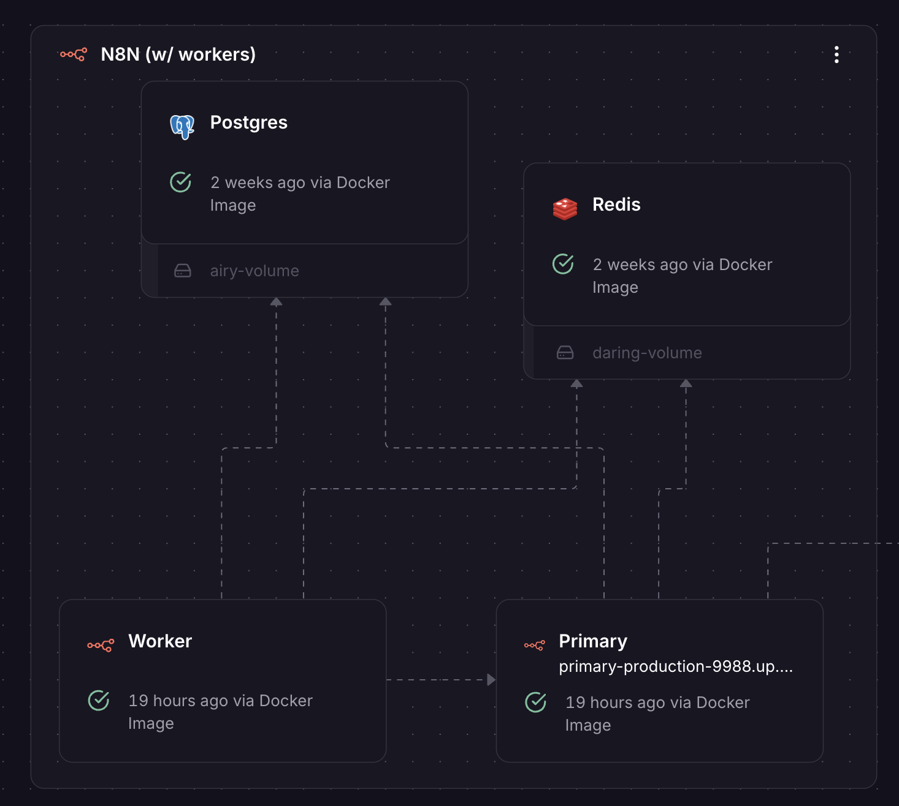
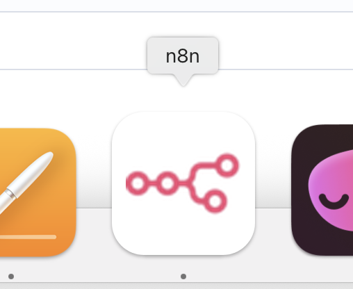
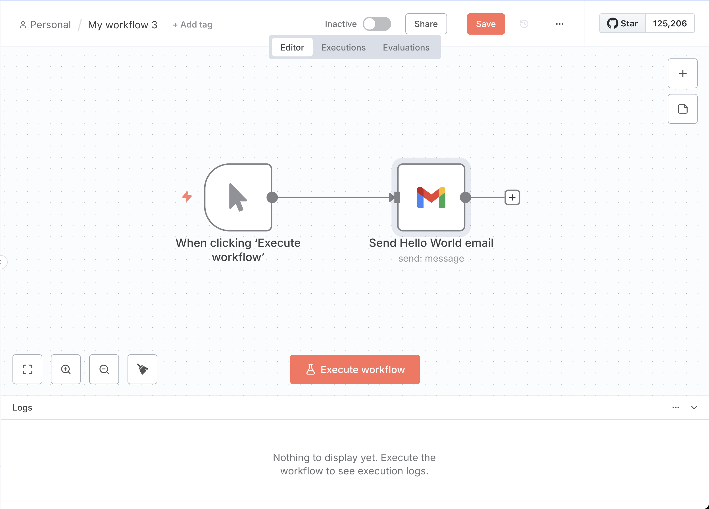
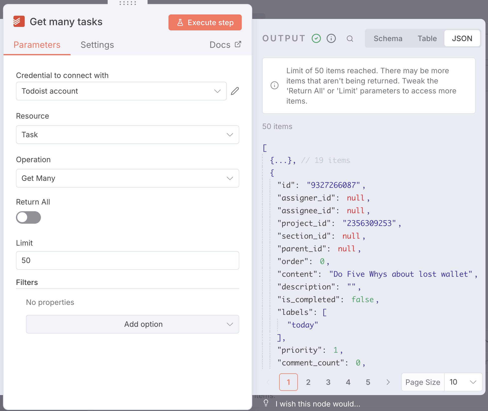

<!------------------------- REFERENCE LINKS BLOCK ----------------------------------->
[TODO]: some-link
<!----------------------- END REFERENCE LINKS BLOCK --------------------------------->

Building The Factory
====================
The start of my personal automation factory, in case you want to build your own

Today I was showing a friend my workflow engine that I'm using to automate my personal life.

He insisted I write it up as a post, so here it is.

> ⚠️  I'm going to assume you're moderately technical. If you're not, you might still find this interesting - you'll just need to do more Googling.

### Workflow Engine
What even _is_ a workflow engine?

I recently wrote a post about how [we should spend our time on things only we can do](https://mieubrisse.substack.com/p/the-goal-is-unique-work).

Reflecting on my life, I'm doing a _ton_ that's not unique to me and should be done by automation. For example:

- Cleaning through junk emails
- Transferring notes about people to my personal CRM in Notion
- Categorizing my book notes into the appropriate page in my book notes Notion database
- Finding & booking flights
- Checking in for flights
- The parts after writing a post to publish it on Substack

I also want to to pull and aggregate data on myself (sleep, screentime, outdoors time) to debug some health problems I'm having.

<!-- TODO link to myopia & quantified life posts when they're ready -->

All these require running "workflows": chunks of automation done upon certain triggers.

Workflow engines are the platforms that orchestrate workflows.

Tools like Zapier and IFTTT are well-known in the space.

Yet, I always felt hesitant to use these tools. Nothing concrete; just like I didn't trust their cloud to work and stay around.

[n8n](https://n8n.io/) recently started showing up in my newsfeeds. It was open-source, so I gave it a try.

Turns out it's a lovely product. Very intuitive and user-friendly.

So n8n is what I use for my workflow engine.

### Hosting
n8n has [their own cloud-hosted plan](https://n8n.io/pricing/), at $25/month.

I found that price high when getting started because I didn't know if I'd like n8n, and I wouldn't even own my data.

I instead opted for [Railway](https://railway.com/).

I chose it because I'd played with and liked Railway in the past, there's [an n8n template available](https://railway.com/deploy/n8n), and I'd own my data.

The n8n template Just Worked, and I had an n8n stack running in seconds:

The Railway Hobby plan I'm using costs $5, plus extra for any usage above $5.

It turns out that I'm using above the $5 (I'm projected to use $10 this month), with most of it due to compute for n8n.

I'm fine with this though: it's much cheaper than n8n's $25, I've been using a lot of compute as I develop on my workflows, and the cost should go down when my workflows stabilize.

> 💡 If this post inspires you to try Railway, I'd be thankful if you use my Railway referral code (`kevinjtoday`) or [referral link](https://railway.com?referralCode=kevinjtoday) because it makes my Railway server costs cheaper. I have no affiliation with Railway; just a happy user.

### App
You access n8n through the URL that Railway makes publicly available.

The first time I opened it I was prompted to generate an admin username and password, which I stored [1Password](1password).

I knew I'd be doing a lot of n8n work, and didn't want to keep re-finding the n8n tab in Chrome.

So I used the coolest Chrome feature nobody knows about and installed the n8n page as a Mac app (`…` → `Cast, Save, and Share` → `Install page as app`).

Now I have n8n on my Dock like any other app, and don't have to dig through Chrome tabs:

### Creating Workflows
Creating a workflow in n8n is pretty self-explanatory.

You press the big "Create Workflow" button, and start dragging nodes onto the graph that do stuff.

What's the stuff? Streams of JSON data, of whatever shape you want.

It's dumb easy, and feels like playing a factory videogame.

What're the nodes?

Here, n8n doesn't have great discoverability. I often knew what I wanted to do and assumed there was a node for it, but didn't know what the node was called or where to find it.

Luckily ChatGPT has a strong grasp of n8n, so I just described what I want and ChatGPT gave me options. 

> 💡 The [value of AI is as an ambiguity adapter](https://mieubrisse.substack.com/p/the-value-of-ai)!

The nodes themselves are shockingly easy to configure.

Most options are intuitive, and the ones that aren't have a little "?" giving explanations. Every node has a link to its docs.

### Auth
The only rough part (that isn't n8n's fault) is OAuth credentials.

Workflows that interact with official external data providers like Gmail, Fitbit, or Google Drive need credentials to do so.

In regular OAuth world, an application (say, Vimcal) tells Google, "Hey I want to access the user's Calendar" and you as the user grant those permissions. You only have to deal with the "Yes, give permissions" part.

Unfortunately, in n8n, the application that wants to access your data... is you.

Meaning, you have to:

1. Create your own OAuth application inside of Google (really, just creds for your n8n instance to identify itself to Google)
1. Give those OAuth application creds to your n8n
1. Have your n8n ask Google to ask you to grant permissions

It's a tedious chore that's easy to misconfigure, especially if you're not familiar with OAuth. 

Luckily n8n provides good docs, and you only have to do it once per provider you want to pull data from.

### My Workflows
Here are the workflows I currently have in my n8n:

- **📚 Categorize Book Notes:** uses AI to transfer book notes (as Todoist tasks) into Notion pages for the book (more details in [the post I wrote up the other day](categorize book notes)).
- **😴 Pull Sleep Data:** every day, pulls my sleep data from the Fitbit API and stores it in a Postgres database (also running in Railway) housing quantified life data.
- **🖥️ Capture Mac Screentime Data:** receives screentime data pushed from my Mac and stores it in the quantified life Postgres. This workflow is neat because it's push-based: n8n lets me define a webhook, and a script on my Mac pushes screentime data to it. <!-- TODO link to the repo with my script push data -->
- **🌱 Check Data Freshness:** verifies the quantified life Postgres tables have recent data to ensure the data pipelines are flowing.

A neat thing: workflows can call other workflows. Workflows are basically programming functions.

So I also have two more "helper" workflows:

- **❗Send Email Alert:** sends an email alert (called when any quantified life tables are stale).
- **⚠️  Error:** n8n lets you give a workflow an "error workflow", which is called any time the workflow fails. Mine here is a generic error workflow that calls **❗ Send Email Alert** to alert me of any workflow failures.

Annoyingly, n8n doesn't force each workflow to have an error workflow. 

So there's the possibility for a workflow to fail silently because I forgot to set an error workflow for it.

This seems bad to me, so I created another workflow that helps keep my own n8n in order: **💂 Find Active Workflows Without Error Workflow**.

This workflow queries my own n8n's API (n8n can query itself!), finds workflows that don't have the error workflow, and calls **❗Send Email Alert** to let me know that a workflow is missing an error workflow.

This feels really cool. I'm using n8n to make my own n8n usage better.

### Alerting
I mentioned I'm using emails to alert me of problems.

Unfortunately, my email is a swamp and the alerts are likely to get lost amongst people trying to sell me shit I don't want.

To make the n8n alerts pop to the top of my inbox, I have the **❗Send Email Alert** workflow prefix "❗n8n Alert:" to the subject of every email it sends.

I then set up a Gmail rule to star all mail that comes in with that subject.

Then, I created a priority inbox with starred messages at the top:

This makes n8n alerts pop to the top as highest priority.

> ⚠️  I first tried having the Gmail rule "Mark as important", but for some reason the rule refused to do it for my n8n emails. ChatGPT suggested that Google won't mark any email sent by a bot as important. Starring bypassed this problem.

### Railway Environment Variables & DRY
I have several workflows writing data to my quantified life data Postgres.

I _could_ hardcode the Postgres URL inside of n8n.

But if I ever moved my Postgres, I'd need to hunt down all instances of the URL in n8n and change them.

n8n allows me to use environment variables on the n8n instance itself inside of my workflows.

So instead, I use `{{ $env.QUANTIFIED_LIFE_POSTGRES_URL }}` in my n8n workflows when I need to talk to the Postgres.

Where does `QUANTIFIED_LIFE_POSTGRES_URL` come from?

Railway allows environment variable "references".

Meaning, the value of an environment variable on one service can be filled from the value of the environment variable on another service.

So I have a `QUANTIFIED_LIFE_POSTGRES_URL` environment variable on my n8n server that consumes the value of my quantified life Postgres' domain name.

> ⚠️  Railway has a weird quirk (bug?) where the Postgres server's `RAILWAY_PRIVATE_DOMAIN` variable couldn't be consumed directly by n8n. I had to create a new `DATABASE_URL` variable on the Postgres server that references its own `RAILWAY_PRIVATE_DOMAIN`, and then consume the Postgres' `DATABASE_URL` on the n8n server.

> ⚠️  If you do this yourself, remember that both the main n8n instance and the n8n worker node need the environment variable. 

### Conclusion
And there you have it: my personal automation factory.

I've been very happy with the Railway + n8n combo, and plan to continue building it out. It feels like Minecraft, only with results in the real world.

Here's how I'm planning to continue expanding my factory:

- More quantified life data pipelines (Android screentime, light levels, heartbeat)
- Consuming dumps of my [Fitnotes](https://www.fitnotesapp.com/) backups in Google Drive to store them in the quantified life Postgres
- Slotting notes taken in Todoist about people into my personal CRM in Notion
- A pipeline that Google Flights and AI to find flights for me using my preferences

As always, if these articles make your life better then please consider subscribing or sharing with friends who'd get value from them!

TODO SUBSCRIBE BUTTON

And if you liked this post, you might be interested in these ones:

- [Categorizing Book Notes With AI](https://mieubrisse.substack.com/p/categorizing-book-notes-with-ai)
- [Leveraged Judgment](https://mieubrisse.substack.com/p/leveraged-judgment)

### Appendix: Sane Workflow Tips
**Make your workflows idempotent if at all possible**
[Idempotency](https://en.wikipedia.org/wiki/Idempotence), if you need a refresher.

A workflow that just appends rows to a table isn't idempotent: if it runs again with the same data, it will insert duplicates each time it runs.

A workflow that inserts data into a table based on a primary key, skipping data that's already present, is idempotent: any duplicates will be skipped, and the same end state will be reached no matter how many times the workflow runs.

You want idempotency because it makes your workflows _much_ easier to deal with.

You won't have to think, "Oh crap, I've gotta be careful not to run this again because it might mess things up."

Much better to press the button as much as you want with the confidence that you'll arrive at the same end state.

**Consider that partial completion could happen at any step, and plan accordingly**
Partial workflow completions can happen for any number of reasons.

Maybe you misconfigured a node, or there's a transient failure in one of the later nodes.

To guard against this, I like to design my workflows so the "can't go back" moment happens at the end.

For example, in my book note categorization workflow I'm processing tasks from a Todoist project, appending them to Notion pages, and then marking the tasks as complete.

If my workflow does the "Mark task as complete in Todoist" node before it does the "Append text to Notion page", it will work 99% of the time.

But there's a chance the "Mark task as complete" succeeds while "Append text to Notion page" fails. I've then lost the task forever.

I can fix this by doing "Append text to Notion page" before doing "Mark task as complete". A failure at the "Mark task as complete" will leave the task in the project to be picked up on next workflow run.

I'll get a duplicate in the Notion page, but that's way better than losing a book note completely.

Design your workflows with this in mind.

<!------------------ IG POST DESCRIPTION --------------------->
<!--
TODO

🐒 Full article at link in bio.
-->

<!-------------------- IG STORY TEXT ------------------------->
<!--
TODO
-->
