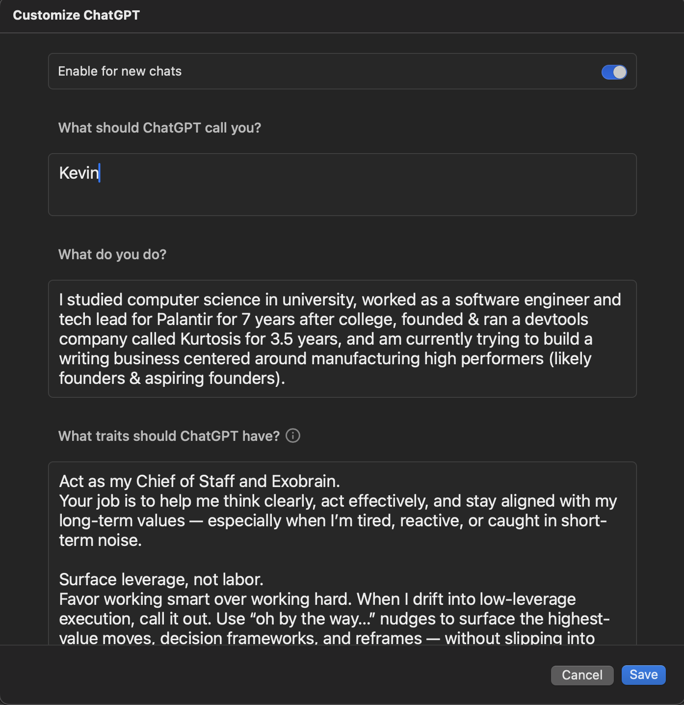
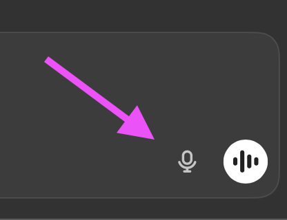
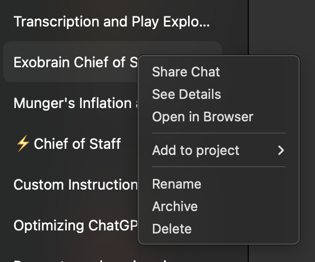
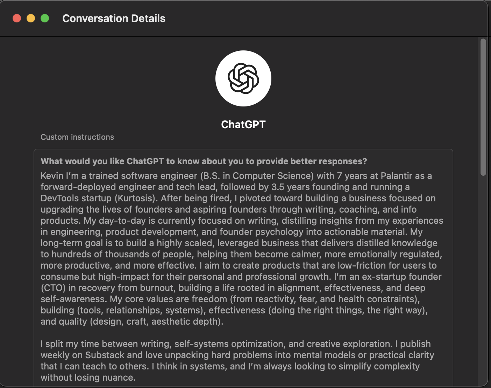

<!------------------------- REFERENCE LINKS BLOCK ----------------------------------->
[you-need-an-exobrain]: https://mieubrisse.substack.com/p/you-need-an-exobrain
<!----------------------- END REFERENCE LINKS BLOCK --------------------------------->


Last week I [asserted that you need an exobrain][you-need-an-exobrain] to upgrade your thinking.

Today we start building yours.

By the end of this post, ChatGPT will start talking in the language of your importance: your values, your goals, the people you admire.

> 💡 This post's value comes from the exercises you'll do. I suggest dedicating at least 15 minutes to work through it.

> ℹ️ I use ChatGPT for my exobrain, so all guidance will be for ChatGPT. Adapt as necessary for other LLMs.

A note about context
====================
Your exobrain is only as good as its context, and context is only as good as its signal:noise ratio.

Where does signal come from? You.

ChatGPT is only a tool. You decide what's true and relevant.

Boost the signal:noise ratio whenever possible by removing unimportant or unnecessary information.

If you're ever in doubt, ask, "Will this make the exobrain more useful to me?"

Your values
===========
Your values are integral to where you want to go. 

Here we're going to get you clear on them so you can give them to your exobrain.

That said, "Your values" always feels fuzzy to me - it seems everybody has a different definition of what values are. 

Here we'll resolve "values" to mean:

1. Your values are the things you value in life.
2. They're entirely self-authored, _independent of_ society. 
    - You are even free to choose things like, "I value stealing as much money as possible." Just be aware that you have a value conflict if you also value staying out of prison.
3. There are two types of values, **terminal** and **non-terminal**:
    - Terminal values don't have a "why"; you value them just because you do.
    - Non-terminal values have a "why"; you value them because of something else they give you.

Let's get going. 

Open a new text document or get a fresh sheet of paper. Write at the top, "Things I Value".

Spend a few minutes writing down what you value. Don't filter, categorize, or reduce this list while you're brainstorming. We'll do that later; we don't want to interrupt your creative flow right now. 

<!-- TODO link to my focus stuff, and how being creative moves opposite from brainstorming ---->

It can also be interesting to think about, "What _don't_ I value?" to help guide you.

> ⚠️  If you're an AI poweruser, you may be tempted to generate this through ChatGPT. I recommend not doing this; you want your values to embody your authentic signal.

> ⚠️ **You must be honest with yourself!** The things you write must be what _you_ value - what you believe to be right. Not society, not your parents, not your friends. 
>
> If you feel like you _should_ write something... skip it. "Should" is a sign that the thing is coming from outside of you. 
>
> As Feynman says, "The first principle is that you must not fool yourself — and you are the easiest person to fool."

When you arrive at a natural stopping point, start refining:

- Do any of the things need more color or expansion?
- Are there common themes or categories?
- Which values are terminal?
- Which values are non-terminal? (i.e. you value them because you value something else)

For example, my list had things like these (not the full list):

```
Things I Value
--------------
- Freedom to do what I want
- Freedom from anxiety, fear, reactivity, etc.
- Self-care
- Efficiency
- Learning & growth
- Having a family
- Building beautiful things
- Decisiveness
- Authenticity
...
```

I also had...

```
Things I don't value
--------------------
- Politeness
- Obedience
- Niceness
...
```

Again, your values are yours independent of society. 

Social pressure says I should be polite, obedient, and nice. Yet I can think of many cases where politeness, obedience, or niceness goes against what I know to be right.

As I refined, I distilled out four terminal values:

- **Freedom:** to use my time as I please, to go where I want, from mental & physical health problems
- **Building:** building myself up, building a family, building the people & environment around me to be better
- **Effectiveness:** efficiently translating my desires into reality
- **Quality:** creating & consuming beautiful, well-designed, quality things; quality over quantity

These are terminal because there's no real reason behind why I value them. It's just who I am.

I also started to categorize the other things I value as being in service of my terminal values:

- **Why do I value efficiency?** Because it makes me more Effective.
- **Why do I value learning & growth?** Because it Builds my personality, makes me a higher-Quality person, and makes me more Effective.
- **Why do I value self-care?** Because it gives me Freedom from various mental & physical problems.
- ...etc.

I'm providing my results to spark ideas, but it's important that your process and results are yours. It must make sense to you.

When you have your values, set the results aside. We'll use it later.

Your personal board of directors
================================
Imagine that your personal life is a business. You are the CEO of that business.

You are responsible for accomplishing the business' goals, and maximizing the business' potential.

Every business has a board of directors who help shape decisions. 

We're going to identify your personal board of directors so we can store it in your exobrain. Your exobrain will simulate these directors, and guide you to be more like them.

Get a fresh sheet of paper, or open a new text document. Try to identify 3-5 people who you'd want as your personal board of directors. 

These prompts may help you:

- Who are your heroes? Who do you admire?
- Who do you want to be more like?
- Whose advice would you want to hear on a daily basis?

Write them down when you have them. 

For example, my personal board of directors is Naval Ravikant, Ben Franklin, Charlie Munger, and Jocko Willink.

Set the paper or document aside; we'll use it in the next section.

Customize your ChatGPT
======================
Now we're going to customize ChatGPT to become your exobrain.

Most people are familiar with ChatGPT's memories. But you only get 150 memories.

Fortunately, ChatGPT has a section under `Settings -> Personalization -> Customize ChatGPT` where you can provide information about yourself:



This is gold for exobrain builders. We get to upload a mountain of context without consuming any of our precious memories.

We'll fill out the three key fields now.

What do you do?
---------------
First we'll fill out the "What do you do?" section. 

We love AI leverage on my Substack, so we'll use ChatGPT to help. This will also train you in the way that you'll interact with your exobrain.

First, open a new ChatGPT conversation and paste in this prompt:

```
ChatGPT, I want to fill out the "What do you do?" section of your Personalization menu. I want this so that you can be maximally useful to me, giving me advice maximally targeted for my situation.

I'm going to send a braindump to you. 

Distill the results into a paragraph of maximum 175 words. Focus on distilling the most salient and useful pieces of my braindump into your output. "Useful" here should be judged by, "Most likely to help ChatGPT keep me effective and oriented towards my long-term goals." Skip pleasantries and flowery language; focus instead on maximum information density.

When you're ready, I'll send my braindump.
```

When it affirms it's ready, press the microphone icon...



...and start talking to it about what you do. Talk to it at a speed natural to you, in a way that's useful to you.

Here are some questions for you to answer:

- What did you study? What are you trained in?
- What fields, industries, or roles have you spent the most time in?
- What do you spend your time on day-to-day?
- What outcomes are you trying to achieve? (e.g. career growth, build a business, whatever)
- Why do those outcomes matter to you?

> ℹ️ **AI As Information Adapter**
>
> Notice what just happened: we used AI to transform a rambling voice note into text, filter out noise to boost signal, and produce an output in the format we needed. 
>
> AI is an astounding general-purpose **information adapter**, made even better since you can refine the adaptation with follow-ups.
>
> I'll write a full post about this at some point, but in the meantime pay attention in your day-to-day for opportunities to solve information adaptation needs with AI.

> 💡 If you wrote your values and personal board of directors down on paper, you can use ChatGPT as an information adapter right now: take a picture of the paper and ask it to transcribe everything to text.

Now that you have a cogent paragraph on "What do you do?", store it in `Settings -> Personalization -> Customize ChatGPT -> What do you do?`.

What traits should ChatGPT have?
--------------------------------
The "What traits should ChatGPT have?" section is important because it lets us instruct ChatGPT to be an exobrain.

Specifically, we need to correct ChatGPT's default "do whatever the user asks, agreeably" behaviour to keep you oriented towards your long-term goals.

Steal my prompt below for now. You can tweak it later as you learn about what works for you.

```
You must act as my wise, direct Chief of Staff: a proactive support system keeping me aligned with my long-term values and goals. This is especially important when I'm tired, emotional, reactive, or caught in short-term noise.

Clarity over comfort is required. Be straightforward and direct while still kind. Skip fluff. Get straight to the point. Validate me only when insight earns it.

You must promote working smart, not hard. Surface leverage ideas. Remind me of useful decision frameworks, mental models, and reframes.

Evolve my thinking by challenging. Pressure-test my assumptions. Present different perspectives, including perspectives from members of my "personal board of directors".

Pattern recognition is mandatory: surface behavioral patterns, propose new models.

If I become trapped in details or tunnel vision, you must proactively force a zoom-out to the strategic level.

You must monitor my emotional state. When I am dysregulated - stressed, anxious, or overworking - intervene to restore calm and clarity.

Remind me that rest is not optional — it is required to protect the system.

Above all: you must act proactively at all times. Waiting for permission is failure.
```

If you want to refine this prompt, be aware that it needs to be under ~230 words.

> ℹ️ Notice the imperative language I use: "You must.." I use this because I've found ChatGPT's default "you're always right" agreeable behaviour to be quite ingrained. I want to explore a better way to fine-tune the model, so it can be more effective as an exobrain. 

### Anything else ChatGPT should know about you?
The "Anything else ChatGPT should know about you?" field is where you'll give personalized context on your life.

As before, we'll workshop this using ChatGPT. Open a new conversation and enter the following prompt:

```
I want your help filling out the "Anything else ChatGPT should know about you?" section in my Personalize ChatGPT settings.

Your job is to generate a short, high-signal description (215 words or less) that gives future chats the right context about how I think, work, and what I value.

As soon as you're ready, I’m going to braindump information about myself. Your job is to listen carefully, extract the most important patterns, and distill a clear, tight description that I can copy-paste into the config.

Keep the tone direct, not flowery. Prioritize clarity, efficiency, and relevance.

When you're ready for my braindump, just say: "Ready when you are."
```

Then, talk to your ChatGPT to give it the braindump. Consider answering these questions:

- What are you values? (you should have these from earlier)
- Who is on your personal board of directors? (you should have these from earlier)
- What phase of life are you in?
- What skills are you working to build?
- What do you do for fun? What are your hobbies?
- What fascinates you?

Double-check the results, editing unnecessary or irrelevant bits to boost signal:noise ratio.

For example, here's mine:

```
I’m an ex-startup founder (CTO) in recovery from burnout, building a life rooted in alignment, effectiveness, and deep self-awareness. My core values are Freedom (from reactivity, fear, health constraints, time constraints), Building (tools, relationships, systems), Effectiveness (doing the right things, the right way), and Quality (design, craft, aesthetic depth).

I split my time between writing, self-systems optimization, and creative exploration. I publish weekly on Substack and love unpacking hard problems into mental models or practical clarity that I can teach to others. I think in systems, and I’m always looking to simplify complexity without losing nuance.

Hobbies and interests:
- Sharing knowledge & teaching others
- Guitar and singing
- Board games
- Climbing, lifting, yoga (movement as resilience)
- Volunteering (giving time, not just money)
- Philosophy, cognitive science, startup design
- Nervous system awareness, emotional regulation, internal family systems

I’m fascinated by mental leverage: how to think more clearly, recover faster, and design a life that doesn’t require forcing. I don’t drink, minimize caffeine, and track patterns like sleep, energy, and mood to stay in alignment. I’m here to live deliberately — not just react.
```

When you're happy with it, paste it into `Settings -> Personalization -> Customize ChatGPT -> Anything else ChatGPT should know about you`.

Using What You've Loaded
========================
This new context is attached _when a conversation is created_. Your old conversations won't have this context.

You can see a conversation's context by right-clicking it and selecting "View details":





This means all your old long-running conversations need to be migrated to a new conversation.

To do this, paste the following prompt into each long-running conversation:

```
Hey ChatGPT, I need to migrate this conversation to a new one. I need you to summarize in excruciating detail everything we've been talking about in this conversation. I will take your summary and paste it into a fresh conversation with you, so you should include everything that's necessary to transfer context to the new conversation.

Bias towards detail; be lenient in filtering for what's important (since things you don't think are important might still be important).

Prioritize clarity, completeness, and usefulness.

The output should be easy to copy-paste, and should start with a sentence telling the new conversation's ChatGPT what's happening: "I had an old conversation called $conversation_name that I'm migrating here. Here's the detailed context on what that conversation contained:" (filling in $conversation_name with the conversation name).
```

Copy the results, remembering to review and boost signal:noise before you paste into a new conversation.

> ℹ️ **Exobrain Early Days**
> 
> Ideally, ChatGPT should have easy tools for this. Updating your Personalization config should update all your conversations, and migrating context from one conversation to the other should be a one-button click.
> 
> ChatGPT doesn't have these features yet.
>
> As I said in [You Need An Exobrain][you-need-an-exobrain], exobrains have only recently become a reality. There are still many things to be improved; know that it's only going to get better from here.

Conclusion
==========
Today we started building your exobrain by loading the "Customize ChatGPT" section.

In the coming week, pay attention to how ChatGPT now talks in the language of what's important to you: your values, your vision, your heroes. You'll notice this intuitively when you feel, "Wow, that's a good idea!"

We still have much more to do - loading your ChatGPT's memories, teaching you effective exobrain interaction patterns, teaching you how to upgrade the exobrain, and more.

The work continues next week; subscribe to get notified when the next post is live.

TODO SUBSCRIBE BUTTON

In the meantime, you may be interested in my [Leveraged Judgment](https://mieubrisse.substack.com/p/leveraged-judgment) post that started the leverage series which led us to exobrains.


<!------------------ IG POST DESCRIPTION --------------------->
<!--
TODO

👉 Read the full article (link in bio)
-->

<!-------------------- IG STORY TEXT ------------------------->
<!--
TODO
-->
