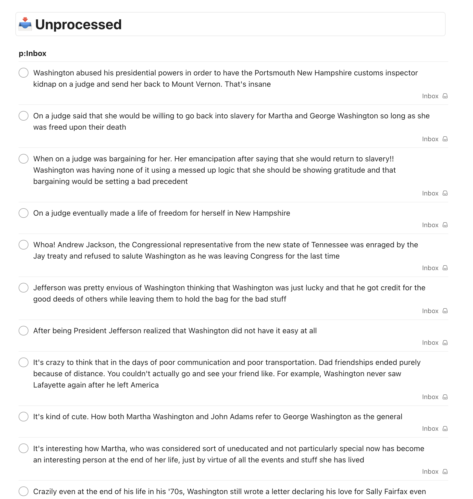
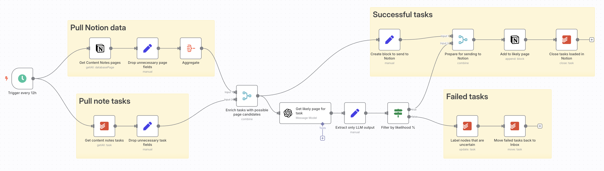

<!------------------------- REFERENCE LINKS BLOCK ----------------------------------->
<!----------------------- END REFERENCE LINKS BLOCK --------------------------------->

The problem
-----------
Every morning I take a walk to get early-morning sunlight (thanks, [Huberman Lab](https://www.hubermanlab.com/newsletter/using-light-for-health)!). 

I listen to audiobooks on these walks, and often want to take notes. But I don't want to be head down, fumbling around on my phone to type (an unwise idea on the streets of São Paulo, and defeats the purpose of a morning light walk). 

Instead, I use Gboard's voice typing to dictate into Todoist's quick-add widget. It works great: I dictate a note in a few seconds, the note gets added as a task in my Todoist inbox for later processing, and I get right back to listening.

The nightmare begins when it's inbox processing time.

I keep a "Content Notes" database in Notion, with one subpage per audiobook. The notes need to be stored in the page for the audiobook.

Processing just a single note in my Todoist inbox requires:

1. Clicking the note to open "Edit mode"
1. ⌘-C to copy the text
1. Switching to the Notion app
1. Identifying and opening the subpage for the audiobook the note was from
1. Scrolling to the bottom
1. ⌘-P to paste the note
1. Switching back to the Todoist app to do it all over for the next note

When I've taken a ton of notes, or haven't processed my inbox in a few days...

...just notes alone can take 15-20 minutes.

I've been searching for AI assistance, but hadn't found anything I liked.

The solution
------------
I stumbled across [n8n](https://n8n.io/), while researching a different data project.

In a nutshell, n8n is a data pipeline-oriented workflow automation platform. It's exceedingly well-designed, and gave me that "this feels like a videogame!" feeling of fun that's vanishingly rare in today's product landscape.

With a lot of drag-and-drop and a little assistance from ChatGPT, behold:

<iframe src="https://www.loom.com/embed/cc3dd1417a584c53a74721076b44c7f2?sid=d5228e07-ba2a-4ac8-9ba3-8a47b0615123" frameborder="0" webkitallowfullscreen mozallowfullscreen allowfullscreen style="position: absolute; top: 0; left: 0; width: 100%; height: 100%;"></iframe>

Now, any note I throw into my "Categorize to Notion" project in Todoist gets automatically added to the right Notion page.

(I could have pulled notes from the inbox itself, but chose to use a separate "Categorize to Notion" project so I could clean up the raw note dictation before storing in Notion)

The technical details (skip if not interested)
----------------------------------------------
Now that you've seen the thing, technical details for the curious:

To get n8n running, I opted for [Railway](https://railway.com/). 

I wanted my own n8n instance so I could trust that any sensitive info I stored would be secure, and I wanted it to be in the cloud so I wouldn't have to worry about missed workflows because my Mac was asleep. Railway is a great fit here, and happily they have [an n8n template](https://railway.com/deploy/n8n-with-workers). Deploying it was as simple as clicking the button.

I quickly started losing the n8n tab amidst all my Chrome tabs, so I used the coolest Chrome feature that nobody knows about and [installed my n8n instance's page as an app on my Mac](https://pureinfotech.com/understanding-and-installing-chrome-web-apps/).

The workflow itself isn't very complicated:

It:

1. Pulls notes from the Todoist "Categorize to Notion" project
1. Pulls the 10 most recently-edited subpages in my "Content Notes" Notion database
1. Asks GPT for the page it thinks the note most belongs in, with a percentage of how confident it is
1. For notes where the certainty is at least 80%, add the note to the Notion page and check the note off in Todoist
1. For notes where the certainty is less than 80%, add a `CATEGORIZATION_UNCLEAR` label and throw it back into my inbox for me to deal with manually

Building the workflow was surprising: the things I thought would be hard were easy, and the things I thought would be easy were more difficult.

For example, all the I/O with Todoist, Notion, and GPT was as simple as popping the respective node into the workflow, filling out the fields, and clicking the helpful "Docs" popup when I had questions.

However, basic stuff like "I have my list of notes from Todoist, and I have my list of Notion pages. How do I throw both into the GPT prompt?" took me an hour to solve because the GPT node has only one input. Asking my personal ChatGPT (unrelated to n8n) questions was very helpful here.

In fairness to the n8n though, I didn't fully understand the n8n datamodel at first. I eventually learned that all flows between nodes are lists of JSON objects, and each node's operation gets ran once for each item in the input list. In this sense, rows in the input are decoupled from each other. 

To accomplish what I needed, I ended up enriching every note row with the same 10 most recently-edited pages from the "Content Notes" database. GPT gets called once per note, with every invocation to GPT sending the same 10 pages for it to choose from. 

This is pretty inefficient; each invocation burns tokens sending the same system prompt and same 10 recently-edited pages. But I'm not worried: all my testing plus the workflow run in the video above using GPT-4o cost me $0.19, and notes are produced on the order of 5-15 per day.

And speaking of GPT, I found a tip online to set the temperature to `0` so that all GPT node responses are fully repeatable. I didn't even know that was possible.

It's also worth noting that n8n doesn't seem to provide any idempotence guarantees. Once a node runs that does something in another system, it's now done regardless of what happens downstream from the node. 

In my case, there's a small risk that notes which got successfully stored in Notion don't get checked off in Todoist, leading to the same note being processed on the next run (thereby causing duplicate data in Notion).

I organized the workflow to mitigate this as much as possible. For example, tasks that don't have an obvious page get the `CATEGORIZATION_UNCLEAR` label before they get moved back to the inbox. This way, a failure after the labelling node will leave the note in "Categorize to Notion" project and it will get picked up by the next run, no harm no foul. 

Contrast with if I moved the note to the inbox first and then labelled after: it would work the same in the success case, but a partial failure (successful move-to-inbox but a failure in labelling) would "lose" a note in my inbox without the `CATEGORIZATION_UNCLEAR` label. So you've got to be thoughtful about your workflows.

Finally, n8n has a hidden feature worth mentioning: every row keeps providence information, linking it to the rows that produced it earlier in the pipeline. This means that you can grab properties from the ancestors of the current row you're looking at. 

This came in very handy for me as I was looking to check notes off in Todoist that had been successfully stored in Notion. 

The output of the Notion node doesn't contain any fields from the input rows, so it seemed I didn't have a way to access the Todoist ID needed to check off the successfully-stored notes. Only when I discovered the providence information was I able to pull the Todoist ID from the nodes that had gone into the Notion node.

Closing thoughts
----------------
### Further improvement
I'm very happy with this workflow, but there's definitely room for improvement:

As I mentioned above, I could batch the categorization of the notes into a single call to GPT so that I'm not wasting tokens on the system prompt and candidate pages. I have a better idea of how to do this, now that I understand the n8n datamodel.

I could also try using a dumber model. I used GPT-4o because I didn't want to deal with model intelligence issues, but my hunch is 4o-mini (which is an order of magnitude cheaper) would also do just fine.

And finally, any automation needs alerting to shout when the human needs to fix something. I'd like to wire up [n8n's error alerting](https://docs.n8n.io/flow-logic/error-handling/#create-and-set-an-error-workflow) so I get notified if the workflow fails.

### n8n
If it's not clear by now, n8n deeply impressed me. Here I'd like to take a step back look at what it does great, and what it still struggles with:

**What went well**
- It was a breeze to start playing inside my first workflow once I had n8n up inside Railway
- Each node does a great job helping you fill it out, with on-hover helptext and links to the docs
- The product as a whole feels the right amount of technical: enough to inspire "Oo I want to play with _that_" but not so much as to be intimidating
- The drag-and-drop node workflow is _fun_; it makes intuitive sense
- The limited node set is good; I feel like I'm snapping together a bunch of small components that have a single purpose
- The data model makes sense, once you get the hang of it
- Being able to drop little Javascript snippets in with `{{ }}` was a real game-changer to keeping my pipeline manageable (so nodes feel like Big Operations)
- Node-renaming and sticky notes work well, and are very useful

**What could improve**
- I occasionally hit a bug where the workflow stayed in a perpetual "Running" state, even though the "Executions" tab showed that it had finished. Closing the workflow and reopening fixed it for me, thankfully.
- As a first-time user who didn't know any of the nodes, I sometimes found it hard to go from "This is what I want to do" to "Node(s) I need". It would be cool to have a videogame-like tutorial, or minimal AI onboard that I can ask questions and get answers (bonus points if it could generate pipeline fragments for me!).
- After the GPT node I added an `If` node to grab only rows whose confidence was 80% or higher. By chance, none of the rows were lower than 80% so my "False" branch had no rows. n8n treated this as "schema unknown" (even though the rows would have the same schema as the "True" branch), so I didn't have any autocomplete for the nodes I plugged in downstream of the "False" branch. The simple fix of using the same schema for "True" and "False" branches seems like it'd be a big quality-of-life improvement.
- If I rename a row property in one node, everything downstream breaks. This makes the pipeline feel fragile. It would be great if I could choose to cascade the rename to everything downstream.
- The implicit providence information inside each row is great but hidden. I'd like to see it introduced in a way that's not overwhelming (maybe an "Advanced Tutorial"?).

### Further projects
Over the years I've accumulated a list of projects I'd love a machine assistant to help with. For example:

- Taking unstructured descriptions of my interactions with people, categorizing them into a personal CRM, and adding task reminders for anything I might need in the future
- Finding flights, booking flights, and choosing seats based on unstructured descriptions of my preferences
- Coordinating times to meet amongst groups of friends

The LLM Revolution has brought these within striking distance with how well LLMs handle unstructured input, but brass-tacks questions still remained for me. How do I actually call the LLM? Where does that code run? How do I wire its output elsewhere? 

n8n has neatly answered all of these, and I feel myself at the beginning of a big personal life automation phase.

### n8n vs Foundry and Rundeck
I stumbled across n8n while trying to build a quantified life data pipeline. 

I used to work at Palantir, and was looking for the poor man's version of Foundry (which is **so** good at data pipelining, but also an insanely expensive beast - both in dollars and computer/storage/memory).

From what I've seen so far, n8n looks to be what I need. 

Foundry is a much bigger product that's better at data providence and in-pipeline analysis, but for the grand total $0 that I paid for n8n... I'm more than satisfied.

n8n actually reminds me of [Rundeck](https://www.rundeck.com/), a workflow automation tool that we used at Palantir client sites before Foundry became widespread. 

Only, Rundeck always felt like a fragile mess, prone to explode for reasons unknown into XML and tears. 

n8n's nice guardrails and clean data-passing semantics feel like what I wish Rundeck had been.

Conclusion
----------
So there you have it - my first pleasant foray into n8n. It's definitely worth a look if you're as into automation as I am.

And if you're interested in more self-improvement-meets-tech, you...

...should subscribe! (I post every 1-3 weeks; I won't spam you)

TODO SUBSCRIBE BUTTON

...might enjoy [the other tools I've built](https://kevintoday.com/).

...might be interested in my [exobrain series](https://mieubrisse.substack.com/p/the-exobrain-series).

_Thank you to Todoist, n8n, and Notion for their excellent products! The Berlin tech product scene really knows what's good._

<!------------------ IG POST DESCRIPTION --------------------->
<!--
I built an AI pipeline to categorize my book notes with AI and n8n. This was my first experience with n8n, and I was very pleasantly surprised.

👉 Read the full article at the link in my bio

#Automation #AIProductivity #n8nWorkflow #SmartNoteTaking #NotionAutomation #TodoistAutomation #VoiceNoteToNotion #TechSystems
-->
