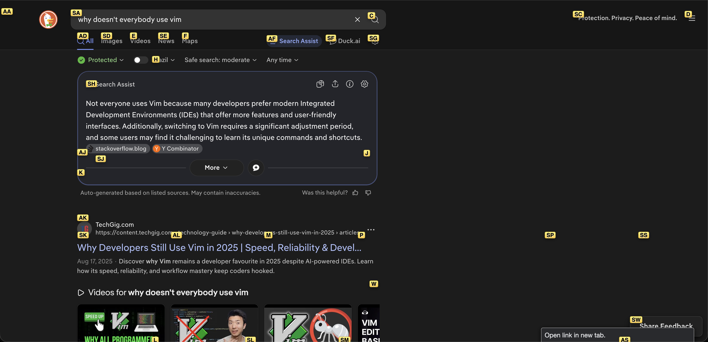
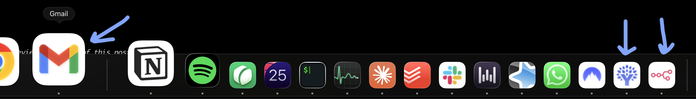
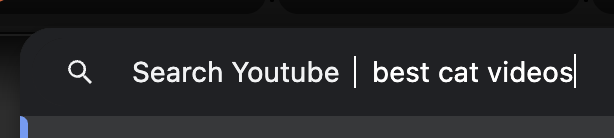
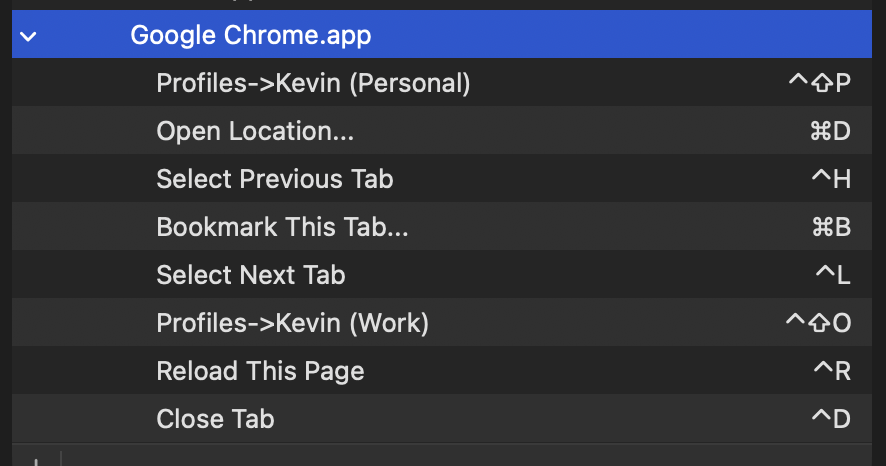

<!------------------------- REFERENCE LINKS BLOCK ----------------------------------->
[TODO]: some-link
<!----------------------- END REFERENCE LINKS BLOCK --------------------------------->

Crackhead Chrome
================
Drive your browser like the speed addict you are


We're Church of Vim acolytes here on this blog. Yet the internet is just so annoyingly mouse-oriented.

So, to celebrate my return from an unplanned writing sabbatical, here are five things I do so my Chrome experience is smoother than a baboon's buttcheek:

### Vimium
Sure, a bunch of sinners made the internet for mouses.

But our holy father foregiveth with [Vimium](https://chromewebstore.google.com/detail/vimium/dbepggeogbaibhgnhhndojpepiihcmeb).

The killer feature is `f`, which gives everything a little tag you can type to click:



You can also bind keys to scroll the page (mine are `j/k` for down/up and `shift-j/k` for page down/up):

```
map J scrollPageDown
map K scrollPageUp
unmap r
unmap d
```

You can even, after searching for something using `/`, press `v` to go to Visual mode for copying to your clipboard. I use this rarely though.

### Install As App
You know how you'll use some great webapp, but it's entirely missing a desktop app?

Chrome's got the answer.

Open a site, then open the `⋮` menu → `Cast, Save, and Share` → `Install Page as App...`

Now it behaves like any other app, complete with `⌘-tab` switching.

Example: these three aren't actually desktop apps:



The only minor limitation I've hit is Mac's Downtime feature can't "Always Allow" apps installed this way.

### Site Search
The modern site search experience: open a site, wait four seconds for its bloated-ass Javascript to finish loading, then finally go to the search bar to ask for what you want.

Now, skip slow sites with Site Search!

Example: I type `yt<space>` in my omnibar, type what I want, and land in the search results. No carcinogenic Youtube homepage required.



HOW TO:

1. Go to your favorite site
2. Search for "foo"
3. Copy the URL
4. Open `chrome://settings/searchEngines` and Add a new Site Search
5. Plug in the URL, replacing `foo` with `%s`
6. Give it a little keyword 
7. Type that keyword into the omnibar, press space, and let 'er rip

Here are some of my Site Searches:

- `yt` for Youtube
- `gh` for searching all of Github
- `gd` for Google Drive
- `mgh` for just my repos on Github
- `pe` for Google Translating whatever I put in omnibar from Portuguese → English
- `ep` for Google Translating whatever I put in omnibar from English → Portuguese
- `mp` for Google Maps
- `li` for Linkedin
- `wk` for Wikipedia

### Profiles
I like to keep my work & personal lives separate.

Chrome supports this as separate profiles, as long as you have different Google accounts for each.

You'll get isolation for bookmarks, Google Drive, extensions, and more.

Then, to make switching between them easy, add the following shortcuts in your Mac's Keybindings:

```
Profiles->PROFILENAME         hotkey
```

For example, I've bound:

```
Profiles->Kevin (Work)            ctrl-shift-o
Profiles->Kevin (Personal)        ctrl-shift-p
```

### Omnibar Hotkey (and a bunch more)
You go to the omnibar hundreds of times per day. Mouse-clicking it is for peasants.

Throw these hotkeys in your Mac's Keybindings...

```
Open Location...         ⌘-d
Bookmark This Tab...     ⌘-b
```

...and you can `⌘-d` to jump to the omnibar. `esc` x 2 backs you out to use more sweet sweet Vimium.

> ⚠️ You need to rebind "Bookmark This Tab..." because ⌘-d is bookmarking by default.

And here are a bunch of other hotkeys I use, to drive mouseless Chrome:



Conclusion
----------
There you have it. Be bold and conquer, my fellow speed demons.

TODO SUBSCRIBE BUTTON

-----------

If you liked this post, take a gander at my other writing:

- [The Goal Is Unique Work](https://mieubrisse.substack.com/p/the-goal-is-unique-work)
- [Building The Factory](https://mieubrisse.substack.com/p/building-the-factory)
- [The Sleep Guide](https://mieubrisse.substack.com/p/the-sleep-guide)
