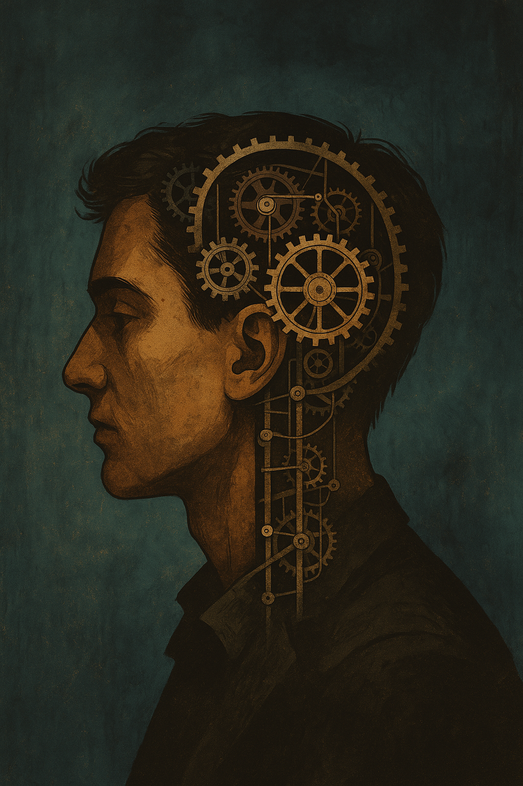
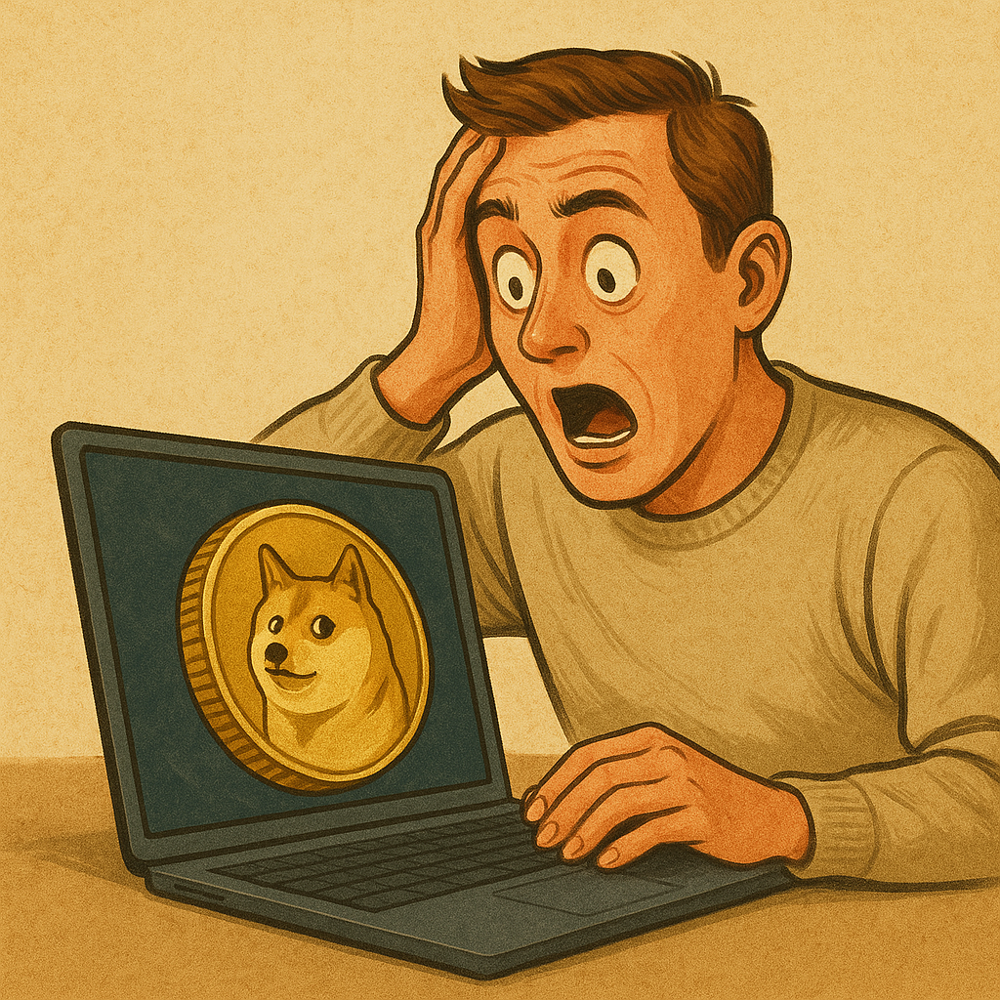

<!------------------ IG POST DESCRIPTION --------------------->
<!--
Your worst decisions aren't random. They're predictable.

We all fall prey to the Four Horsemen of Bad Decisionmaking: ego, emotion, social pressure, and inertia.

This post breaks down how decision systems protect you when you’re weakest... by designing them when you’re calm.

👉 Read the full article (link in bio)

#decisionmaking #mentalclarity #productivitysystems #selfmastery #leverage #exobrain #mindsetdesign
-->

_This post is part of a series on leverage. Here are parts [one][leveraged-judgment], [two][negative-leverage], and [three][first-do-nothing]._

I've [said it before][leveraged-judgment]: the modern world is is Fucking Leveraged. Small choices trigger huge consequences. 

One piece of content goes viral? Thousands of followers and a global platform.

One bad strategy call in business? Hundreds of hours of wasted work.

Working smart dominates working hard. Decisions define outcomes.

My ["first, do nothing" mantra][first-do-nothing] is a mental strategy for better decisionmaking.

This post defines what throws us off course, and how to use systems to keep us on track.

The Four Horsemen
-----------------
You, like all of us, are a dumb monkey with a bunch of evolved behaviours.

These behaviours were helpful in the ancient environment. They're harmful today because they create false urgency and [negative leverage][negative-leverage].

_Oops... reacted without thinking and now my entire portfolio is Dogecoin._

[Clear Thinking](https://www.amazon.com/Clear-Thinking-Turning-Ordinary-Extraordinary/dp/0593086112) defines these harmful tendencies as our "defaults":

- **The ego default:** Acting to feel right/important ("I always knew the stock market was going to crash")
- **The emotion default:** Reacting to fear, anger, jealousy, etc. ("Fucking Linda from fucking finance is about to get a piece of my mind")
- **The social default:** Acting to fit in with the crowd ("Everyone else is getting in on Beanie Babies... I can't miss this!")
- **The inertia default:** Doing what's always been done ("I always eat ice cream with Netflix")

I call these the "Four Horsemen of Bad Decisionmaking".

Training your mind is the classic protection: self-awareness, meditation, mnemonics like "Count to 10 before responding".

These techniques are foundational; you need to work on them. 

But they take decades to master because they're _hard_. 

You're fighting evolution, so each situation requires effort. You must burn cycles recognizing what's happening, slowing down, and figuring out how to avoid the Four Horsemen pitfalls.

Decisionmaking Systems
----------------------
We can do better. Clear Thinking again:

> [Good judgment] is about designing systems at your best, that work for you at your worst.

If we can create a system when calm that works when we're in the chaos, **we can make our worst decisionmaking days look like our best**.

Present calm gets leveraged to future moments.

This can be done through **rules**, commitments made now that are fulfilled in the future:

- "I don't respond when I'm feeling stressed" (guards against ego and emotion defaults)
- "I diversify my portfolio regardless of what the market is doing" (guards against emotion and social defaults)
- "I don't make commitments on the phone" (guards against social pressure default)
- "I don't eat after 8pm" (guards against inertia and emotion defaults)

Or through **[Ulysses pacts](https://en.wikipedia.org/wiki/Ulysses_pact)**, removing your option to make bad choices:

- Your friends take drinks from you after 7pm (guards against emotional, social, and inertia defaults)
- I use [a phone app to block distracting apps after 9pm](https://appblock.app/) (guards against emotional and inertia defaults)
- I [have a modded version of Instagram on my phone that removes the dopamine-bait Feed and Search grid](https://www.distractionfreeapps.com/) (guards against emotional and inertia defaults)
- I have [a laptop app that forces me to take eye breaks every 20 minutes](https://lookaway.app/) (guards against inertia default)

You're a bumper car, getting knocked around by the world. The systems you build are guardrails to keep you on track even when the Four Horsemen crash into you.

When Linda from finance comes with her bullshit, you have more than just your awareness that you should slow down. You have a system.

Clear Thinking:

> Good judgment is expensive... but poor judgment costs a fortune.

Conclusion
----------
Take a moment to consider decisionmaking systems for yourself:

Where are you trying to go with your life?

Where are you falling prey to the Four Horsemen of Bad Decisionmaking?

What rules or Ulysses pacts can you use to keep you on course?

[Next post](https://mieubrisse.substack.com/p/you-need-an-exobrain) we're taking decisionmaking systems much farther: I'll introduce the **exobrain**, and why it's imperative you get one.

TODO SUBSCRIBE BUTTON

_Thank you to Tedi Mitiku, Yannik Zimmerman, Morgan Lefebvre, John Therrien, and Mike Zhao for reviewing drafts of this._

<!------------------------- ONLY LINKS BELOW HERE ----------------------------------->
[leveraged-judgment]: https://mieubrisse.substack.com/p/leveraged-judgment
[negative-leverage]: https://mieubrisse.substack.com/p/shattered-glass-and-negative-leverage
[first-do-nothing]: https://mieubrisse.substack.com/p/first-do-nothing
