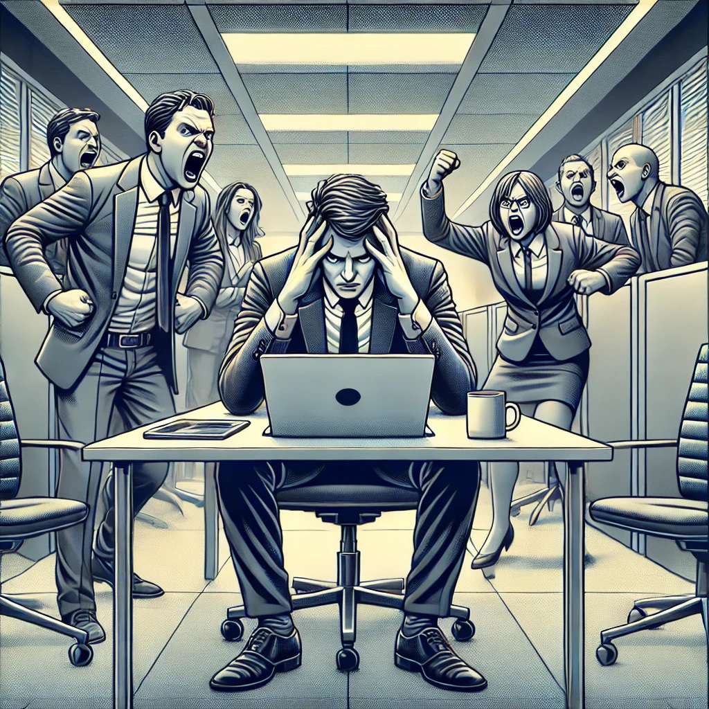

<!----
TAGLINE FOR IG POSTS:

TODO (use ChatGPT to help)
----->

<!--
--------------------- POSTING CHECKLIST ----------------------------
Before posting:
1. [ ] Decide on tagline that will go in IG post desccription
1. [ ] Ensure I have "Share" or "Subscribe" CTAs in the post!
1. [ ] Create a PR and merge into main

AFTER POSTING
-------------
### Prep
1. Download the shareable image that Substack generates for the post
1. Post the shareable link that Substack generates to my self Whatsapp group (for using in Stories)
1. Send raw cover image to myself on Whatsapp for stories

### Sharing
1. Post a feed post to gringowellness, ensuring to cut off the `mieubrisse.substack`
1. Pin the new feed post
1. Share the raw cover from Whatsapp as a story WITH LINK to gringowellness
1. Share the raw cover from Whatsapp as a story WITH LINK to kevinjtoday
1. Post the link to Twitter
1. Send to all the friends that I've recorded as interested
-->

_This post is part of a series on leverage. The first part is [here][leveraged-judgment], and the second part [is here][negative-leverage]._

I have a favorite mantra: first, do nothing.

The other day a friend was stressing about a girl he liked. She'd given a noncommittal response to his last text message, and many thoughts were swirling around his head. Did she still like him? Should he send a followup? Should he distance himself from her?

My advice: first, do nothing.

Don't send any messages. Don't draw any conclusions. Don't take any actions with her.

Instead, I suggested he...

- Lie down on his bed
- Meditate
- Write in his journal
- Go for a walk
- Go to the gym

Stress & Negative Leverage
--------------------------
The "first, do nothing" advice often sounds bad the first time someone hears it. 

They feel I'm not respecting the gravity of the situation. They forget that stress straps reality-distortion goggles to our minds.

When we feel stressed - angry, afraid, alone, etc. - we feel we _must_ take action Right Now. We forget long-term goals and favor short-term thinking. We tunnel vision on what's in front of us.

This urgency was useful in the simple ancient world. 

Back then, stressors like "getting chased by a tiger", "getting expelled from the tribe", and "getting rejected by a romantic prospect" carried real risk of failing to pass on your genes. Sudden drastic action favored survival, else we wouldn't have these instincts.

This is [Daniel Kahneman's System 1 thinking](https://en.wikipedia.org/wiki/Thinking,_Fast_and_Slow#:~:text=brain%20forms%20thoughts%3A-,System%201,-%3A%20Fast%2C%20automatic).

But urgent response to stress is frequently harmful in the complex modern world. 

Today most tigers are in zoos, a new tribe is available in the next town over, and the internet delivers thousands of romantic options to your living room. Most perceived threats are not dangerous at all.

Further, [the modern world is full of leverage][leveraged-judgment]. A hasty decision frequently misses non-obvious solutions that save dozens of hours of work.

How many times have you...

- Said something in the heat of the moment, then wished you could take it back?
- Been confident you knew what was happening (e.g. confident about a person's motivations for doing something), only to find out later that you got it wrong?
- Burned time and energy fighting for something that _felt_ crucially important, then felt sheepish the next day when you realized it didn't matter?

These are examples of [negative leverage][negative-leverage]: small choices that waste lots of your time. If you'd only slowed down and made a different choice - [engaged your System 2 thinking](https://en.wikipedia.org/wiki/Thinking,_Fast_and_Slow#:~:text=understand%20simple%20sentences-,System%202,-%3A%20Slow%2C%20effortful) - you could have saved hundreds of hours.

[Astronaut Chris Hadfield tells us about a saying at NASA](https://www.youtube.com/watch?v=Zo62S0ulqhA&ab_channel=TED):

> There's no problem so bad that you can't make it worse

Stress and urgency pressure us to react, but careful - we can _always_ worsen the situation.

"First, do nothing" guards yourself from causing further damage.

By slowing down, you skip negative leverage and become faster in the long run.

Deeply Feeling The Power
------------------------
You already know that stress causes bad decisionmaking.

Think about which situation you'd prefer for an important negotiation:

- **Tense:** A pressure-filled, urgent environment
- **Calm:** A relaxed environment with plenty of time to think

Obviously the calm one. You know that it gets better outcomes.

_Time to do some important work._

But _even knowing this_, I bet you still struggle to slow down when the pressure's on. Our evolved instincts are strong!

Simply knowing that we should slow down isn't enough. You need to deeply _feel_ that slowing down under pressure is the right choice.

My business coach, [Ravi Raman][ravi-website], gave me this metaphor:

> Let's say your daily drive to the office takes 10 minutes.  
> If I tell you about a new route that's 2 minutes faster, will you take it?  
> Probably not right away... your current route is ingrained in your head, and you only know the new one is faster logically.  
> But one day you take it, and feel the speed.  
> Now you're never going back to your old route: you've *felt* the difference.  

To feel the power of "first, do nothing", try this exercise in your own life:

1. The next time you're feeling urgency, write down the action that you want to take.
1. Wait a day, doing nothing.
1. Read what you wrote. How often are you _really_ glad you didn't do what you wrote?

If "wait a day" feels too hard because you _absolutely must_ react, instead pay attention to the regret you feel the next day. 

Remember: if you made the right choice, you shouldn't feel any regret the very next day.

Identifying When To Slow Down
-----------------------------
So now you understand the power of "first, do nothing". The next step is to recognize when to use it.

I use these as warnings that my fight-or-flight nervous system is activated, and I need to first do nothing:

- I'm feeling irritated, frustrated, defensive, or resentful
- I'm feeling rejected, isolated, or abandoned
- I'm feeling stressed or anxious
- I'm feeling jealous

Alcoholics Anonymous has the ["HALT"](https://www.ascendantny.com/halt-acronym/) acronym: hungry, angry, lonely, or tired. I'm feeling any of those, I know my decisionmaking is impaired.

These are negative activations of our fight-or-flight nervous system. However, my decisionmaking is _also_ compromised when I'm positively activated.

Have you ever rushed along on a tide of enthusiasm (and maybe some caffeine)? Remember how the situation didn't seem so worthwhile when the endorphins wore off and you soberly looked at the facts? It's that.

Here are some positive states that are also warning signs that I need to first do nothing:

- Feeling so excited I can't sit still
- Being caffeinated
- Feeling giddy
- Feeling a "productivity pressure" to take action _right now_
- Feeling like I need to act right now to not miss a great opportunity

Retailers and con artists abuse these emotions constantly. They have "great opportunities" then apply time pressure to activate your fear-of-loss so you don't think before buying.

You've seen it before: "Get 20% off while supplies last!"

Only when you come down from the emotional high do you realize the problems you created for yourself. If only you'd first done nothing!

What To Do Instead
------------------
Now you're noticing when you're activated and should do nothing. Great! What now?

Doing nothing isn't, "Lie on the floor and stare at the ceiling for a day." 

_Mastering emotional resilience: become one with the floor._

It means, "Don't change the state of the situation while you're activated. Give your fight-or-flight nervous system time to deactivate."

[Ravi][ravi-website] has another metaphor:

> When we're stressed, our mind is like a shaken snowglobe.  
> All the snow is whirling and it's hard to see.  
> To get back to clarity, just stop shaking the snowglobe.  
> The snow will settle and suddenly... we can see again.  

Here are things I do to help my snowglobe settle when I'm activated:

- Lie on my bed and meditate for 10 minutes, either using a self-guided mindfulness meditation or a guided meditation from Youtube
- Go for a walk around my neighborhood, focusing on walking at 50% my normal speed
- Put on [the lofi calming playlist I've built](https://open.spotify.com/playlist/30XMfauACKupUMTgcq0xeP?si=414a5aeed8bc45fc)
- Write in my pen-and-paper journal using the prompt, "How am I feeling right now?"
    - I intentionally use pen-and-paper over journalling on the computer because pen-and-paper forces me to slow down which deactivates me, but I'll also use the computer if I don't have my paper journal available
- Swim some laps in the pool
- Work out at the gym
- Go for a run

<!-- TODO link to a "deactivating your fight-or-flight nervous system" post! -->

When To Act
-----------
Of course, we can't do nothing forever. We must eventually act.

My test for whether it's time to act is, "Do I feel calm about this?"

Shane Parrish's [Clear Thinking](https://www.amazon.com/Clear-Thinking-Turning-Ordinary-Extraordinary/dp/B0BVP84J94) suggests some other ways to judge if it's time to act:

- Have you written down your decision, slept on it, woken up, and still felt like it was a good idea?
- Can you communicate the pros and cons of various courses of action?
- Are you seeking new perspectives on the situation (maybe through Google, ChatGPT, or friends), but aren't finding any new insights?

When You Can't Do Nothing
-------------------------
Sometimes we can't do nothing.

If someone breaks into your house, "May I please have some time to think?" might not go over well.

In these situations, we do our best with the information we have at the time. Then, we live with the consequences.

But these scenarios are quite rare. The tigers are in the zoos and the next tribe is a "Hello" away. We overestimate the threat.

Yet _even in truly dangerous situations_, slowing down for a single breath can produce non-obvious, better solutions.

### A Robbery
A hairdresser in Brazil once told me how an armed man had come into her studio to rob it. Despite her terror, she welcomed him as if he were a customer and offered him an espresso. 

Her kindness disarmed him, and he told her how he didn't want to rob her but he needed money to feed his family. She gave him the cash in her pocket, and counselled him that if he wanted to see his kids grow up he should choose a life outside of crime.

She recounted him leaving thoughtful, and remorseful.

She had slowed down, and made a choice to break the robber/victim script. 

Her deescalation meant nobody got hurt or killed, and she was only out her cash on hand rather than all the money in the cash register.

### Harassment
While researching this post I came across [Antje Mattheus' story of getting harassed by a biker gang](https://wagingnonviolence.org/2013/07/how-i-fought-off-a-motorcycle-gang/).

Rather than accept the predator/prey power dynamic, Antje tells of slowing down...

> I take a breath, open my eyes wide and sink into deep calmness detached from the frenzy of bodies and hands.

...recognizing the subtleties of the situation...

> I ask in a loud, steady voice: “Who is the leader?”  
> I notice the small signals. The men’s bodies and eyes turn incrementally to a man who stands a few inches outside the tight circle, as if watching, allowing, guarding. He is a tall, blond-brown, bushy-bearded, wide-stanced man whose eyes smile with the joy of sex and power.  
> That is his weakness, I think. He loves power. And he wants people to know he has it. I want to make him prove his power to me. My thoughts are a millisecond quick, grounded in childhood play and the stories told by family members who survived two world wars.  

...and choosing a non-obvious path:

> I need to be seen, be liked and not be an unknown sexual object. I look into his eyes, and my gaze remains locked despite the commotion. I see in him the internal conflict that power brings — joy and loneliness. I feel empathy for him, a joint longing for unreachable love and understanding. I speak loud without fear: “Please. Tell your men to get off us.”  
> My voice is dignified — no wavering, no provocation, a clear acknowledgement of his power to harm or help.  

This ultimately results in her release:

> I am still. My eyes hold his and I am not afraid of who he is, what he has done. I accept. I feel we know each other. Surprise flits over his face. He blinks. His lips curl and I know he has chosen to help.  
> “Let them go.”  

If Antje had succumbed to her fear and fought or ran, she would have reinforced the predator-prey dynamic and likely gotten a terrible outcome.

Her choice to pursue the non-obvious, better path removed worlds of trouble from her future.

_No mention of slowing down and choosing a better path can skip Martin Luther King Jr. Analyzing him would take an entire post and I don't have space here, but I plan to do so as soon as I finish reading his autobiography._

<!-- TODO link to MLKJr post when it's ready -->

Conclusion
----------
My friend decided to follow my advice. He went for a walk, journalled, and came back the next day.

With the benefit of hindsight, he realized that it wasn't a big deal. If she didn't like him, there are many fish in the sea. If she did like him, she'd come back.

First, do nothing.

### Further Reading
You can find the first post on negative leverage [here][negative-leverage].

To see how I use "first, do nothing" and learn about the Un/Conditionally Okay mindsets, read [Anxiety, Emotions, & Freedom](https://mieubrisse.substack.com/p/anxiety-emotions-and-freedom).

Or to learn how America's quirkiest Founding Father mastered his emotions to make better choices, read [Building Ben Franklin](https://mieubrisse.substack.com/p/building-ben-franklin).

_If this resonated, **tell me what’s hard for you right now in the comments**. I’ll write a post just for you and you’ll help others._

TODO COMMENT BUTTON

<!------------------------- ONLY LINKS BELOW HERE ----------------------------------->
[leveraged-judgment]: https://mieubrisse.substack.com/p/leveraged-judgment
[negative-leverage]: https://mieubrisse.substack.com/p/shattered-glass-and-negative-leverage
[ravi-website]: https://raviraman.com/
