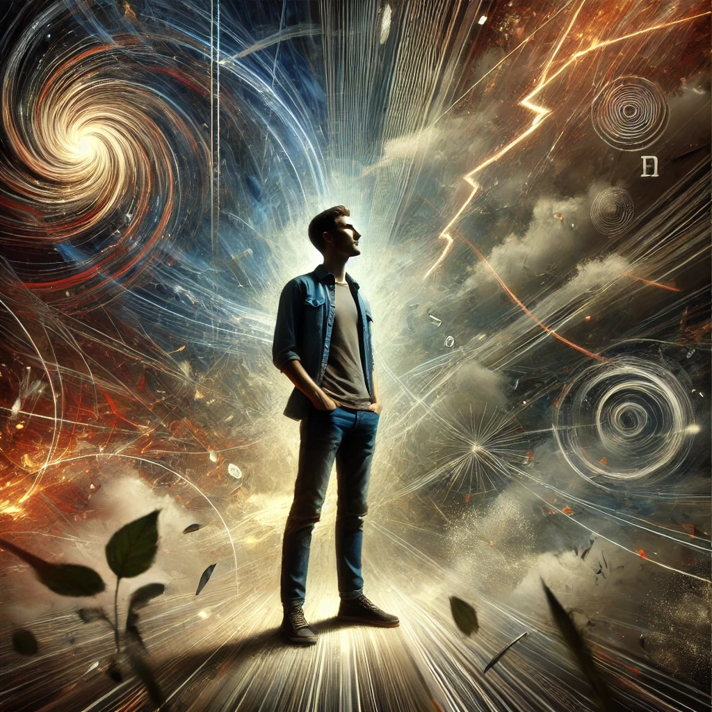

<!----
TAGLINE FOR IG POSTS:

TODO (use ChatGPT to help)
----->

<!--
--------------------- POSTING CHECKLIST ----------------------------
Before posting:
1. [ ] Decide on tagline that will go in IG post desccription
1. [ ] Ensure I have "Share" or "Subscribe" CTAs in the post!
1. [ ] Create a PR and merge into main

AFTER POSTING
-------------
### Prep
1. Download the shareable image that Substack generates for the post
1. Post the shareable link that Substack generates to my self Whatsapp group (for using in Stories)
1. Send raw cover image to myself on Whatsapp for stories

### Sharing
1. Post a feed post to gringowellness, ensuring to cut off the `mieubrisse.substack`
1. Pin the new feed post
1. Share the raw cover from Whatsapp as a story WITH LINK to gringowellness
1. Share the raw cover from Whatsapp as a story WITH LINK to kevinjtoday
1. Post the link to Twitter
1. Send to all the friends that I've recorded as interested
-->

Anybody who knows me knows one of my favorite mantras: first, do nothing.

The other day a friend was stressing about a girl he liked. She'd given a noncommittal response to his last text message, and many thoughts were going through his head. Did she like him still? Should he send a followup? Should he distance himself from her?

My advice: first, do nothing.

Don't send any messages. Don't draw any conclusions. Don't take any actions with her.

Instead, I suggested he...

- Lie down on his bed
- Meditate
- Write in his journal
- Go for a walk
- Go to the gym

### Stress & Negative Leverage
My "first, do nothing" advice usually sounds bad the first time someone hears it. They feel I'm not respecting the situation.

When we feel stressed - angry, afraid, alone, etc. - we feel we _must_ take action Right Now. We forget long-term goals and favor short-term thinking. We tunnel vision on what's in front of us.

This urgency was useful in the simple ancient world. 

Back then, stressors like "getting chased by a tiger", "getting expelled from the tribe", and "getting rejected by a romantic prospect" carried real risk of failing to pass on your genes. Sudden drastic action favored survival (else we wouldn't have these instincts).

But urgency in response to stress is frequently harmful in the complex modern world. 

Today, most tigers are in zoos, a new tribe is available in the next town over, and the internet delivers thousands of romantic options to your living room. Most perceived threats are not dangerous at all.

Further, [the modern world is full of leverage](https://mieubrisse.substack.com/p/leveraged-judgment). A hasty decision can miss non-obvious solutions that save dozens of hours of work.

How many times have you...

- Said something in the heat of the moment, then wished you could take it back?
- Been confident you knew what was happening (e.g. confident about a person's motivations for doing something), only to find out later that you got it wrong?
- Burned a bunch of time fighting for something that _felt_ crucially important, but felt sheepish the next day when you realized it didn't matter?

These are examples of [negative leverage][negative-leverage]: small choices that waste lots of your time. If you'd only slowed down and made a different choice, you could have saved hundreds of hours.

[Astronaut Chris Hadfield tells us NASA has a saying](https://www.youtube.com/watch?v=Zo62S0ulqhA&ab_channel=TED):

> There's no problem so bad that you can't make it worse

The point of "first, do nothing" is to save yourself from making the situation worse.

By slowing down, you skip creating negative leverage. You become faster in the long run.

### Identifying When To Slow Down
To apply "first, do nothing" in your life, you must recognize when it's needed.

These are some of the warning signs that my fight-or-flight nervous system is going and I need to first do nothing:

- I'm feeling irritated, frustrated, defensive, or resentful
- I'm feeling abandoned or isolated
- I'm feeling pressured
- I'm feeling jealous

Alcoholics Anonymous has an excellent acronym to help: ["HALT"](https://www.ascendantny.com/halt-acronym/), which stands for "hungry, angry, lonely, or tired". If I'm feeling any of these, I know my decisionmaking is jeopardized.

However, my decisionmaking 

As I said in [the previous post about negative leverage][negative-leverage], the first step is recognizing the decision point. 

### When To Act

### How To Practice This
TODO noticing before vs after

But you already know this.

Think about which situation you'd prefer for an important negotiation:

- **Tense:** A pressure-filled, urgent environment
- **Calm:** A relaxed environment with plenty of time to think

Obviously the calm one. Yet how many times have you willingly put yourself in the tense one by pressuring yourself to respond Right Now?

The point of "first, do nothing" is to create the calm environment for yourself.

My [last post talked about negative leverage][negative-leverage]: little choices that create big problems for yourself in the future.

This saying from NASA focuses specifically on negative leverage in stressful situations. [When you're in a hole, stop digging](https://en.wikipedia.org/wiki/Laws_of_holes).

When something's going wrong, [don't do things that create negative leverage for yourself][negative-leverage]!

This is the same thing as the famous saying, "when you're in a hole, first

So when you're stressed, first do nothing.

###

When we take action from a stressed, reactive place,

TODO HALT

How often have you said something from a reactive, stressed place and regretted it the minute you said it? How often has that

As I've wr

Stress tricks us into thinking that we _have_ to act right now. This is because our body's can't differentiate between "tiger chasing me in the jungle" and "

Acting from a place of stressed-out urgency _feels_ necessary in the moment... but how many times have you regretted your hasty action right after you took it?

Maybe regretted the message you sent, or the decision you took

If you were negotiating for your life, which environment would you prefer? A pressure-filled, urgent one? Or a calm one, with plenty of time to think?

Obviously the latter. So why do we make

TODO

When we're stressed we feel like we _need_ to react.

TODO no situation you can't make worse

TODO Ravi's "stop shaking the snowglobe"

TODO link to anxiety & emotions

TODO link to negative leverage

TODO we have to _feel_ it to get this

When do we take action?
-----------------------
TODO Ravi's "when you feel calm"

Conclusion
----------
TODO

### Further Reading

TODO link to previous writing

TODO SUBSCRIBE BUTTON COPY (use ChatGPT) + SUBSCRIBE BUTTON

<!------------------------- ONLY LINKS BELOW HERE ----------------------------------->
[negative-leverage]: https://mieubrisse.substack.com/p/shattered-glass-and-negative-leverage

