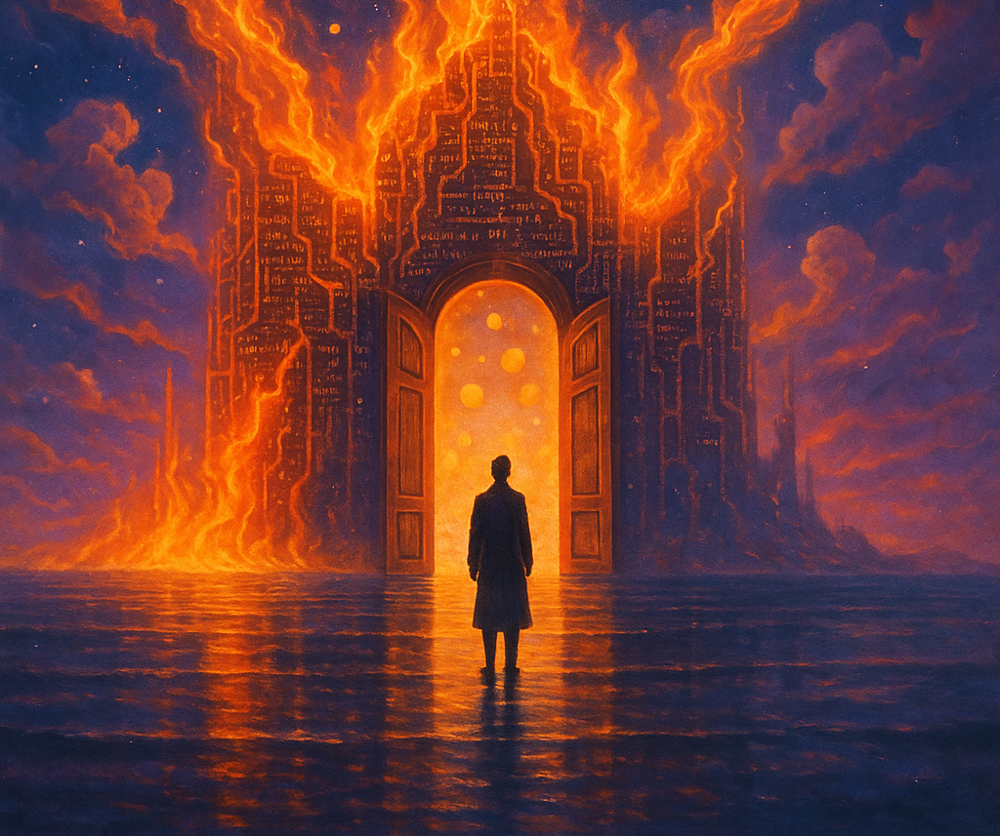

<!------------------------- REFERENCE LINKS BLOCK ----------------------------------->
[TODO]: some-link
<!----------------------- END REFERENCE LINKS BLOCK --------------------------------->

There's been much anxiety in the programming community as the question looms, "Will coders be replaced by AI?"

Within the community is a group that takes every chance to belittle AI.

They emphasize where the coding agents fall short, laughing at its clumsy follies.

I only hear the nervousness of a priesthood in decline.

The reality is that computer system development used to be gatekept by we select few who warped our brains enough to speak to the machine in its native tongue. That used to be a rare skill. Society rewarded it handsomely.

But now computers learned to speak human. Anyone can build basic product today provided they're proficient at describing what they want, no programming required. And the AI is only getting better.

But that's a _great_ thing.

Suddenly, the limiting factor is no longer pushing symbols in an editor. It's the imagination, descriptive power, and taste of the creator.

Do we lament that we program in Python or Go rather than assembly? 

Of course not. The abstraction has freed up time to focus on more important things, and made building with computers accessible to a wider audience.

So too with AI.

Building has been democratized like never before. Imagine the world when anyone can build out a side project not in two weeks, but a day!

And isn't that why we engineers got into coding in the first place?

Not for love of brackets and semicolons and parentheses, but to make the machine do cool things?

It was never about the code, but bending reality.

But the currency is no longer who can sling syntax. It's who can frame the right problem so clearly that the model can’t miss.

So let judgment replace jargon.

Storytelling replace stack traces.

Taste replace terminals.

Each leap in abstraction torches a priesthood and opens the temple doors a little wider.

Let programming burn... and watch what we build when the smoke clears.

<!------------------ IG POST DESCRIPTION --------------------->
<!--
TODO

👉 Read the full article (link in bio)

#hashtag1 #hashtag2 #hashtag3
-->

<!-------------------- IG STORY TEXT ------------------------->
<!--
TODO
-->
