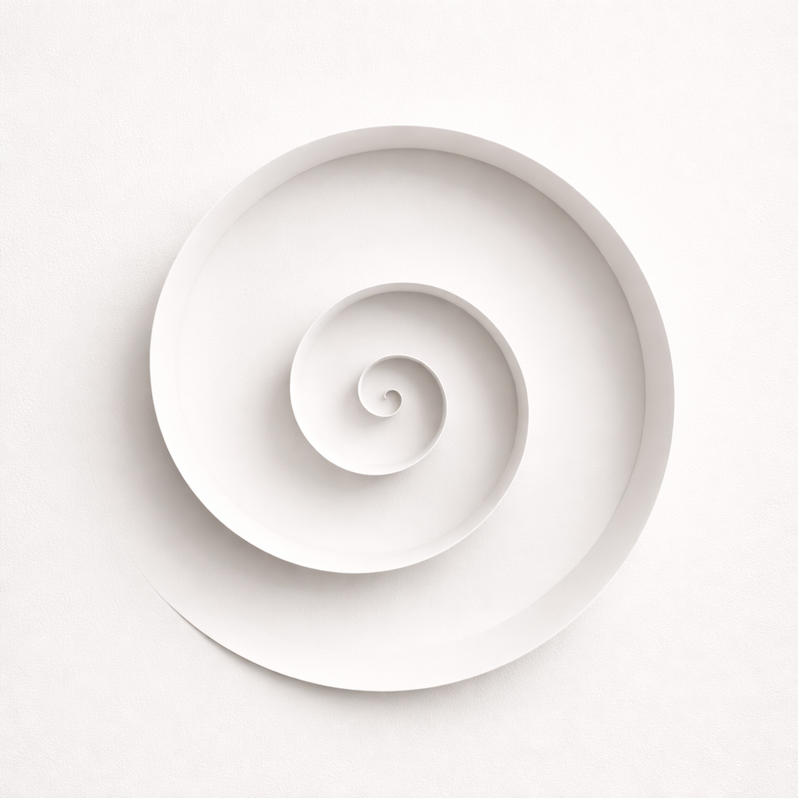
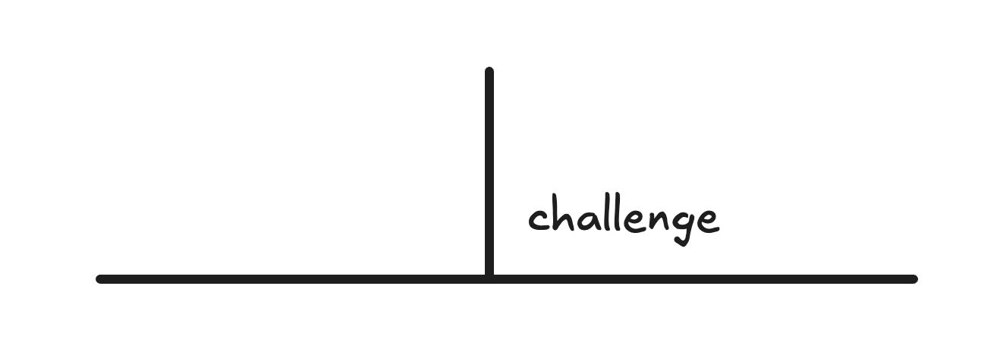
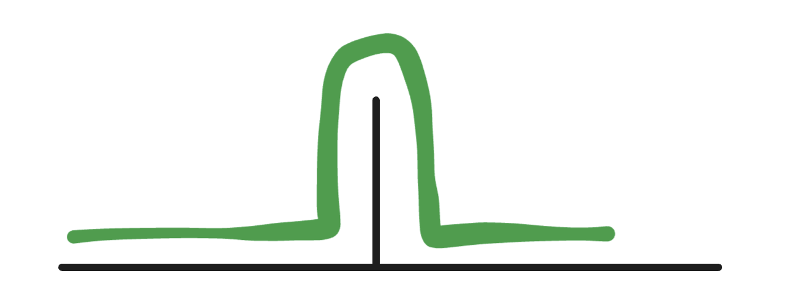
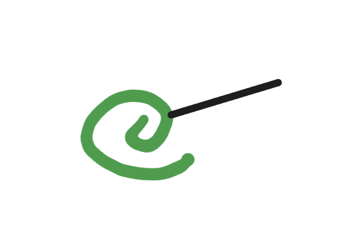
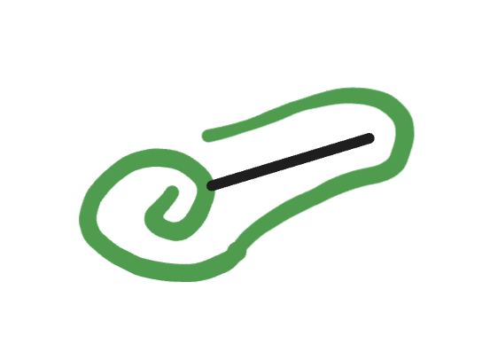
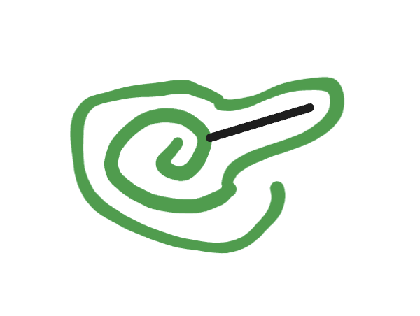
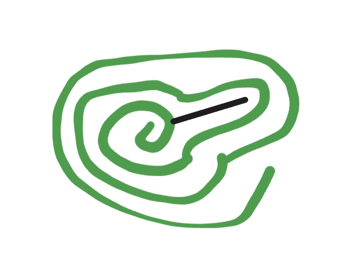
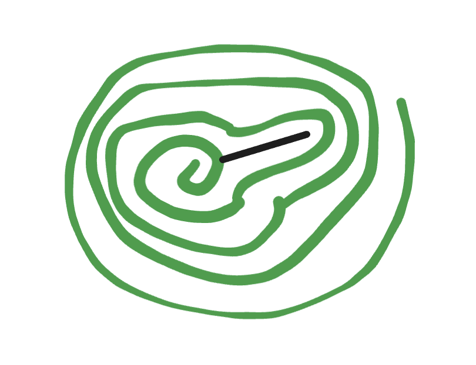

<!------------------------- REFERENCE LINKS BLOCK ----------------------------------->
[TODO]: some-link
<!----------------------- END REFERENCE LINKS BLOCK --------------------------------->

Life Is A Spiral
===============
Life is not hurdles

I used to think life was like running hurdles.

Life presents you with a challenge...

...you overcome it...

...and then you're good.

In reality, life is a spiral.

You get presented with a challenge...

...you overcome it...

...and then it keeps coming back around again...

...and again...

But each time it gets easier.

You grow, the bump smooths, and eventually you don't even notice it:

Life is a spiral.

TODO SUBSCRIBE BUTTON

-----------

If this post was useful to you, here's more of my writing:

- [The Goal Is Unique Work](https://mieubrisse.substack.com/p/the-goal-is-unique-work)
- [Psychic War Defense Systems](https://mieubrisse.substack.com/p/psychic-war-defense-systems)
- [The Sleep Guide](https://mieubrisse.substack.com/p/the-sleep-guide)
