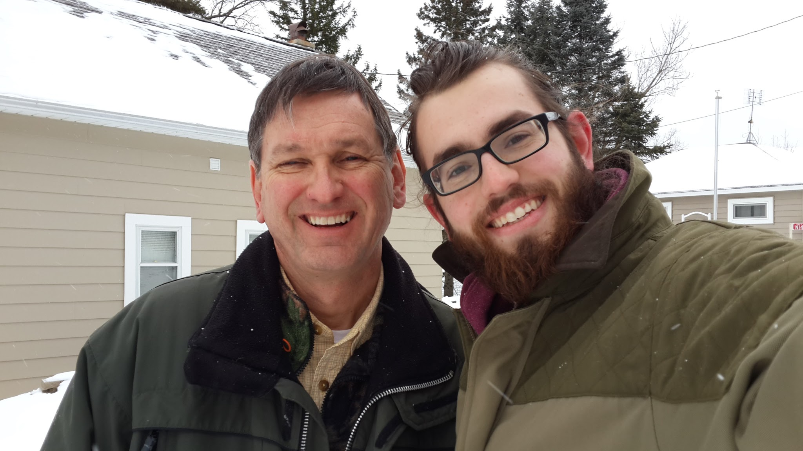

Masculine Archetypes
====================
_Written 2021-08-14_
This essay explores my journey of discovering and thinking about masculine archetypes.

Rugged, Refined, Rakish
-----------------------
I was first introduced to the idea of masculine archetypes in 2018 while my friend [Galen](https://twitter.com/galenmarchetti) and I were going deep on male style. Galen had found [Masculine Style's three fashion archetypes, Rugged, Refined, and Rakish](https://masculine-style.com/rugged-refined-and-rakish/), and as I read the breakdowns (which are well-described in the link and I won't repeat here) I felt that intuitive gut feeling of "Yes, this is describing something real." I was just coming out of a long-haired, bracelets-and-necklaces style phase inspired [by my seduction heroes][what-seduction-means-to-me], and it was clear to me how I'd been dressing as a [Rake](https://masculine-style.com/rugged-refined-and-rakish-rakish/) and was now seeking a more [Rugged](https://masculine-style.com/rugged-refined-and-rakish-rugged/) look. In Masculine Style's terms, I'd been dressing very Play and was now seeking more Danger to represent how I felt physically more dangerous training jiu jitsu.

    
    
<i>January 2016, shortly before cutting my hair and beard</i>

Galen and I played around with this for several years, but as I thought more about the three archetypes I began to feel like things were missing. Masculine Style's modelling was definitely touching something real, but where did hipsters or hippie guys fit? Rugged was all Danger and Rake was all Play, but did Refined really sit halfway in the middle of the spectrum? And if something as drastically different as Refined was halfway in between, were there other drastically different archetypes elsewhere? As a whole, I felt like there were additional dimensions beyond Danger and Play that weren't described.

Warrior, Lover, Magician, King
------------------------------
In May of this year I went on [The Natural Lifestyles' Eurotour seduction workshop](https://theeurotour.com/) and met [Shae Matthews](https://www.shaematthews.com/), one of the TNL coaches I'd long respected. His focus on the workshop was helping us remove ideologies that no longer served us so we could replace them with more productive ideologies, and during one of the sessions he introduced us to the [Robert Moore's Warrior/Lover/Magician/King masculine archetype modelling](https://www.goodreads.com/book/show/91781.King_Warrior_Magician_Lover). Once again, I felt the intuitive "Yes, this describes something _real_" sensation in my gut as I reflected on my life. I didn't feel respected or admired when young so I sought power, strengthened my Magician, and became a respected engineer at Palantir. I felt disconnected from women so [I studied seduction to channel the Lover and learn how to connect romantically][what-seduction-means-to-me]. I didn't feel capable of defending myself, so I embraced the Warrior as I learned jiu jitsu and MMA. And as I sat in the grass of Shevchenko Park in Kiev and thought about the engineers I'd mentored at Palantir, my love of teaching, and my excitement to level up a team at Kurtosis, I realized that my King energy was coming online.

Shae had just given us a high-level overview, so naturally I had to read the book.

* First started hearing about RRR
    * This felt good - felt like it was describing something that I felt
    * But, also felt like it was missing _something_
    * E.g. describiing hipsters and hippies as Rakes felt overly-broad
    * I didn't really understand Refined
    * Underlying feeling I had was that it was missing some dimensions

Warrior, Lover, Magician, King
------------------------------
* Heard about WLMK from Shae Matthews
    * Really resonated with me - felt intuitively more descriptive than RRR
    * Matched my own life:
        * The Magician came online first
        * Then the Lover
        * Then the Warrior
        * Finally the King
* Read WLMK
    * Really resonated with the archetypes, in particular:
        * King, as generative & lawgiver
        * I saw the Addicted Lover inside myself
    * Still felt like it was missing something - e.g. where does the Outlaw fit in into the archetypes?

Expanding To Full Archetypes
----------------------------
* Made my list of archetypes that I intuitively felt

12 Jungian Archetypes
==================
* Jester made sense now
* Outlaw as a full category made sense

WLMK Archetypes
===============
* Warrior
    * Discipline
    * Violence
    * Protection
    * Tactical
    * Action-oriented
    * Decisive
    * Able to endure pain
* Lover
    * Curious about people
    * Empathetic
    * Connector
    * Appreciator of art
    * Living in the moment
* Magician
    * Knower of secret knowledge
    * Understander of reality
    * Spirit guide
    * User of technology
    * Innovator????
* King
    * Organizer
    * Tames chaos
    * Sets rules
    * Levels people up

Archetypes I feel
=================
* Charming Outlaw
    * Pirate
    * Pimp
    * Pickup artist
    * Robin Hood
    * Johnnie Depp
    * Russell Brand?
    * Hugh Hefner?
    * Richard Branson?
    * Crypto millionaire????
    * Rockstar?????
* Adventurer/Treasure Hunter
    * Indiana Jones
    * Nathan Drake
    * Conan the Barbarian???
    * Lord Byron??????
* Trickster
    * Court jester
    * Loki
    * Penn & Teller
    * Theo Von
    * Russell Brand
    * Andrew Schulz?????
* Silent Man of Action
    * Ryan Gosling in Blade Runner
    * James Bond
    * John Wick
    * Ethan Hunt
* Rugged Outdoorsman
    * Teddy Roosevelt
    * Bear Grylls
    * Steve Irwin
    * Lewis & Clark
* Guardian
    * Wild West sheriff
    * Policeman
    * Firefighter
    * EMT
    * Doctor?
* Spirit Guide
    * Journeyed inwards
    * Shaman
    * Therapist (Geoff)
    * Meditation teacher
    * Yoda
    * Obi-Wan Kenobe
    * Gandalf
    * Cult leader???
    * Ayahuasquero
    * Bohemian/hippie??????
* Mastermind?
    * Sherlock Holmes
    * Moriarty
    * Hannibal Lecter
* Seducer/Lover (Dandy??)
    * Casanova
    * Don Juan
    * Lord Byron
    * Zan Perrion
* Inventor/Innovator/Technologist (Wizard??)
    * Elon Musk 
    * Ben Franklin
    * Entrepreneur founder
* Connected/High Roller
    * DJ
    * Jeff Bezos
    * Elon Musk
    * Wall Street trader
    * VC
* Wise King
    * Marcus Aurelius
    * King Solomon
    * Alexander the Great
    * Father
    * Mafia godfather????

[king-warrior-magician-lover]: https://www.goodreads.com/book/show/91781.King_Warrior_Magician_Lover
[what-seduction-means-to-me]: ./what-seduction-means-to-me.md
