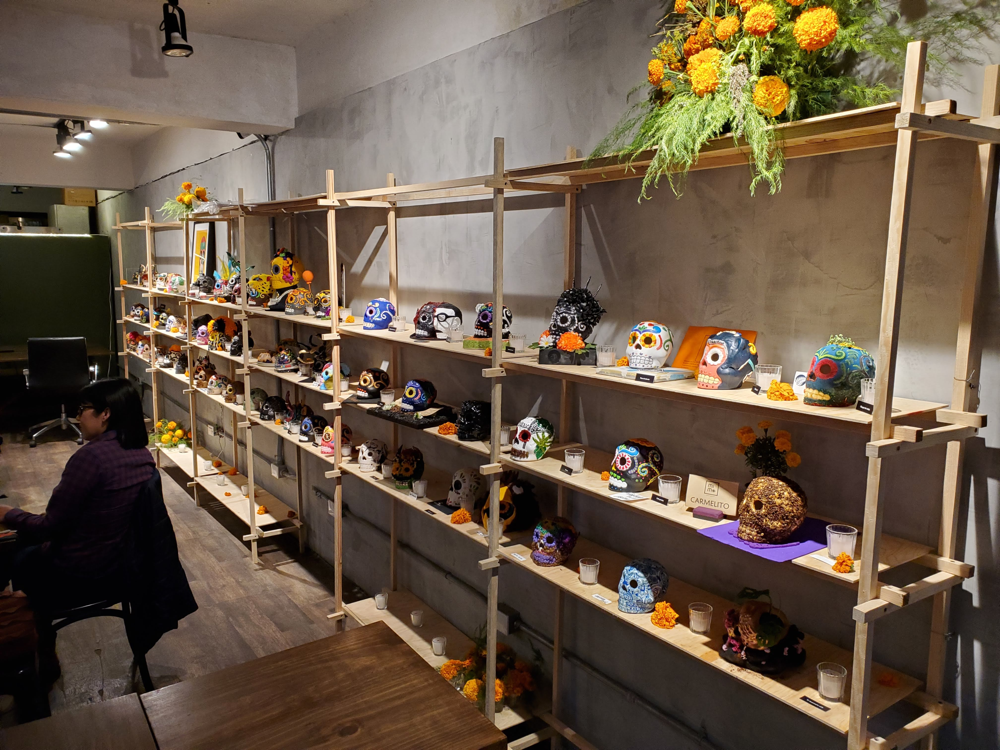
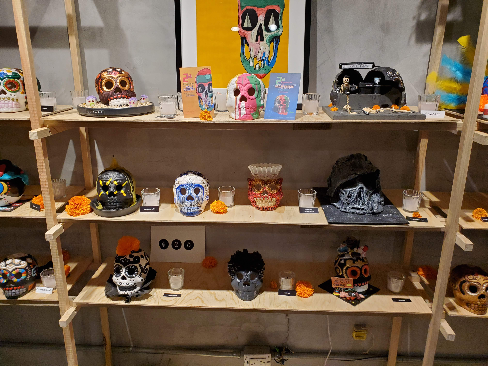
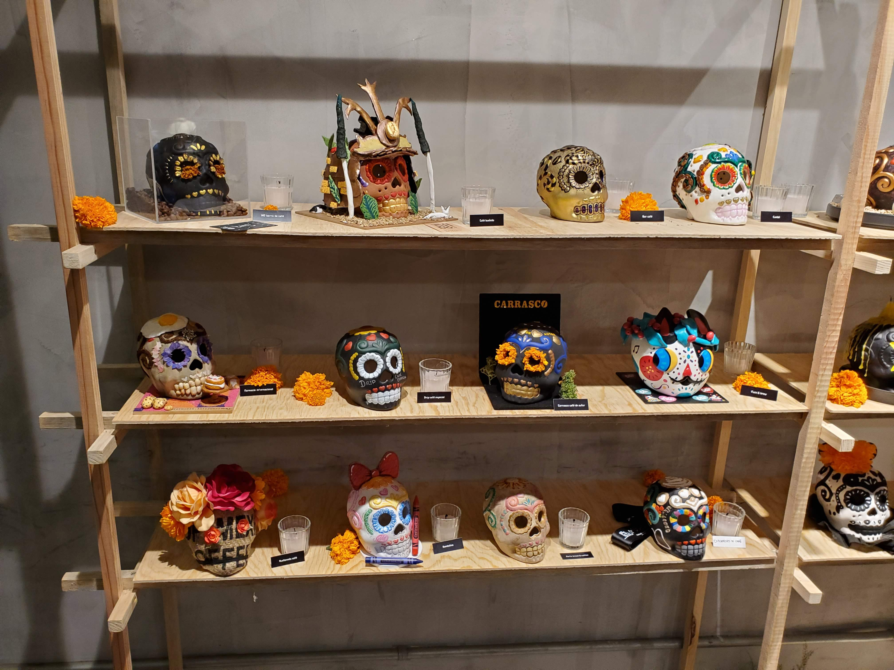
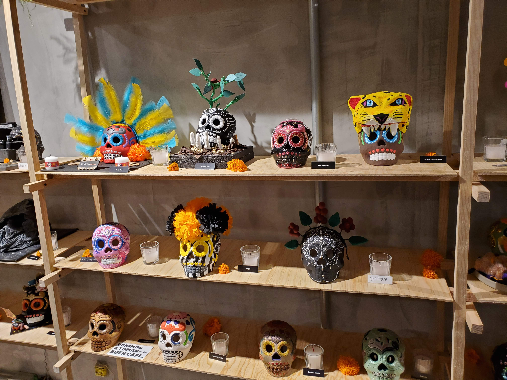

_First written on 2021-10-24, and updated periodically afterwards_

One of my favorite ways to pass a Saturday or Sunday is in a Third Wave coffeeshop with great ambience, paleo food, excellent pourover coffee, chill music, and my laptop (naturally, [this is where I'm writing this article now](https://www.elilusionista.mx/)). I'm not exactly sure why this appeals to me so much - perhaps a semblance of comfort/home, given how long I've been travelling? - but it resonates on such a level that for the past 7 years I've been building [a Spotify playlist of music I'd play in the cafe I plan to open one day](https://open.spotify.com/playlist/30XMfauACKupUMTgcq0xeP?si=dd5a9d5799e04d87). I've formed a stable of preferred cafes during my last year in Mexico City ([Blend Station](https://blendstation.com.mx/), Cafe Curado, and [Boicot Cafe](https://boicotcafe.com/)), and I've mostly stuck to them during the past months.

That said, I'm always up for [some exploring during my exploiting](https://medium.com/data-science-for-everyone/the-explore-exploit-dilemma-436cb1edff0d) and yesterday I hit the jackpot: Cafe Curado was displaying an exhibit of Dia de los Muertos skulls, each designed by a specialty coffee shop in Mexico City and tagged with the cafe's name. 

    

        
        
    

    

        
        
    

 

The skulls were undoubtedly beautiful, but the real treasure was the list of names. Cafes with true specialty coffee - high-quality beans, prepared with a pourover method like V60 or Chemex - are surprisingly difficult to find as many cafes brand themselves "specialty" or "Third Wave" to freeload off the popularity of the movement while serving only espressos and [whipped cream bullshit](https://i.pinimg.com/736x/32/b9/02/32b9028c101a12357ca45dc181e2314b.jpg). In assembling their exhibit, Cafe Curado had inadvertently given me a wealth of new cafes who met my hard requirement. I wrote down the names, found them all on Google, removed the ones that didn't have physical locations, and gathered them into [a list that I could view on Google Maps](https://goo.gl/maps/zbprzrahT74MxKzy8). 

Thus began The Great Mexican Cafe Adventure Of 2021. Over the course of the next few months, I'll be visiting as many of these cafes as feasible and rating them on a 1-to-10 scale on the aspects that I care the most about:

* **Ambience:** How good does it feel to sit and work in the cafe? Is the interior design welcoming? Is the music conducive to relaxing, or is it too loud/annoying?
* **Coffee:** Is the coffee any good? Preparation matters heavily in pourover coffee; great beans can easily be ruined with the wrong grind or too much water.
* **Food:** Do they serve food with protein & vegetables, or just sugar-filled carbohydrate nonsense? Often a weak point for specialty coffeeshops.
* **Utilities:** How's the bathroom? Are there power chargers? Are the tables & chairs functional for working, or are they tiny?
* **Service:** I'm not as fussed about bad service, but am including it to give myself a metric for rewarding exceptionally good service.

2021-10-30: Alegre Cafe
-----------------------
* **Ambience:** 7/10
    * Feels quite nice - wood tables & chairs, interesting brick walls, and a subtle black-white-and-yellow color theme
    * Nice salsa music playing
    * Small pieces of neat art on the walls
    * No door and on a busy street, so lots of traffic noise from outside
    * Tile floor feels a bit too industrial; wood would be a huge improvement
* **Coffee:** 7/10
    * Quite good!
    * Multiple types of beans to pick from
    * Prepared with care
    * On the lighter side - I suspect they could have extracted a biiiit more flavor
* **Food:** 7/10
    * Mostly varying types of bagels, sweets, and salads
    * Not the most paleo-friendly or freshest ingredients, but still prepared on-demand and presented well
* **Utilities:**
    * Power outlets at nearly every table
    * Tables are comfortable, though small
    * Chairs & tables are of middling quality
    * Bathroom is somewhat janky - feels old & cramped, with cleaning supplies stored there
* **Service:** 8/10
    * Friendly, welcoming, and helpful
    * Gave me a little cup of water without needing to ask

**Verdict:** Overall, I like it! It's better for a short-term visit than a long-term one due to the traffic noise and limited food options, but for an hour or two it's very nice.

2021-10-24: El Ilusionista
-------------------------
My first cafe, and the one this article was started in.

* **Ambience:** 7/10
    * Quite welcoming, with wood furniture & panelling, tile floors, and pleasing pastel greens-and-blues coloring
    * Feels somewhat like being in a funky modern hacienda
    * Only downsides are:
        * Decor feels a _tiny_ bit hodgepodge
        * The cafe's street has a tiny of graffiti, and feels a little seedy
* **Coffee:** 7/10
    * Quite good; lots of flavor without the burnt taste of coffee prepared wrong or with old beans
    * No choice in beans though
* **Food:** 5/10
    * Light fare - avocado toast, sandwiches, and cakes
    * Nothing too hearty, but ingredients taste decently high-quality
    * That said, better than some shops
* **Utilities:** 5/10
    * Nothing amazing, though nothing bad
    * Tables and chairs are the best part:
        * Built solidly out of wood
        * Feel great to sit and work on
        * Remind me of something out of a farmhouse
    * Outlets are a bit far from tables
    * Bathroom is nice
* **Service:** 6/10
    * Pleasant and functional, but nothing extraordinary

**Verdict:** Definitely pleasant to post up for a while; food is the biggest weakness while coffee is the biggest strength. Would definitely come back.

---

[Back to index](../index.md)
