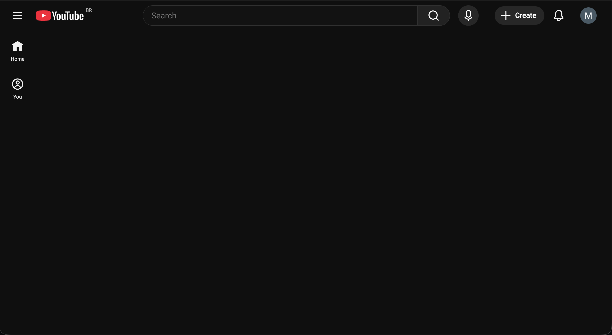

<!------------------------- REFERENCE LINKS BLOCK ----------------------------------->
[TODO]: some-link
<!----------------------- END REFERENCE LINKS BLOCK --------------------------------->

Psychic War Defense Systems
===========================
When robots are hunting your mind, you need machines of your own

_This is a continuation of my previous post, [Psychic War](https://mieubrisse.substack.com/p/psychic-war)._

Last August I was lying on my couch at 3 AM, mindlessly scrolling through Facebook shorts.

I don't even use Facebook. But I'd sat down to check something quickly (I forget what) and got grabbed the algorithm. Hours later, there I was: flicking past 15-second videos of cute cats and lemurs who knows what else. I knew this was _wrong_... but I couldn't help myself.

I was kicking myself the next morning. My Critical Voice booted up: _You know better. You fucked up AGAIN. Are you going to do this forever?_

But this time a lightbulb popped on: I remembered how NASA treats failures as system failures rather than personal failures.

My doomscrolling wasn't a personal failure.

No, it was a systems failure. Facebook's hired teams of engineers and psychologists to build robots ready to pounce whenever I'm depleted (as I was then).

I had no defenses, and the robots got in. Which Facebook would just _love_ me to think is a personal failure.

That next morning I started researching how to protect myself. Here's my system.

Philosophy
----------
A few principles guide everything below.

**Your adversaries are robots. Your defenses have to be too.**

The algorithms hunting your attention don't take days off. They don't get tired at 11 PM. They don't have a moment of weakness after a bad day at work - in fact, they get _stronger_ after your bad day, because that's when you're most vulnerable.

You can't fight automation with willpower. You fight it with automation.

Meaning, deploy tech. Build systems.

**Money is cheaper than time and psychic energy.**

People have built good products that help remove distractions. Some of these products are paid.

Yet so many people refuse to pay for them... which means they're paying with their time and psychic energy instead.

I consider a couple dollars a month well worth the price of spending my time on what's important to me.

**Take the best, leave the rest.**

Total blocking doesn't work for every site. Some apps are genuinely useful _and_ genuinely addictive - often by design.

If you've totally blocked Instagram, how do you preview that restaurant your friend recommended? If you've blocked Youtube, how do you watch that valuable tutorial your coworker sent you?

This is intentional, of course. These apps draw you in with genuinely valuable stuff, then keep you with the addictive stuff.

So we have to eliminate the bad while keeping the good. Surgical strikes, not carpet bombing.

**The internet is not for entertainment.**

This is a mindset shift, and it's the foundation for everything below. The internet is a _tool_ - for work, communication, learning, creating. It is not a leisure activity.

Take away the internet and your phone is a camera, a calculator, and a flashlight. Most of what makes your devices addictive is the internet connection.

Once you internalize "the internet is not for entertainment," the defenses below stop feeling like deprivation and start feeling obvious. You're not blocking fun. You're removing something that was never supposed to be there.

**Fall in the right direction.**

If you're relying on discipline, you have to be perfect.

You can do it right 99 out of 100 days, but one imperfect day can lead to a doomscrolling late night that tires you for the next day which makes you more likely to doomscroll the next day. Doing the right thing is hard, and doing the wrong thing is easy.

Conversely, if you set up a bunch of systems you have to _disable_ to doomscroll, it becomes hard to do the wrong thing and easy to do the right one.

> 💡 Think of it like guardrails on a mountain road. You don't need them on every straight stretch. But at the hairpin turns - late at night, after a stressful day, when you're bored and lonely - the guardrails keep you from driving off the cliff.

TODO SUBSCRIBE BUTTON

Site Blockers
-------------
I group sites into two categories.

### Hard blocks
The first are sites I've decided I don't ever need to be on:

- Porn sites
- HackerNews (there's great stuff here, but I get it from other sources)
- xkcd (I can still see comics on explainxkcd.com, without the addicting Prev/Random/Next buttons)
- Twitch.tv

I block these with [Block Site](https://chromewebstore.google.com/detail/block-site-site-blocker-f/dpfofggmkhdbfcciajfdphofclabnogo). No time windows, no exceptions. Just gone.

### Soft blocks
The second are sites that are useful during the day but have a high risk of addiction - especially at night:

- Youtube
- Reddit
- Instagram
- X
- Facebook
- Wikipedia (yep)
- Amazon (for Prime Video)

For these I use [Web Site Blocker](https://chromewebstore.google.com/detail/web-site-blocker/aoabjfoanlljmgnohepbkimcekolejjn) with time rules so that the above sites are blocked between 20:30 and 07:15.

I then configure it with an exception so that my Instagram and X profile pages are always allowed, allowing me to produce content but not consume it.

### Passwords
Both site blockers are secured with a password.

That password is randomly generated, 30 characters long, and written down on a piece of paper in my apartment. Not digital, so I can't copy-paste.

If I want to make changes, this forces me to be at home and type a long-ass password by hand. It's the digital equivalent of putting your alarm clock across the room - by the time you've walked over to it, you're awake enough to make a better decision.

App Blockers
------------
I've determined that I want 8 hours of sleep.

Meaning, I need to be in bed for 9 hours.

Working backwards gives me a bedtime of 22:00.

My [sleep guide](https://mieubrisse.substack.com/p/the-sleep-guide) taught me I need about 1.5 hours of downtime before bed to fall asleep easily.

So I've configured my laptop and phone to block apps with a high risk of addiction after 20:30.

On my Macbook, I use [Mac's Downtime feature](https://support.apple.com/guide/mac-help/manage-downtime-in-screen-time-mchl69510069/mac) to block everything except specific allowed apps which aren't going to wind me up.

Some example whitelisted apps:
- Terminal
- Spotify
- Claude
- 1Password
- Todoist
- Notion

Everything else gets blocked, including:
- Chrome
- Gmail
- Whatsapp
- iMessages

On my Pixel, I do the equivalent using [AppBlock](https://appblock.app/). These apps get blocked after 20:30:
- Instagram
- Chrome
- Whatsapp
- Discord
- Gmail

I've also configured it so that Instagram only unblocks at 07:30 and Discord at 09:00, so there's no risk of me waking up and immediately going to them.

> ℹ️ The gap between "app blocked" and "bedtime" is intentional. 20:30 to 22:00 gives me 90 minutes to wind down with music, reading, journalling, or playing guitar. This buffer is critical. If your apps are available right up to bedtime, you'll be doomscrolling at 21:59 and wondering why you can't fall asleep.

Per-App Defenses
----------------
Blocking apps on a schedule covers the most dangerous hours, but some apps need additional surgery even during the day. These are apps where the core functionality is useful but the engagement features are designed to trap you.

### Instagram
The Feed and the Search page were the two biggest Instagram black holes for me.

On my Macbook I've installed [Antigram](https://chromewebstore.google.com/detail/antigram-explore-reels-bl/igbheapdmolhhmmklmkfjjjncmhihfjh) to block both.

On my phone I've installed [Distraction Free Instagram](https://www.distractionfreeapps.com/), and configured it to remove the Search grid and Feed as well. Instagram becomes just a messaging and posting tool - the useful parts, minus the black hole.

> ⚠️ Distraction Free Instagram is _amazing_, but it seems to be a side project by a dev out of Australia. You might need a VPN to access the site, Instagram obviously doesn't like these tools existing, and the guy releases updates rarely. But it's worth the trouble.

### Reddit
In addition to being blocked after 20:30, I've installed [Old Reddit Redirect](https://chromewebstore.google.com/detail/old-reddit-redirect/dneaehbmnbhcippjikoajpoabadpodje) to force the old Reddit design. New Reddit is a dopamine slot machine. Old Reddit looks like it was designed by someone who thinks "user engagement" is a dirty word. Perfect.

> ℹ️ Photos uploaded directly to Reddit's own image-hosting service won't load with Old Reddit. I consider it an acceptable tradeoff - less content to get sucked into.

### Youtube
Youtube is the biggest risk for me, so I've invested heavily in controlling it (beyond blocking it after 20:30). I have three Chrome extensions working together to defang it.

**[BlockTube](https://chromewebstore.google.com/detail/blocktube/bbeaicapbccfllodepmimpkgecanonai)** silently removes content that's likely to distract me. I've configured it to:

- Block videos with titles containing trigger words (minecraft, warcraft, gameplay, prank, etc.)
- Block the Explore page entirely
- Block Youtube Shorts
- Block Youtube's auto-generated playlists
- Block specific channels by name and ID that are my kryptonite (MrBeast, Daily Dose of Internet, etc.)

Helpfully, BlockTube doesn't show you a "this was blocked" placeholder - it just removes the result like it never existed. You don't get tempted by what you can't see.

**[Improve Youtube](https://chromewebstore.google.com/detail/improve-youtube-video-you/bnomihfieiccainjcjblhegjgglakjdd)** strips out the engagement machinery Youtube wraps around every video. I've configured it to:

- Set the Youtube home page to empty - no video previews at all
- Hide Shorts everywhere (home page, search results, sidebar)
- Hide sponsored videos on the homepage
- Hide the pause overlay that suggests more videos when you pause
- Hide thumbnail autoplay
- Disable video playback on hover
- Block end-of-video autoplay
- Hide the sidebar
- Disable trailer autoplay on channel pages

**[Clickbait Remover for Youtube](https://chromewebstore.google.com/detail/clickbait-remover-for-you/omoinegiohhgbikclijaniebjpkeopip)** replaces thumbnails with an actual frame from the start of the video and normalizes titles to regular capitalization.

Combined, these extensions work great. Here's what my Youtube looks like:

My home page - no videos pushed to me at all:

Search results for "mrbeast" - his channel is blocked, and the remaining results have real thumbnails instead of clickbait:

Playing a video - no sidebar recommendations, no popup suggestions:

Youtube went from my biggest time sink to a search engine for specific videos I intentionally want to watch. The internet is not for entertainment, and now my Youtube reflects that.

### LinkedIn
I've installed [LinkOff](https://chromewebstore.google.com/detail/linkoff-disconnect-from-l/liagghebhiciplbhejpnmcfbfadgnkpa) to remove the LinkedIn feed. I can still navigate profiles, but don't get pushed anything.

### General news sites
Most news sites are covered with clickbait sidebars, autoplay videos, and "YOU MIGHT ALSO LIKE" sections engineered to keep you scrolling. I use [JustRead](https://chromewebstore.google.com/detail/justread-for-web-articles/dgmanlpmmkibanfdgjocnabmcaclkmod) to strip it all away and present just the article text.

> ⚠️ JustRead isn't perfect and it breaks with some sites. But it sure cuts down on the garbage.

### Surgical element removal
Some sites are mostly fine but have one or two elements that act as rabbithole on-ramps. For these I use [uBlock Origin Lite](https://chromewebstore.google.com/detail/ublock-origin-lite/ddkjiahejlhfcafbddmgiahcphecmpfh) to surgically remove specific page elements.

For example, Stack Overflow's "Related Questions" sidebar was great at sending me down distracting tangents. I blocked it, and am calmer for it.

### Cookies
Cookie popup spam is a significant source of distraction. To control this I use:

[I Still Don't Care About Cookies](https://chromewebstore.google.com/detail/i-still-dont-care-about-c/edibdbjcniaddombaafbhiccbalhmcng) which accepts these for you, paired with Cookie AutoDelete to default clear website cookies for any site not on my whitelist.

> ⚠️ Cookie AutoDelete isn't available on the Chrome extension store since Chrome's Manifest V3 change that took out huge swathes of the app store. I'm using a manually-installed version from [here](https://github.com/median-dxz/Cookie-AutoDelete-MV3/releases).

### Tiktok
I don't use or have Tiktok because I think it's bad for me, so this is easy.

### Streaming services
I don't subscribe to Netflix or any other streaming service. This is the same idea as "diet starts at the grocery store": what you allow in your house is what you'll consume. I don't want to spend my time binging shows, so I ensure not to have it available.

Phone
-----
### Charging location
Whenever I don't need an alarm the next morning, I charge my phone outside the bedroom. This removes the "wake up and immediately scroll" reflex entirely.

When I do need an alarm, I try to put the phone across the room. Same principle as the 30-character password: add friction between you and the bad decision.

I'm planning to take this further by getting a dedicated old phone that does nothing but run my alarm app (I use a gentle wave wakeup). That way my phone can stay out of the bedroom permanently.

### Notifications
I've turned off all buzzing and sounds for my phone notifications, because my focus is intentional: _I_ choose where my attention goes, not some app.

The only sounds I allow are:
- Calendar event reminders, so I don't miss meetings
- Ringing for incoming Whatsapp and phone calls

Everything else is silent.

Beyond sounds, I use the Pixel's notification settings to block notifications entirely from apps that have no business interrupting me. The Substack app, for example, should never send me a push notification - I get those through email, on my own schedule.

For apps that do need notifications but are prone to spamming (food delivery apps are terrible about this), I disable everything except the essential ones like when my food is actually arriving.

I also have no push notifications for Whatsapp, Instagram, or any messaging app. This is deliberate. I want to be _poll-based_, not _push-based_: I make the decision "I need to check this" rather than the app deciding "you need to check this right now."

> 💡 I think of it as the **principle of least urgency**: apps should be configured to deliver notifications via the least urgent channel possible. It's really not essential that I know about a new Substack post the instant it drops. Email is fine. So my urgency tiers look like this:
>
> Email → push notification without sound (I see it when I check) → push notification with sound → phone actually rings
>
> Very few things in life belong in that last tier.

In the Pixel phone app I've also turned on "block spam calls," and it works great.

This is all in line with my [Inputs, Not Outputs](https://mieubrisse.substack.com/p/inputs-not-outputs) principle. If your personal factory is generating a lot of distraction and reducing your focus, you have to tune the settings on your factory to enable what you actually want - i.e. focus.

The Emotional Component
-----------------------
All the systems above are necessary. But they're not sufficient.

My therapist specializes in addiction, and once told me: "Addictions always have an emotional component."

When I find myself with a strong desire to use the internet for "relaxation" - especially at night - I've started journaling instead.

Turns out, I'm at a 100% correlation between "wanting to use the internet for entertainment" and "there's some negative something swimming in my semi-conscious, perhaps not even noticed."

Loneliness. Frustration. Feelings of inferiority. General stress and anxiety.

Sometimes it's not even something I can name right away - just a vague sense of _not okay_ that I'm trying to numb.

The internet isn't the problem in those moments. It's the anesthetic.

And like any anesthetic, it doesn't fix the underlying issue. It just delays the reckoning while adding a hangover on top.

So now, when I feel that pull - that itch to open Youtube or scroll through something, _anything_ - I try to pause and ask: what's actually going on right now? Naming and addressing that has been insightful.

> 🤔 The defense systems in this post handle the robots. But the emotional component is about handling yourself. No amount of Chrome extensions will fix loneliness. The systems buy you time and space to notice what's actually going on, so you can address _that_ instead of numbing it.

Conclusion
----------
The modern internet is a psychic battlefield, and most of us are walking around without armor.

The defenses I've described aren't complicated. They're Chrome extensions, app blockers, and a piece of paper with a long password. None of this is rocket science. But it _is_ a system - and systems beat willpower every single time. Consistency over intensity.

A few questions to sit with:

Where are your biggest psychic vulnerabilities? What apps or sites do you _know_ are stealing your time, but you haven't done anything about?

What would it look like to set up defenses so that doing the right thing is the _easy_ thing?

And when you feel the pull to scroll - what might be hiding underneath that urge?

TODO SUBSCRIBE BUTTON

-----------

If this post was useful to you, here's more of my writing:

- [Psychic War](https://mieubrisse.substack.com/p/psychic-war) - the predecessor to this post, on the battle for your attention
- [Inputs, Not Outputs](https://mieubrisse.substack.com/p/inputs-not-outputs) - on concentrating your effort where it counts
- [The Sleep Guide](https://mieubrisse.substack.com/p/the-sleep-guide) - the comprehensive guide to fixing your sleep
- [The Goal Is Unique Work](https://mieubrisse.substack.com/p/the-goal-is-unique-work) - why you should stop spending time on things society already knows how to do
