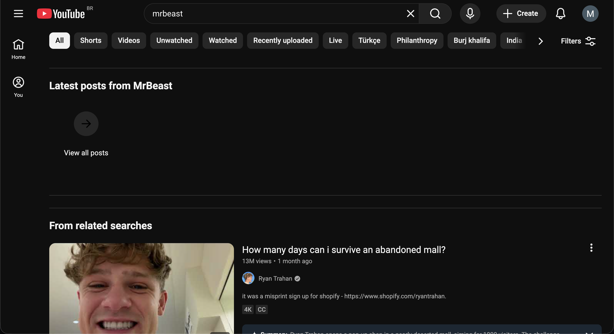
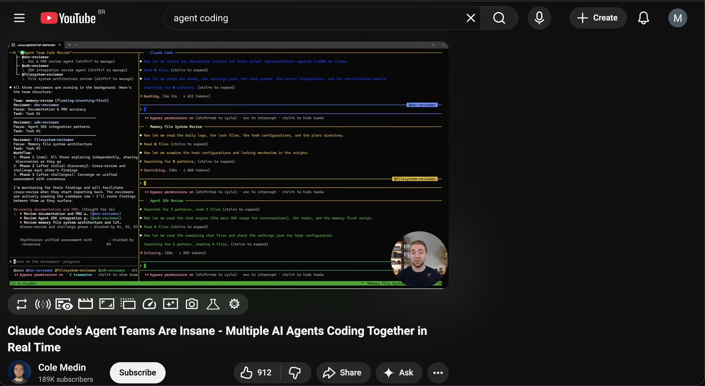

<!------------------------- REFERENCE LINKS BLOCK ----------------------------------->
[TODO]: some-link
<!----------------------- END REFERENCE LINKS BLOCK --------------------------------->

Psychic Warfare Defense Systems
===============
Keeping your mind safe

Last August I was lying on my couch at 3 AM, thumb scrolling through Facebook Shorts like a lab rat pressing the pellet lever.

I don't even _use_ Facebook.

I'd opened the app to check one thing - a message from a friend - and sixty seconds later I was watching a man in rural India fry an egg on a shovel. Then a street fight in Philadelphia. Then a golden retriever that could "sing." Three hours gone. Not in a flow state. Not learning anything. Just... gone.

The next morning I felt so dumb. The familiar self-talk started: _You're weak. You know better. Just have more discipline._

But then something clicked. I'd just written [a post about psychic warfare](https://mieubrisse.substack.com/p/psychic-war) - about how billion-dollar companies deploy armies of engineers and psychologists to capture your attention, and how framing it as a discipline problem is _exactly_ what those companies want you to think.

And here I was, doing it to myself.

This wasn't a personal failure. It was a systems failure. I had no defenses, so the robots got in.

That morning I started building the defense systems I'm going to share with you today.

Philosophy
----------
A few principles guide everything below.

**Your adversaries are robots. Your defenses have to be too.**

The algorithms hunting your attention don't take days off. They don't get tired at 11 PM. They don't have a moment of weakness after a bad day at work - in fact, they get _stronger_ after your bad day, because that's when you're most vulnerable.

You can't fight automation with willpower. You fight it with automation.

Meaning, deploy tech. Build systems.

**Money is cheaper than time and psychic energy.**

People have built good products that help remove distractions. Some of these products are paid.

Yet so many people refuse to pay for them... which means they're paying with their time and psychic energy instead.

I consider a couple dollars a month well worth the price of spending my time on what's important to me.

**Take the best, leave the rest.**

Total blocking doesn't work for every site. Some apps are genuinely useful _and_ genuinely addictive - often by design.

If you've totally blocked Instagram, how do you preview that restaurant your friend recommended? If you've blocked Youtube, how do you watch that valuable tutorial your coworker sent you?

This is intentional, of course. These apps draw you in with genuinely valuable stuff, then keep you with the addictive stuff.

So we have to eliminate the bad while keeping the good. Surgical strikes, not carpet bombing.

**The internet is not for entertainment.**

This is a mindset shift, and it's the foundation for everything below. The internet is a _tool_ - for work, communication, learning, creating. It is not a leisure activity.

Take away the internet and your phone is a camera, a calculator, and a flashlight. Remarkably boring. Most of what makes your devices addictive is the internet connection, and the robots on the other end of it.

Once you internalize "the internet is not for entertainment," the defenses below stop feeling like deprivation and start feeling obvious. You're not blocking fun. You're removing something that was never supposed to be there.

**Fall in the right direction.**

If you're relying on discipline, you have to be perfect.

You can do it right 99 out of 100 days, but one imperfect day can lead to a doomscrolling late night that tires you for the next day which makes you more likely to doomscroll the next day. Doing the right thing is hard, and doing the wrong thing is easy.

Conversely, if you set up a bunch of systems you have to _disable_ to doomscroll, it becomes hard to do the wrong thing and easy to do the right one.

> 💡 Think of it like guardrails on a mountain road. You don't need them on every straight stretch. But at the hairpin turns - late at night, after a stressful day, when you're bored and lonely - the guardrails keep you from driving off the cliff.

TODO SUBSCRIBE BUTTON

Site Blockers
-------------
I group sites into two categories.

### Hard blocks
The first are sites I've decided I don't ever need to be on:

- Porn sites
- HackerNews (there's great stuff here, but I get it from other sources)
- xkcd (I can still see comics on explainxkcd.com, without the addicting Prev/Random/Next buttons)
- Twitch.tv

I block these with [Block Site](https://chromewebstore.google.com/detail/block-site-site-blocker-f/dpfofggmkhdbfcciajfdphofclabnogo). No time windows, no exceptions. Just gone.

### Soft blocks
The second are sites that are useful during the day but have a high risk of addiction - especially at night:

- Youtube
- Reddit
- Instagram
- X
- Facebook
- Wikipedia (yep)
- Amazon (for Prime Video)

For these I use [Web Site Blocker](https://chromewebstore.google.com/detail/web-site-blocker/aoabjfoanlljmgnohepbkimcekolejjn) with time rules so that the above sites are blocked between 20:30 and 07:15.

I then configure it with an exception so that my Instagram profile page and my X.com profile page are always allowed, thereby allowing me to produce content but not consume it.

### Passwords
Both site blockers are secured with a password.

That password is randomly generated, 30 characters long, and written down on a piece of paper in my apartment. Not digital, so I can't copy-paste.

If I want to make changes, this forces me to be at home and type a long-ass password by hand. It's the digital equivalent of putting your alarm clock across the room - by the time you've walked over to it, you're awake enough to make a better decision.

App Blockers
------------
I've determined that I want 8 hours of sleep.

Meaning, I need to be in bed for 9 hours.

Working backwards gives me a bedtime of 22:00.

My [sleep guide](https://mieubrisse.substack.com/p/the-sleep-guide) taught me I need about 1.5 hours of downtime before bed to fall asleep easily.

So I've configured my laptop and phone to block apps with a high risk of addiction after 20:30.

On my Macbook, I use [Mac's Downtime feature](https://support.apple.com/guide/mac-help/manage-downtime-in-screen-time-mchl69510069/mac) to block everything except specific allowed apps which aren't going to wind me up.

Some example whitelisted apps:
- Terminal
- Spotify
- Claude
- 1Password
- Todoist
- Notion

Everything else gets blocked, including:
- Chrome
- Gmail
- Whatsapp
- iMessages

On my Pixel, I do the equivalent using [AppBlock](https://appblock.app/). These apps get blocked after 20:30:
- Instagram
- Chrome
- Whatsapp
- Discord
- Gmail

I've also configured it so that Instagram only unblocks at 07:30 and Discord at 09:00, so there's no risk of me waking up and immediately going to them.

> ⚠️ The gap between "app blocked" and "bedtime" is intentional. 20:30 to 22:00 gives me 90 minutes to wind down with music, reading, journaling, or just sitting around. This buffer is _critical_. If your apps are available right up to bedtime, you'll be doom-scrolling at 21:59 and wondering why you can't fall asleep.

Per-App Defenses
----------------
Blocking apps on a schedule covers the most dangerous hours, but some apps need additional surgery even during the day. These are apps where the core functionality is useful but the engagement features are designed to trap you.

### Instagram
The Feed and the Search page were the two biggest Instagram black holes for me.

On my Macbook, I've installed [Antigram](https://chromewebstore.google.com/detail/antigram-explore-reels-bl/igbheapdmolhhmmklmkfjjjncmhihfjh) to block both.

On my phone I've installed [Distraction Free Instagram](https://www.distractionfreeapps.com/), and configured it to remove the Search grid and Feed as well. Instagram becomes just a messaging and posting tool - the useful parts, minus the black hole.

> ⚠️ Distraction Free Instagram is _amazing_, but it seems to be a side project by a dev out of Australia. You might need a VPN to access the site, Instagram obviously doesn't like these tools existing, and the guy releases updates rarely. Worth it despite the jank.

### Reddit
In addition to being blocked after 20:30, I've installed [Old Reddit Redirect](https://chromewebstore.google.com/detail/old-reddit-redirect/dneaehbmnbhcippjikoajpoabadpodje) to force the old Reddit design. New Reddit is a dopamine slot machine. Old Reddit looks like it was designed by someone who thinks "user engagement" is a dirty word. Perfect.

> ℹ️ Photos uploaded directly to Reddit's own image-hosting service won't load with Old Reddit. I consider it an acceptable tradeoff - less content to get sucked into.

### Youtube
Youtube is the biggest risk for me, so I've invested heavily in controlling it (beyond blocking it after 20:30). I have _four_ Chrome extensions working together to defang it.

**[BlockTube](https://chromewebstore.google.com/detail/blocktube/bbeaicapbccfllodepmimpkgecanonai)** silently removes content that's likely to distract me. I've configured it to:

- Block videos with titles containing trigger words (minecraft, warcraft, gameplay, prank, etc.)
- Block the Explore page entirely
- Block Youtube Shorts
- Block Youtube's auto-generated playlists
- Block specific channels by name and ID that are my kryptonite (MrBeast, Daily Dose of Internet, etc.)

The key word is _silently_. BlockTube doesn't show you a "this was blocked" placeholder - it just removes the result like it never existed. You don't get tempted by the thing you can't see.

**[Improve Youtube](https://chromewebstore.google.com/detail/improve-youtube-video-you/bnomihfieiccainjcjblhegjgglakjdd)** strips out the engagement machinery Youtube wraps around every video. I've configured it to:

- Set the Youtube home page to empty - no video previews at all
- Hide Shorts everywhere (home page, search results, sidebar)
- Hide sponsored videos on the homepage
- Hide the pause overlay that suggests more videos when you pause
- Hide animated thumbnails that auto-play to grab your eye
- Disable video playback on hover
- Prevent short videos from auto-looping
- Turn off Shorts "up next" autoplay
- Force autoplay off globally
- Hide the sidebar
- Disable trailer autoplay on channel pages

**[Clickbait Remover for Youtube](https://chromewebstore.google.com/detail/clickbait-remover-for-you/omoinegiohhgbikclijaniebjpkeopip)** replaces thumbnails with an actual frame from the start of the video and normalizes titles to regular capitalization. Turns out videos are _way_ less tempting when the thumbnail isn't a guy making an exaggerated shocked face next to a red circle.

**The combined effect is dramatic.** Here's what my Youtube looks like:

My home page - no videos pushed to me at all:

Search results for "mrbeast" - his channel is blocked, and the remaining results have real thumbnails instead of clickbait:

Playing a video - no sidebar recommendations, no popup suggestions:

Youtube went from my biggest time sink to a search engine for specific videos I intentionally want to watch. The internet is not for entertainment - and now my Youtube reflects that.

### LinkedIn
I've installed [LinkOff](https://chromewebstore.google.com/detail/linkoff-disconnect-from-l/liagghebhiciplbhejpnmcfbfadgnkpa) to remove the LinkedIn feed. LinkedIn is like if a motivational poster and a car salesman had a baby, and that baby learned to make content. I use it to manage my profile and respond to messages, not to read "thought leadership."

### General news sites
Most news sites are festooned with clickbait sidebars, autoplay videos, and "YOU MIGHT ALSO LIKE" sections engineered to keep you scrolling. I use [JustRead](https://chromewebstore.google.com/detail/justread-for-web-articles/dgmanlpmmkibanfdgjocnabmcaclkmod) to strip all of that away and present just the article text.

> ⚠️ JustRead isn't perfect - some sites break it. But most of the time it turns a dopamine minefield into a clean reading experience.

### Surgical element removal
Some sites are mostly fine but have one or two elements that act as rabbit hole on-ramps. For these I use [uBlock Origin Lite](https://chromewebstore.google.com/detail/ublock-origin-lite/ddkjiahejlhfcafbddmgiahcphecmpfh) to surgically remove specific page elements.

For example, Stack Overflow's "Related Questions" sidebar sounds helpful in theory. In practice, I'd click one tangentially-related question, then another, then another, and twenty minutes later I'm reading about a niche JavaScript edge case that has nothing to do with my original problem. So I used uBlock to remove it. The actual answer I came for is still there. The rabbit hole isn't.

This is the "take the best, leave the rest" philosophy in its purest form - you're not blocking the site, you're just removing the specific piece that grabs you.

### Cookies
Every website now asks if you accept cookies, with a giant green "ACCEPT ALL" button and a tiny grey "manage preferences" link that leads to seventeen submenus. [I Still Don't Care About Cookies](https://chromewebstore.google.com/detail/i-still-dont-care-about-c/edibdbjcniaddombaafbhiccbalhmcng) auto-dismisses all of these.

This isn't directly a psychic defense, but every one of those popups is a decision that costs you a tiny sliver of attention. Death by a thousand paper cuts.

### Tiktok
I don't use or have Tiktok, so this is easy. If you _do_ use it... I'd suggest starting with not using it.

### Streaming services
I don't subscribe to Netflix or any other streaming service.

This sounds extreme, but it's actually the easiest defense on this list. You can't binge what you can't access. Taking away the option is a remarkably effective way to keep control of your brain, because there's nothing to resist.

I still watch things - movies with friends, a show someone specifically recommends. I just don't have an infinite content buffet sitting in my living room whispering "just one more episode" at 11 PM.

The Emotional Component
-----------------------
All the systems above are necessary. But they're not sufficient.

My therapist told me something that changed how I think about this: "Addictions always have an emotional component."

When I find myself with a strong desire to use the internet for "relaxation" - especially at night - I've started journaling about it instead. And I've found something startling.

There is a 100% correlation.

Every single time I've wanted to doomscroll, there's been something bubbling underneath the surface. Something I haven't fully acknowledged. Loneliness. Frustration. Feelings of inferiority. General stress and anxiety. Sometimes it's not even something I can name right away - just a vague sense of _not okay_ that I'm trying to numb.

The internet isn't the problem in those moments. It's the anesthetic.

And like any anesthetic, it doesn't fix the underlying issue. It just delays your reckoning with it while adding a hangover on top.

So now, when I feel that pull - that itch to open Youtube or scroll through something, _anything_ - I try to pause and ask: what am I actually feeling right now? The answer is always something worth paying attention to.

> 🤔 The defense systems in this post handle the robots. But the emotional component is about handling _yourself_. No amount of Chrome extensions will fix loneliness. The systems buy you time and space to notice what's actually going on, so you can address _that_ instead of numbing it.

[AUTHOR: If you have a specific story about a time the journaling revealed something surprising underneath, it would be powerful here. E.g., "Last month I was desperate to watch Youtube and when I journaled about it I realized I was actually terrified about X."]

Conclusion
----------
The modern internet is a psychic battlefield, and most of us are walking around without armor.

The defenses I've described aren't complicated. They're Chrome extensions, app blockers, and a piece of paper with a long password. None of this is rocket science. But it _is_ a system - and systems beat willpower every single time.

A few questions to sit with:

Where are your biggest psychic vulnerabilities? What apps or sites do you _know_ are stealing your time, but you haven't done anything about?

What would it look like to set up defenses so that doing the right thing is the _easy_ thing?

And when you feel the pull to scroll - what might be hiding underneath that urge?

TODO SUBSCRIBE BUTTON

-----------

If this post was useful to you, here's more of my writing:

- [Psychic War](https://mieubrisse.substack.com/p/psychic-war) - the predecessor to this post, on the battle for your attention
- [The Sleep Guide](https://mieubrisse.substack.com/p/the-sleep-guide) - the comprehensive guide to fixing your sleep
- [The Goal Is Unique Work](https://mieubrisse.substack.com/p/the-goal-is-unique-work) - why you should stop spending time on things society already knows how to do

_Thank you to [AUTHOR: names of draft reviewers] for reviewing drafts of this post._
