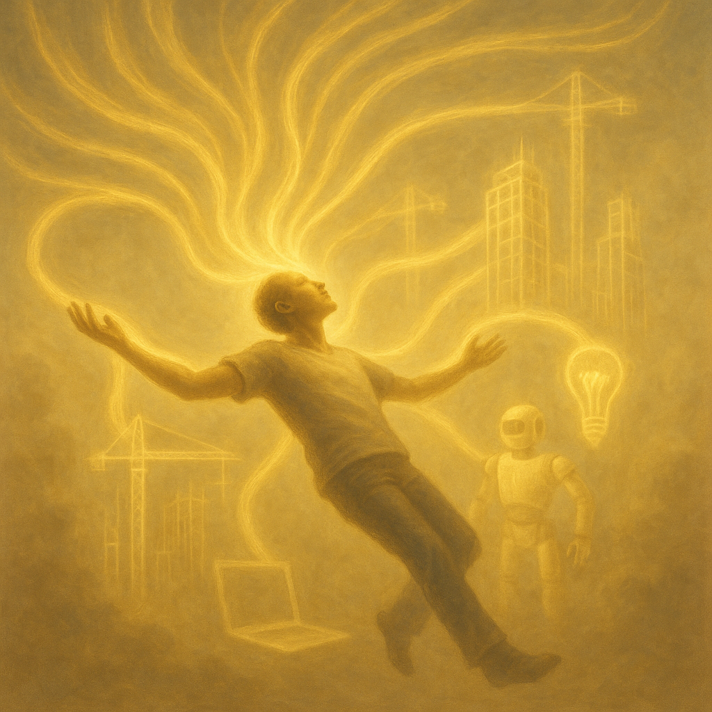

<!------------------------- REFERENCE LINKS BLOCK ----------------------------------->
[TODO]: some-link
<!----------------------- END REFERENCE LINKS BLOCK --------------------------------->

I've been contemplating:

_Why_ is technology so fascinating?

My conclusion: technology is the embodiment of efficiency. Less input = more output. 

Meaning, technology makes thoughts more clearly transform into reality.

I used to stockpile videogame ideas as a kid. I wanted to touch them, so I learned to code.

But coding is a long, laborious process. It involves heaps of note-taking and planning, window-switching, Googling, copy-pasting, typing in the terminal and IDE.

As a professional engineer this frustrated me. So I invested in personal efficiency:

- I got really good at text-editing (Vim)
- I invested in Vimium and custom search engines in Chrome, Raycast and Karabiner and keyboard shortcuts, all so I could drive my Mac without a mouse
- I built a terminal replica of the "open anything, anywhere" ⌘-K shortcut of Slack, Notion, and Discord ([cmdk](https://github.com/mieubrisse/cmdk))
- I built [a terminal-based Markdown notetaking app](https://github.com/mieubrisse/cli-journal) so I could write and retrieve at the speed of thought
- I heavily customized my terminal experience ([my Bash dotfiles](https://github.com/mieubrisse/dotfiles/blob/master/bash/bash_aliases))

For a while this was the best I could do. But then LLMs arrived.

Now I don't have to Google or code or debug myself. I can [speak to the machine](https://getharker.com/) and it's done for me.

I **love** this. It's why I wrote [Let Programming Burn](https://mieubrisse.substack.com/p/let-programming-burn).

It was never about pushing characters into an editor.

It was about thought leaping from mind into reality.

Yesterday's [post about categorizing book notes with AI was a step in that direction](https://mieubrisse.substack.com/p/categorizing-book-notes-with-ai).

But it's not enough.

I still have to babysit Cursor through small steps. 

I still write every character of these posts by hand. 

I still clean my email, book flights, schedule doctor's appointments, and order things on Amazon myself.

I want a fluid stream of idea into constructed output.

I want [Ensō](https://enso.sonnet.io/) where reality reshapes itself to my flow.

I want to speak an idea over morning coffee and have it ready by the time I've finished bacon.

I want to summon an Android app with a sentence in the shower.

The ultimate flow state.

Sandbox games like Minecraft have thought hard about this problem, and we [see it in the real world occasionally](https://www.youtube.com/watch?v=PUv66718DII).

But what exactly is "it"? What's the essence of the thing?

"It" is removing all non-unique work.

“It” is cutting out everything that’s not you.

Naval Ravikant says that money is earned by providing society with something it doesn't already know how to get.

Society already knows how to switch between windows, book a dentist appointment, check in for a flight, or push words to an editor (be they code or blog post).

But society doesn't know how to get another you.

Everyone knows how to place a block in Minecraft. But until it comes from you, nobody knows which particular blocks in which combination summon the idea in your mind.

It's no accident the Substack-iverse is exploding with [posts about](https://substack.com/home/post/p-161399572) the [importance of taste](https://signull.substack.com/p/wear-the-hat) in the wake of the LLM revolution.

"Taste" is you, personified.

Rick Rubin isn't a musician, and that's good because society already knows how to play instruments.

Steve Jobs wasn't a coder, and that's great because he got to focus on expressing the unique essence of Jobs.

So why are we spending all our time doing things society already knows how to do?

Why are we still placing blocks?

TODO SUBSCRIBE BUTTON

<!------------------ IG POST DESCRIPTION --------------------->
<!--
There's only one you. Why are you wasting your time doing things anyone can do?

Full article at link in bio.
-->

<!-------------------- IG STORY TEXT ------------------------->
<!--
TODO
-->
