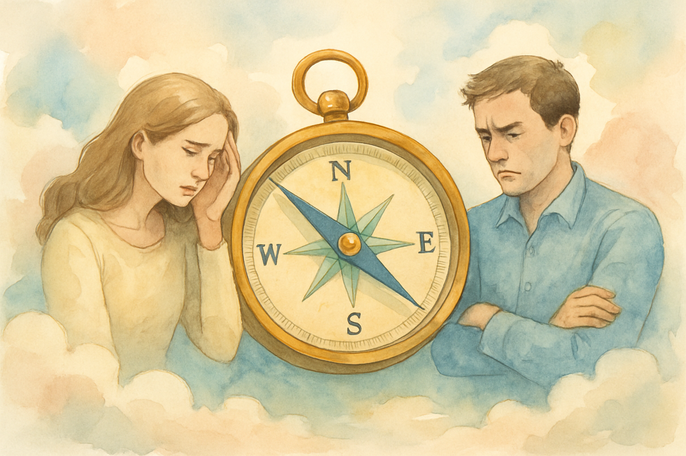

<!------------------------- REFERENCE LINKS BLOCK ----------------------------------->
[TODO]: some-link
<!----------------------- END REFERENCE LINKS BLOCK --------------------------------->

The Relationship GPS
====================
A tool for getting your bearings when interpersonal chaos reigns

Last week I had my first fight with my girlfriend.

You know how when you fight, you want to ensure you're being a reasonable and fair human while also being firm on what's important to you?

It feels like giving a piano concert in the middle of a boxing match: a million delicate decisions made at Danger Fast.

"Should I respond now? If yes, what do I say? Am I being an asshole? Am I being too soft?"

Today I want to share a tool I use to orient myself when I'm lost in the thick of it.

The GPS
-------
This tool comes the branch of psychotherapy called Transactional Analysis (specifically, [this book](https://en.wikipedia.org/wiki/I%27m_OK_%E2%80%93_You%27re_OK)). It goes:

"I'm okay, you're okay"

It is a diagnostics test for assessing your ability to respond productively.

Here's the idea: when you feel "I'm okay, you're okay", you're good with the world.

You don't need to make any drastic urgent changes. You don't need the other person to do or become anything.

Embodying "I'm okay, you're okay" lets you meet the world where it is, which is [really effective](https://altered.substack.com/p/charisma).

But wait, how can we just "be good" with the world without needing anything from it?

Well, you can't really. You really do need food and water and shelter.

But beyond these basics, there's a lot we treat as a need... that isn't actually.

You don't _need_ your partner to acknowledge your point.

You don't _need_ recognition by your boss.

You don't _need_ your friends to calm your fears.

In fact, you probably know it'd be better if you could give these things to yourself rather than relying on others.

Yet by quirk of evolution or parents who themselves were needy, a stressful situation has us regressing to our primitive selves that scream, "The other person _must_ do this!"

"I'm okay, you're okay" gives you a meter to measure how far off course you are.

Responding to the GPS
---------------------
When the fight started with my girlfriend, I was feeling apprehensive about an intense psychological workshop I'd signed up for on her recommendation.

The workshop team made a logistical error, and my scared primitive self took it as proof that the workshop team (and by my extension my girlfriend) weren't qualified to care for my mind.

It took a day of her and I arguing for me to realize I was embodying, "I'm not okay, you're not okay".

When you catch yourself embodying anything other than "I'm okay, you're okay", [the first step is to do is nothing](https://mieubrisse.substack.com/p/first-do-nothing).

You're in fight-or-flight mode; anything you do is likely to make the problem even bigger and lead you even further off course ([negative leverage](https://mieubrisse.substack.com/p/shattered-glass-and-negative-leverage)).

So ask for some time to breathe. Stop reading messages. Stop responding.

Let your mind disengage the stress response and come down to a calmer level.

That extra space will allow you to make clearer decisions that reduce the conflict.

When I finally recognized I'd fallen out of "I'm okay, you're okay", I set down my phone, did some meditation, and went to bed.

The next morning, it was as if a dense fog had lifted.

I could see how my fear had led me astray, and I knew it was my responsibility to get us both back to "I'm okay, you're okay".

Conclusion
----------
Give the "I'm okay, you're okay" tool a spin in your own life. See if you can make it a habit to check the GPS through your interactions.

Where do you solidly embody "I'm okay, you're okay"?

Where do you stray away from it?

What things pull you off course?

In the next post I'll outline another tool I use to navigate interpersonal conflict; subscribe to get notified when it's live.

TODO SUBSCRIBE BUTTON

_Thank you to my therapist, [Geoff Newton](http://www.psychotherapist.com.br/), and my business coach, [Ravi Raman](https://raviraman.com/), without whom none of my present life would have been possible._

-----------

If you liked this post, you might enjoy my other writing:

- [Anxiety, Emotions, & Freedom](https://mieubrisse.substack.com/p/anxiety-emotions-and-freedom)
- [Decisionmaking Systems](https://mieubrisse.substack.com/p/decisionmaking-systems)
- [A Life's Work](https://mieubrisse.substack.com/p/a-lifes-work)

<!------------------ IG POST DESCRIPTION --------------------->
<!--
You know how an argument feels like a million delicate decisions made at boxing match speed?

I use a tool to find my 

🐒 Full article at link in bio.
-->
