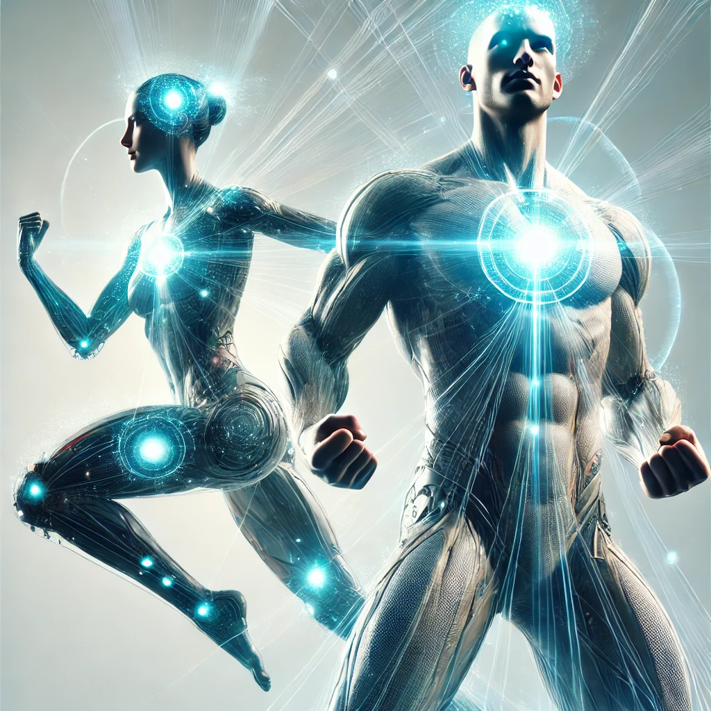
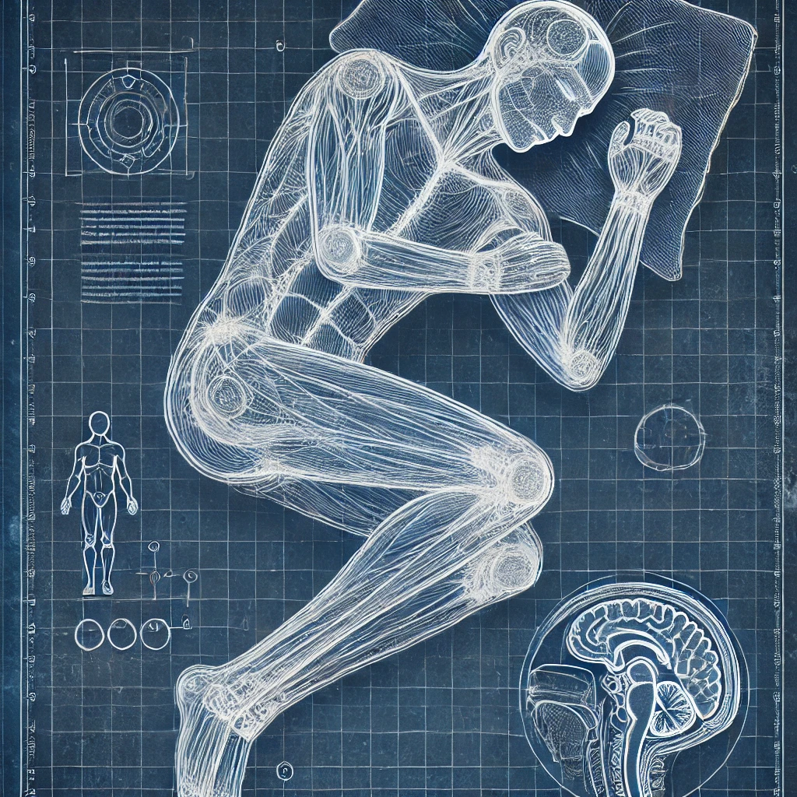
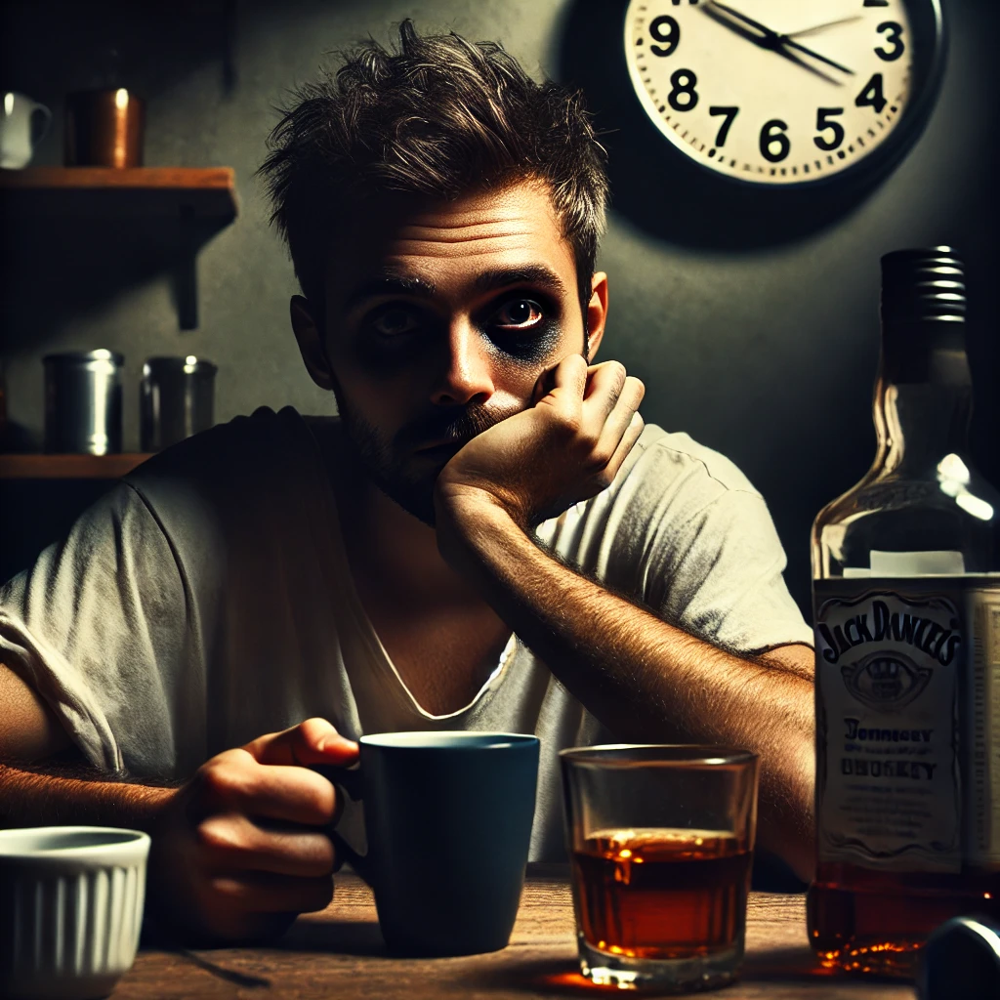
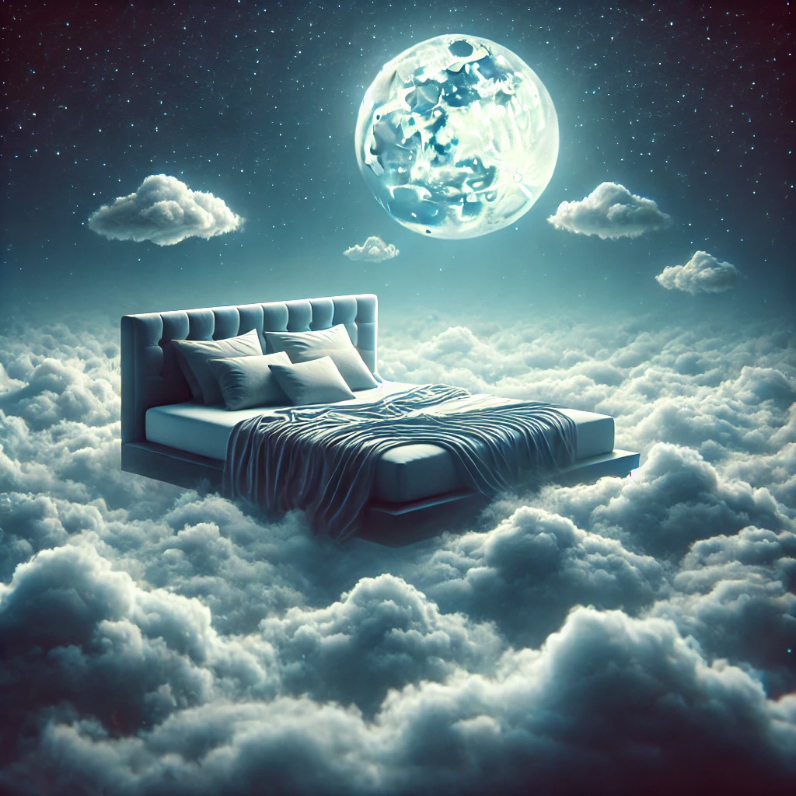
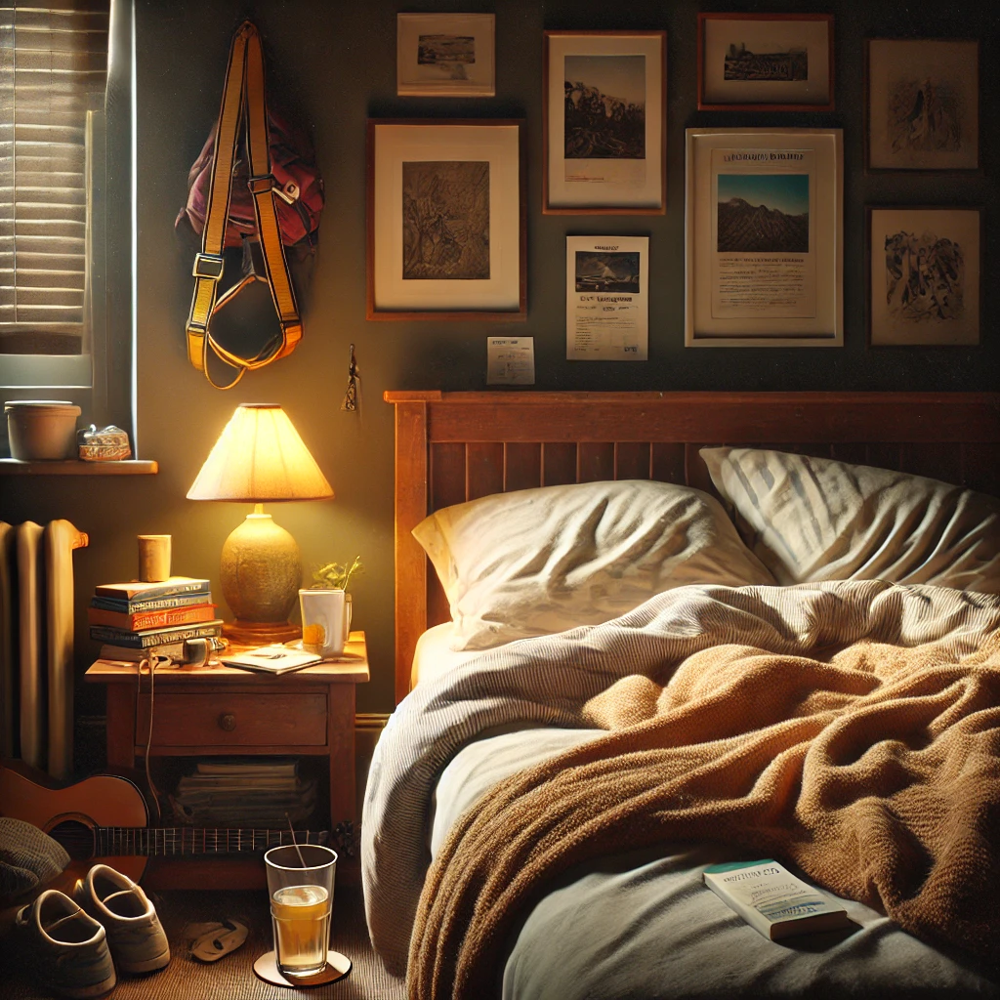
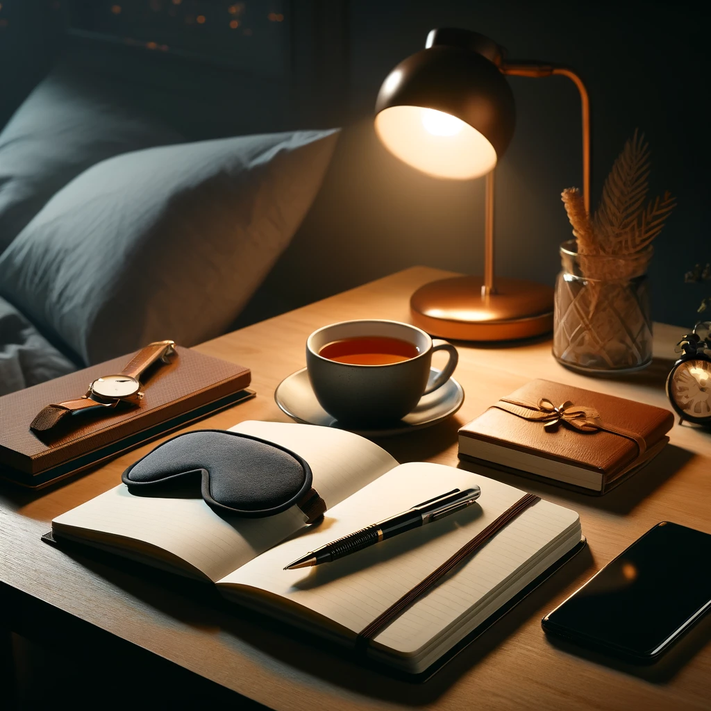
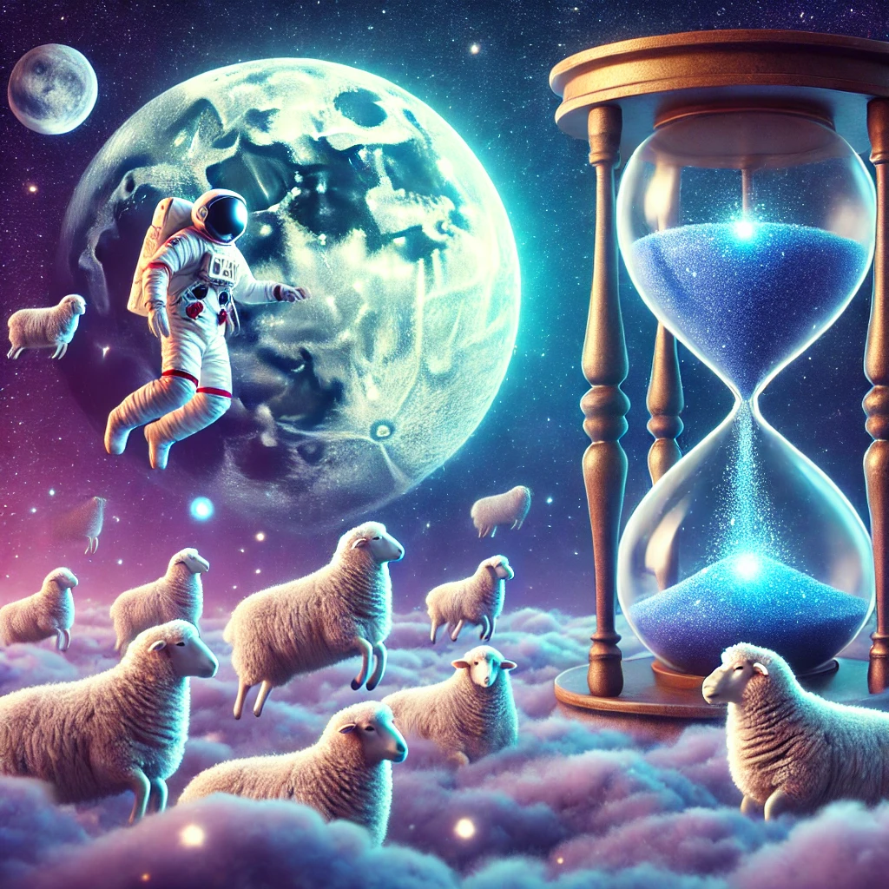

---title: "The Sleep Guide"
subtitle: "A distillation of 10 years spent solving insomnia"
---

I'd wrestled with insomnia for most of my life. It's now mostly solved. This article concentrates my experience so you can fix yours, and explains why it's important to do so.

This will be useful if you:

- Feel like sleep is a mystical thing that sometimes happens and sometimes doesn't
- Know you "should" fix your sleep, but it doesn't feel like a priority to do so
- Aren't tired when it's time for bed
- Lie in bed unable to fall asleep because your mind is racing
- Wake up in the middle of the night and can't get back to sleep
- Can't seem to keep a consistent bedtime

I wrote this guide for the average person. My test was, "Could my mom read this?". I hid scientific stuff inside links so that you can read it if you want to, but aren't forced to.

**WARNING:** I am not a doctor. I'm just an engineer who had a lot of trouble sleeping in his life, learned a lot about sleep, and experimented on himself until he found something that worked. You're responsible for your own health.

Table Of Contents
=================

_Substack generates a table of contents on the left, but you can also use this one here._

1. [Why bother fixing your sleep?](https://substack.com/home/post/p-158617177#%C2%A7why-bother)
1. [How sleep works](https://substack.com/home/post/p-158617177#%C2%A7understanding-how-sleep-works)
1. [Caffeine & alcohol](https://substack.com/home/post/p-158617177#%C2%A7caffeine-and-alcohol)
1. [What perfect sleep looks like](https://substack.com/home/post/p-158617177#%C2%A7what-perfect-sleep-looks-like)
1. [What "good enough" sleep looks like](https://substack.com/home/post/p-158617177#%C2%A7what-realistic-sleep-looks-like)
1. [Specific advice for various scenarios (e.g. mind is racing, jet lag, etc.)](https://substack.com/home/post/p-158617177#%C2%A7specific-advice)
1. [Tools mentioned in this post, collected in one spot](https://substack.com/home/post/p-158617177#%C2%A7tools)
1. [Fun sleep facts](https://substack.com/home/post/p-158617177#%C2%A7fun-sleep-facts)
1. [Sources](https://substack.com/home/post/p-158617177#%C2%A7sources)

Why Bother?
===========

We know we "should" fix our sleep. Yet we're blasted with information telling us not to sleep:

- Entrepreneurs on Instagram talking about their "grindset", and how little they sleep
- "I'll sleep when I'm dead" 
- "Sleep is for the weak"
- "Live fast, die young, leave a pretty corpse"
- "You Only Live Once (YOLO)"
- Party music encouraging us to "dance until the sun comes up"
- The famous "sleep faster" video from Arnold Schwarzeneggar
- People like Jocko Willink who claim they only need 4h of sleep, making us think "Maybe that's me too?"

When we're given this information every day, of course pushing through tiredness seems reasonable.

But you need to know: **sleep deprivation is poison for every system in your body.**

The science is exceedingly clear. If you are sleep-deprived, you are...

- [Destroying your mental performance](https://pmc.ncbi.nlm.nih.gov/articles/PMC2656292)
- [Making yourself depressed](https://pubmed.ncbi.nlm.nih.gov/16259539/)
- [Making yourself anxious](https://pubmed.ncbi.nlm.nih.gov/23814343/)
- [Hurting your athletic performance, reducing muscle recovery, and increasing injury risk](https://pmc.ncbi.nlm.nih.gov/articles/PMC9960533/#S13)
- [Progressing towards Alzheimer's and dementia](https://www.nih.gov/news-events/lack-sleep-may-be-linked-risk-factor-alzheimers-disease)
- [Increasing obesity and progressing towards diabetes](https://pubmed.ncbi.nlm.nih.gov/18929315/)
- [Making yourself feel bad, reducing your ability to emotionally regulate](https://pmc.ncbi.nlm.nih.gov/articles/PMC8193556/)
- [Increasing the chance you have a heart attack](https://pmc.ncbi.nlm.nih.gov/articles/PMC10565718/)
- [Damaging your ability to form memories, including your immune system's "memory" of invaders](https://pmc.ncbi.nlm.nih.gov/articles/PMC3768102/)
- [Reducing your testosterone](https://clinmedjournals.org/articles/ijsem/international-journal-of-sports-and-exercise-medicine-ijsem-6-169.php)

But you don't need to read scientific studies to understand this. Consider what you've already noticed in your own life when you're sleep-deprived:

- Sugary, fatty food are more appealing than healthy foods
- Working out is harder, and you're more likely to skip it
- You're more likely to get angry at irritations, leading to problems you have to fix later
- You're slow and inefficient in your work
- You're more likely to favor short-term gratification (e.g. keep drinking, not worrying about tomorrow)
- **You're more likely to stay up late passively consuming Netflix or social media, thereby making you more tired the next day**

Pay attention to that last one. Sleep deprivation poisons with destructive cycles: if you get a little sleep deprived, it often leads to more sleep deprivation.

And here's the crazy thing: you can't tell how bad your mental state is. 

[One study](https://pmc.ncbi.nlm.nih.gov/articles/PMC10108639/#:~:text=This%20study%20also%20found%20that%20subjective%20sleepiness%20ratings%20largely%20stabilized%20after%202%E2%80%933%20days%2C%20despite%20continued%20cognitive%20performance%20decline%20%5B8%5D) showed that when you're getting less sleep than you need, you don't just get more and more sleepy each day. Rather, your body eventually stops getting more sleepy... but your mental performance continues to go down.

Meaning, if you've been sleep-deprived for a while then there's probably a _lot_ of downside you're experiencing and you can't tell.

So here's me sounding the alarm: **if you're sleep deprived (which you very likely are), you are destroying yourself**.

Now the good news:

Suppose I tell you I have [the miracle drug from the movie "Limitless"](https://en.wikipedia.org/wiki/Limitless_(film)). But it doesn't just increase your mental performance. It also increases your athletic performance, and protects against cardiovascular disease, diabetes, obesity, Alzheimer's, anxiety, and depression.

Wouldn't you do a lot to get that drug? 

Turns out that drug exists, it's free, and it can be found in your bedroom. 

You can basically become superhuman by getting sufficient rest.

Understanding How Sleep Works
=============================

So how do we fix your sleep problems? First it's _very_ important that you understand how sleep works.

If you're thinking "Just tell me what to do!", know that understanding _how_ sleep works is essential to actually fixing your sleep. 

Sleep can feel random: sometimes we can fall asleep easily, other times we can't. It's understandable to feel, "Well, that's just how sleep is."

But sleep is governed by biological rules. If you know those rules, you'll understand why you can and can't fall asleep on certain days. You won't be dependent on me or anyone else tell you what to do, because you'll know how you work.

We'll cover six things:

1. Your two nervous systems for stress
2. Why you feel tired
3. The internal clock your body uses to track day and night
4. How to adjust your internal clock
5. Why you fall asleep
6. The stages & cycles during sleep

### Two Nervous Systems For Stress
Your body has two separate nervous systems for stress: 

1. **[Fight-or-flight](https://en.wikipedia.org/wiki/Sympathetic_nervous_system):** This activates during stressful situations. It's responsible for the release of adrenaline and cortisol. Think of running away from a tiger: rapid breathing, pounding heart, wired muscles, intense focus.
2. **[Rest and digest](https://en.wikipedia.org/wiki/Parasympathetic_nervous_system):** This deactivates the fight-or-flight nervous system. Think calm, peace, relaxed muscles, sex, and **sleep**.

The fight-or-flight system is stronger and faster. It can activate in a second (remember the surge of adrenaline when there's a loud bang?), and it keeps you awake even when you're tired. The rest-and-digest is slower; it takes a while to calm you down.

If your fight-or-flight system is activated, you're going to have a hard time falling asleep because your body thinks it's in danger.

Also important: _your body does not distinguish between physical and psychological stress_.

All of the following are "danger" from your body's perspective: a tiger attack, a cold shower, an argument with your romantic partner, and social anxiety from Instagram. The only difference is how much the fight-or-flight system is activated.

Therefore, any type of stress = difficulty falling asleep.

### Why You Feel Tired
While you are awake, a chemical called **[adenosine](https://en.wikipedia.org/wiki/Adenosine)** is produced. Adenosine is a tiredness chemical: the more it builds up in your brain, the more desire to sleep you feel. This is called **sleep pressure**.

Think of it like brakes for your brain: the harder your brain works, the more adenosine gets created, and the more your brain needs to slow down so it doesn't damage itself.

In the natural flow of things, the built-up sleep pressure means you get tired near the end of the day, you sleep, your brain does maintenance, and the adenosine is cleaned out during sleep. You wake in the morning feeling refreshed.

However, if you're not sleeping enough then you don't clean the adenosine from your brain. You wake up tired and slow due to leftover adenosine. You have **sleep debt**.

### Your Internal Clock
Your brain has a little clock called the **[circadian clock](https://en.wikipedia.org/wiki/Circadian_clock)** that keeps track of day and night. It tries to wake you up at sunrise, keep you alert throughout the day, and put you to sleep 14-16 hours after you wake up.

It controls your body through two methods.

The first is body temperature. The higher your body temperature, the more alert and energized you are. The lower your body temperature, the slower and sleepier you are.

Your circadian clock is constantly changing your body temperature throughout the day. It normally looks like this:

1. Your body temperature is lowest in the middle of the night, as you're in deep sleep.
1. As you get closer to waking up, your body temperature increases.
1. You experience a body temperature peak (and feel most energized) around 3-4 hours after waking. You might have noticed this as mid-morning productivity.
1. You get a small body temperature dip around 5-6 hours after waking, which you might recognize as the post-lunch slump. It's caused by your circadian clock; it will happen even if you don't eat lunch!
1. You get another peak around 10-12 hours after waking, which you might recognize as late afternoon productivity.
1. Your body temperature steadily declines from there, making you slow and sleepy.

You'll see this is true if you think of your own life:

- It's hard to sleep in a hot room because your body temperature can't drop the way it wants to.
- It's hard to wake up at 3am to catch a flight because your body is still cold and sleepy (and you haven't cleared all the adenosine from the day before).
- Cold showers and cold plunges wake you up because your body increases its temperature to keep you warm under the cold (and because your fight-or-flight nervous system activates).
- Exercising right before bed makes it hard to sleep because exercise elevates your body temperature and activates your fight-or-flight nervous system. It takes a couple hours for your temperature and stress level to come down.
- Taking a hot shower before bed helps you sleep because your body lowers its temperature under the hot water to avoid overheating. When you get out of the shower, your body temperature is lower and you're more ready to sleep.

The second way your circadian clock controls your body is a chemical called **[cortisol](https://en.wikipedia.org/wiki/Cortisol)**.

Cortisol is a stress chemical. It enhances alertness, blocking the sleep pressure from adenosine. It's the same chemical produced by your fight-or-flight nervous system to keep you alert when your body is responding to stress. 

Cortisol itself is not a bad thing! It's a useful part of your body's operation. It's only bad when your cortisol levels are high for long periods of time.

Your circadian clock peaks your cortisol levels ~30-45 minutes after awakening, and then lets them decline over the rest of the day (allowing you to feel more sleep pressure 14-16h after waking). They hit their lowest levels during the first half of sleep, and then increase in the second half of sleep until you wake up.

### Adjusting Your Internal Clock
Our circadian clock does its best to keep track of day and night, but it can be wrong.

If you've ever taken a long flight going east, you've likely experienced jet lag. You can't sleep when it's night, and you wake up at odd times.

Jet lag is when your circadian clock's idea of day and night don't match actual day and night. The body temperature and cortisol peaks we just talked about are happening at the wrong times (e.g. in the middle of the night, instead of right after waking).

Fortunately, our circadian clock's idea of day and night can be adjusted.

Adjustment happens through two main methods: light and food.

First, light: you have [sensors in the back of your eye that measure the intensity of light you're seeing](https://en.wikipedia.org/wiki/Intrinsically_photosensitive_retinal_ganglion_cell). These cells train your circadian clock. Seeing bright light - and particularly bright blue light that comes from above you - tells your circadian clock, "It's daytime; adjust yourself."

Wait, "blue light that comes from above you"? Yep.

Blue light coming from above you makes a stronger adjustment to our circadian clock because the light sensors are located mostly in the bottom of our eyes. 

This makes sense from an evolutionary perspective: we want our circadian clock adjusted by the blue sky above us during the day but not the orange fire at our feet during the night.

Artificial lights at night, and particularly white or blue light, are problematic. If it's nighttime but we're receiving light through lamps and screens, we're telling our circadian clock, "It's daytime; adjust yourself so that I'm awake during this hour". The absolute worst thing would be bright white fluorescent lights above you at night.

<!--
The stronger the light intensity, the stronger the adjustment to your clock. But us humans are really bad at judging brightness.

Light intensity is measured by a unit called "lux", with more lux = brighter. It's a clear sunny morning as I write this, and my office seems plenty bright. Using [a lux-measuring app](https://play.google.com/store/apps/details?id=com.doggoapps.luxlight), I see that my office is sitting at 431 lux. When I hold my phone out the window, however, I see the light intensity vary between 20 and 60 _thousand_ lux. More than 50 times brighter.

Therefore, to effectively set our clock, we really want to see daylight.
-->

The second way your circadian clock adjusts itself is through food.

When you eat, you're telling your circadian clock, "Food is available at this time, so adjust yourself so I'm awake during this time".

I couldn't find a clear reason why, but this makes sense from an evolutionary perspective. Food was much harder to find in ancient times than it is today, and ancient humans needed to adapt themselves to be awake when their food was available. If the deer you normally eat only comes out at night, it makes sense that you're more awake at night.

The result is that if you eat food close to bed, you're telling your circadian clock, "Shift yourself to be awake during this time".

### Why You Fall Asleep
Sleep pressure - built-up adenosine - makes you feel tired, but it's not what actually puts you to sleep. Your body produces a chemical called **[melatonin](https://en.wikipedia.org/wiki/Melatonin)** that lets your tiredness turn into sleep. 

Melatonin does _not_ directly force you unconscious like sleep medication. Instead it lets sleep pressure turn into sleep by lowering your body temperature and reducing cortisol that's keeping you awake.

Remember those light intensity sensors in your eyes? When they detect darkness they tell your body to start producing melatonin, and when they detect light they tell your body to stop producing melatonin.

Therefore, artificial lights at night are doubly bad. They incorrectly tell your circadian clock, "It's daytime; adjust yourself", and they block melatonin production so you can't sleep even if you're tired.

You might have experienced this in your own life after a late-night TV, videogaming, or phone-scrolling session. Even though you're tired (sleep pressure from built-up adenosine), you can't fall asleep because you don't have enough melatonin.

### Sleep Stages & Cycles
During sleep, our body moves through [four different sleep stages](https://www.sleepfoundation.org/stages-of-sleep). Each has its own purpose:

1. **Transition Sleep:** The lightest stage, lasting 1-10 minutes. It's in between wakefulness and real sleep, and if you're woken up here you may not even know you were asleep. If you've ever been sleeping next to a partner and they twitched, that happened in this stage.
2. **Light Sleep:** A slightly deeper stage where breathing slows, muscles relax, and heart rate drops. If you're awakened here, you probably knew you were asleep.
3. **Deep Sleep:** The deepest sleep, and hardest to wake someone up from. This stage is mostly about body repair: your immune system works and your muscles repair. If you're woken up during this stage, you'll feel groggy and slow. This is the stage where sleepwalking occurs.
4. **Rapid Eye Movement (REM) Sleep:** This is a weird stage. Your eyes are sliding back and forth behind your eyelids (hence the name "rapid eye movement"), and your brain is active almost as if you're awake because you're having vivid dreams. However, your body has paralyzed itself on purpose to keep you from acting out your dreams. This stage's benefit is mostly mental: memory formation and emotional processing.

But our body doesn't just go Transition Sleep -> Light Sleep -> Deep Sleep -> REM Sleep -> wake up. 

Instead, our body moves through cycles of the four stages. It roughly looks like Transition Sleep -> Light Sleep -> Deep Sleep -> REM Sleep -> start the next cycle, but there can be some skipping around. 

Each cycle is [1.5-2 hours](https://www.ncbi.nlm.nih.gov/books/NBK526132/), and a normal night of sleep is composed of 4-5 cycles.

This means that there are better and worse times to wake up. Waking up during Light Sleep feels better than waking up during Deep Sleep.

You might have experienced this in your own life when you wake up to an alarm. 

Sometimes, you feel better waking up after roughly 4 hours than you do after 5. This is likely because you woke up near the end of the cycle after 4 hours, whereas with 5 hours you'd have been better off waiting a little longer.

But each individual's sleep cycle length is different, and the cycles change as the night goes on. Early cycles are shorter and more focused on Deep Sleep, and later cycles are longer and more focused on REM Sleep.

Meaning, it's very hard to wake yourself up at the perfect time using an alarm. It's much easier to let yourself wake up naturally.

### Review
And that's what you need to know for now!

To review:

- You have two nervous systems, a fight-or-flight one for stress and a rest-and-digest one for calm and sleep
- Your body doesn't distinguish between physical and psychological stress
- Sleep pressure builds up as you're awake due to built-up adenosine, resulting in you feeling tired
- You have a biological clock that regulates your wakefulness and sleepiness with body temperature and cortisol
- Your biological clock gets set by eating and light exposure (particularly blue light from above you)
- Melatonin lets sleep pressure turn into sleep
- You sleep in cycles that last 1.5-2 hours
- Each cycle is composed of four sleep stages: Transition, Light, Deep, and REM

With this foundation, we'll now look at what's messing with your sleep.

Caffeine & Alcohol
==================

### Caffeine
Caffeine messes with our sleep in three ways.

First, it blocks our brains from noticing sleep pressure (adenosine), so we don't notice we're tired. The adenosine is still building; our brain just can't see it.

Second, caffeine tells our fight-or-flight nervous system to produce cortisol. This activates us, reducing how tired we feel. This is why you feel wired on caffeine.

If you've ever had a caffeine crash, it's because:

1. The caffeine wore off and your brain suddenly noticed all the built-up adenosine
2. The cortisol boost from caffeine passed, and your body is tired from being so activated (being stressed requires more energy)

Third, caffeine suppresses hunger. This makes it more difficult to use food to adjust your circadian clock.

### Alcohol
Alcohol is [straight bad for sleep](https://www.verywellhealth.com/why-does-alcohol-make-me-sleepy-8656023).

It makes you "sleepy", but it's corrupted sleep:

- It keeps your body warm, preventing your body from cooling like your circadian clock wants to
- You spend more time in Light Sleep in the second half of the night, meaning you're easier to wake up
- You spend less time in REM Sleep, thereby reducing your mental and emotional recharging
- You have to wake up to pee frequently, meaning you have to spend more time getting back to sleep

What's more, the environment around alcohol is often destructive to sleep:

- The loud music, dancing, and social interaction of a club activate your fight-or-flight nervous system
- The lights in the bar, club, or street after a late night of drinking tell your circadian clock, "It's daytime; adjust yourself so I'm awake now"
- Eating late at night further confuses your circadian clock into thinking it's daytime

All of these add up to big sleep disturbances.

What Perfect Sleep Looks Like
=============================

Below I've listed my understanding of what a "perfect" sleep routine might look like based on how our bodies work.

This is **not** realistic for most people. You **don't** have to do all of this. Most people - myself included - won't hit this perfect ideal because the sacrifices involved are just too extreme.

Instead, I'm giving this so we have a direction we can go towards. Afterwards, I'll break it down into something more realistic.

A "perfect" sleep routine:

**Morning**
- You sleep in a cool, dark, quiet room with windows that can let in morning light at sunrise
- You wake around dawn naturally without an alarm clock, which is the same time you get up every day
- Rather than look at screens, the first thing you do is go for a ~10 minute walk under the daylight sky to tell your circadian clock "It's daytime" (and wake you up with some exercise)
- You might take a cold shower when you get back to increase your body temperature and wake yourself up
- You might do some other exercise to further raise your body temperature and wake yourself up
- When you get back you eat breakfast, further signalling to your circadian clock "It's daytime"

**During the day**
- You do not drink any caffeine or alcohol
- You do not use your bed for anything except sleep and sex
    - You do not work in your bed
    - You do not read in bed
    - You do not play with your phone, work, or watch TV
- As the post-lunch slump happens, you might take a nap of either 20 minutes or 1.5-2 hours (but not 20-90 minutes)
    - Naps of 20-90 minutes should be avoided so that you don't get woken up in Deep Sleep and feel groggy
    - A nap of less than 20 minutes will refresh you without entering Deep Sleep
    - A 1.5-2 hour nap will allow you to complete a full sleep cycle
- You don't take long naps in the late afternoon or night
    - This is so that you don't clear _too much_ sleep pressure (making it hard to fall asleep at bedtime)

**Night**
- You eat a relatively early dinner, around sunset
- After sunset, 2-3 hours before bed, you...
    - Stop strenuous physical exercise
    - Don't eat any food
    - Disconnect from screens (phone, TV, computer, etc.) and the internet
    - Turn off overhead lights and only use dim, orange lights placed low in the room
    - Do a calming activity like reading, listening to a podcast, or listening to calming music
    - Might take a warm bath or shower
    - Might do some pen-and-paper journalling
- When you get in bed you...
    - Wear a sleep tracker so you can get an idea of your sleep duration and quality
    - Might wear earplugs or turn on a noise generator to block any sound that could wake you up
    - Consciously take deep, slow belly breaths to trigger your rest-and-digest nervous system
    - Keep your thoughts focused on a calm, soothing place (redirecting yourself back when you find yourself thinking, planning, or anticipating because your bed is only for sleep and sex - not for thinking)
- If you find yourself unable to sleep, you...
    - Might try the [military sleep method][military-sleep-method] to help yourself relax
    - Might get up and do a calming activity in the dark elsewhere in your house so that you're not using your bed for thinking
- If you wake up in the middle of the night and can't go back to sleep, you...
    - Do not turn on lights (e.g. no lights when using the bathroom)
    - Do not eat food
    - Might listen to some calming music, or a low-activation podcast or audiobook
- When you wake up you check your sleep tracker to see how your sleep was

What Realistic Sleep Looks Like
===============================

I'll emphasize again: perfect sleep is unrealistic. I'm _never_ going to have a coffee? I'm _never_ going to stay up late with friends? It's not reasonable.

But that's okay because we don't need to be perfect. We just need to be good enough.

By my definition, "good enough" means you regularly experience all of the following without taking substances like caffeine or sleeping pills:

1. You wake up easily feeling refreshed and energized
2. Your mind feels clear and quick throughout the day
3. You fall asleep easily at the end of the day

### Good Enough
To get to "good enough", I try to degrade the perfect ideal into something that I can actually maintain. 

Here's what I currently do in my own life:

**Morning**
- I sleep in a bedroom with a blackout shade over the window that I lower 80% of the way down, leaving 20% of the window uncovered so that the morning light will gradually wake me up
- I sleep with earplugs ([I recommend Mack's][earplugs]), as I live in a noisy city and [noise can decrease sleep quality even if it doesn't wake you up](https://www.sleepfoundation.org/noise-and-sleep) (I definitely notice that my sleep quality is worse without earplugs)
- I turn on the air conditioner if I feel even a little warm, to maintain a cool environment
- I usually wake between 5am and 6am with [an alarm clock app that plays wave sounds][alarm-clock-app] - softly at first, and then getting louder over 5 minutes to pull me out of sleep more gradually
    - Sometimes I'll sleep in to 7am or 8am if I feel that I really need to recover
- I get out of bed as soon as my alarm goes off, and pull the blackout shades all the way up to let in full sunlight
- Depending on the day of the week, I then try to set my circadian clock with daylight and raise my body temperature with exercise:
    - Eat a banana, ride my bike to the park, and do an hour of yoga or functional training
    - Go for a 10-minute walk around my neighborhood while listening to an audiobook or podcast
- When I get back I evaluate how much more alert I need to be and choose between a cold shower and a warm one
- I do mindfulness meditation for at least 10 minutes afterwards
- I then eat breakfast to further mark "It is daytime"

**During the day**
- I might have a single cup of caffeinated coffee, so long as it's before ~10:30am and I'm okay taking the coffee crash in the afternoon and reduced sleep quality at night
    - I do this because even though I know it's best to have no caffeine, I love coffee
    - The "before 10:30" rule is because my body processes caffeine slower than normal people due to my genetics, so caffeine stays in my system longer than most people
    - I do this only 1-2 days per week
    - When I do drink coffee, I have a noticeable crash in the late afternoon: I feel anxious, tired, and bad about life so I need to remember that it's the coffee talking so I don't make any reactive decisions
- When feeling tired throughout the day I occasionally lay on my bed to rest, though I'm trying to cut this habit so that my bed is strictly for sleep and sex
    - I never work or watch TV in bed
    - I sometimes play on my phone in bed, though it's a bad habit and I'm trying to stop
- If I feel tired in the afternoon I might take a 20-minute nap
    - Rarely, if I know I'm going to be out late with friends, I'll take a 2-hour nap around 5-6pm (but this messes up my next days so I tend to avoid it)
- My last workout of the day ends in the early afternoon, by 4-5pm

**Night**
- I try to finish dinner by ~7pm, though sometimes this gets stretched to 8pm
    - When I eat late, I notice a significantly harder time falling asleep
- At 7:30pm I've configured [this Chrome browser extension][blocksite-chrome-extension] on my laptop to block Youtube, Reddit, Instagram, and a news site I read, just in case I get caught in a scrolling spiral
    - I don't yet have my phone block Instagram because sometimes I want to post Stories of what I do after 7:30pm
    - This is less dangerous for me because I use (and highly recommend) [this modded version of Instagram][modded-instagram] that disables the Feed and all the addictive crap on the Search page
- I also have apps on my phone and laptop that turn my screen orange at night, reducing blue light:
    - On my phone, I use [Twilight][twilight]
    - On my laptop, I use [f.lux][flux]
- I'm not drinking alcohol, but if I were then ~7:30pm is when I'd stop alcohol consumption
- Around 8:30pm I...
    - Turn off all lights in my apartment except for very dim ones that are low in the room
    - Take a warm shower
    - Stop all screens
    - Might do some journalling in my pen-and-paper journal about the day, focusing on the things that went right rather than the things that went wrong (to decrease my stress rather than increase it)
    - Might lay on my couch in the dark while listening to a low-stress audiobook
        - I find that books with useful information (e.g. business books) tend to be stressful, since I'm trying to pay attention and remember everything
        - The best books I've found for this are books where I say, "Huh that's interesting" but don't feel pressured to learn and apply a lesson
- Between 9:00 and 9:30pm I'll crawl into bed
    - I'm always wearing my [Fitbit][fitbit] to bed, which logs my sleep duration and quality overnight
    - As I lie in bed, I try to slow my breathing by 50% and think about a calming place
- At 22:30pm I have my phone and laptop configured to block most everything, as an extra safety in case I get caught in a bad scrolling spiral
    - On my phone, I use [AppBlock][appblock] to block Instagram and Discord
    - On my laptop I use [the Mac Downtime feature][downtime] to block everything except Notion, the app that I use for writing, Spotify, and ChatGPT
- I commonly catch myself in bed thinking about mistakes of the past, planning for the future, or trying to resolve a problem; when notice, I remind myself that my bed is not for thinking and focus my thoughts back to a calm, neutral place
    - For me, this is a rock on the shore of a lake that I used to sit on as a child
- If I have to go to the bathroom, I do so without turning on any lights
- If I'm still lying awake in bed after 20-30 minutes, I'll try the [military sleep method][military-sleep-method] to see if I can relax enough to sleep
- If I still can't sleep (usually because of food, exercise, or coffee earlier), or I wake up and can't get back to sleep, I'll get up and try to do something calming
    - For me, this is meditating, listening to calming music, or slow stretching
    - Sometimes I'll turn on a dim orange desk light and do pen-and-paper journalling
    - I'll try to sleep again in 30-60 minutes
- When I wake up I check my sleep duration and quality in the Fitbit app
    - Very commonly, my duration is less than I thought (8 hours in bed usually means between 6 and 7 hours of actual sleep)

### More On Caffeine
Caffeine is so widespread that I wanted to share more information here so you know how to handle it.

As you now know, caffeine blocks your body's ability to notice sleep pressure (adenosine). It also activates your fight-or-flight nervous system.

When you drink or eat something with caffeine, nearly all the caffeine is in your blood by 45 minutes after consumption. From there, your body starts the slow process of eliminating the caffeine. 

For normal people, [half of the caffeine will be eliminated every 4-6 hours](https://www.caffeineinformer.com/the-half-life-of-caffeine). Some people process caffeine faster, and others (like me) process slower.

Caffeine is measured in milligrams (mg). I find it useful to know the dose of some common things:

- **Cup of green tea:** 15mg
- **Cup of black tea:** 30mg
- **Normal 355ml (12oz) soda:** 30mg
- **Single shot of espresso:** 75mg
- **250ml (8oz) can of Red Bull energy drink:** 80mg
- **250ml (8oz) cup of regular coffee:** 80-100mg
- **Cup of coffee at a chain like Starbucks:** usually 90-180mg, more than normal coffee
- **16oz (450ml) can of Monster energy drink:** 160mg
- **Exercise preworkout:** 175-300mg

You can find caffeine quantities for anything you're curious about on [the Caffeine Informer database][caffeine-informer].

An example: if you take 300mg of exercise preworkout at 8am, you'll still have 75mg of caffeine in your body 10 hours later at 6pm (300mg divided by 2 for the first 5 hours, and then divided by 2 again for the second 5 hours).

### Getting To Good Enough
As you make changes in your own life, it's important that you _take things slow_.

<!-- TODO Link to the behavioural change guide here when it's ready!! -->
I'm a firm believer in "consistency over intensity". 

If you try to change everything all at once you'll feel excited at first. Then the changes will start to feel like a lot of work, and you'll begin to feel stressed. Eventually you'll procrastinate a little on what you're supposed to do. Eventually you'll quit, and you'll be back exactly where you started with no progress. 

So take it slow. Experiment with changing one thing per 1-2 weeks.

Put another way, you got your bad sleep habits through years of poor choices. You're not going to fix it in a week _and that's okay_. Just keep going, and you _will_ fix it.

To keep you motivated, I strongly recommend a sleep-tracking wearable. Just like in the gym, you can use it to help you see a link between the choices you make and results.

When you make a bad decision (which _will_ happen; it's okay!), you'll see the negative impact it has on your sleep and you'll be reminded to get back on track.

Specific Advice
===============

### I'm not tired when it's time for bed
There are many things that could be causing this:

- You're drinking too much caffeine too close to bed, which is preventing you from feeling sleep pressure and activating your fight-or-flight nervous system
    - SOLUTION: try to keep your daily caffeine intake below 200mg, with no caffeine after 11am
- You exercised too close to sleep and your body is still activated
    - SOLUTION: exercise in the morning or early afternoon
- You've been blasting your eyes with light at night so you don't have enough melatonin built up to sleep
    - SOLUTION: stop screens and overhead light 1-1.5h before the time you want to be in bed
- Your circadian clock isn't anchored on actual sunrise (perhaps due to jetlag, perhaps because you've been confusing it with light or eating at night)
    - SOLUTION: get 10+ minutes of daylight immediately after waking up and then eat. 2 hours before bedtime stop eating, overhead lights, and screens
- You're sleeping at different times each night, so your circadian clock doesn't have a consistent idea of nighttime that it can prepare you for
    - SOLUTION: get daylight right when you wake up to anchor your circadian clock, and go to bed at the same time each night
- Your fight-or-flight nervous system is still activated, preventing you from noticing sleep pressure
    - SOLUTION: do something calming - a guided meditation while laying quietly, calming music, pen-and-paper journalling, a peaceful audiobook, etc.
- You took too long of a nap too close to bedtime, so you don't have sufficient sleep pressure built up
    - SOLUTION: limit naps in the afternoons to 20 minutes

### I'm in bed but can't fall asleep
This is very likely your fight-or-flight nervous system keeping you alert because it thinks there's danger you need to react to. 

Your body treats all stress the same, so your troubles at work or in your relationship are activating the same stress response as physical danger. Try to figure out what your mind is holding on to, and see if you can tell it, "There's nothing I can do about this right now. There's nothing to be done. We'll address this tomorrow." 

Sometimes, our mind is hanging on to something because it's afraid we'll forget it. It sometimes helps me to write what I'm worrying about in a place where I'll see it the next morning. This way my mind trusts that I'll handle it tomorrow (credit to ["Getting Things Done"](https://gettingthingsdone.com/) for this trick). Often I have to do this a couple times, until my mind lets go of everything it was hanging on to.

Sometimes though, you just mess up. You ate, or exercised, or were on screens, or took coffee too close to bed. It's okay, it happens. 

It's important that you don't beat yourself up. If you get freaked out about how tired you're going to be tomorrow, you're just activating your fight-or-flight nervous system and making it even harder to fall asleep. 

Just like a pilot coming in for a bad landing, just pull up and try again later. Get out of bed so that you're not using bed for thinking/stressing/worrying, and do something calming: writing, listening to podcast or audiobook, etc. Try to sleep again in 20-30 minutes, or when you feel tired again.

### I wake up in the middle of the night and can't go back to sleep
I've found that I tend to wake up in the middle of the night more often when I don't do a 1-1.5 hour wind-down routine before bed. 

Trying to simply jump in bed (especially after work or screens) means that I sleep lighter, and wake up more. You'll want to look at if you're doing a proper wind-down routine before bed.

I've also found that caffeine and alcohol have me waking up in the middle of the night, so consider whether you can reduce your intake of those.

But assuming you're not stressed or taking caffeine or alcohol, this might not even be a problem!

There's decent evidence that before the invention of artificial lights, [humans slept in two phases with an awake period between them](https://en.wikipedia.org/wiki/Polyphasic_sleep#Historical_%22first_sleep%22_and_%22second_sleep%22). Supposedly this middle-of-the-night awake time felt very calm and peaceful. Rarely, when I'm very well-rested, I've experienced something sort of like this. 

So don't worry; just do something calming and go back to sleep when you feel ready. And **definitely** don't turn on any lights, screens, or social media!

### I wake up tired
This could be for several reasons:

- You didn't sleep long enough, meaning you didn't fully clear the adenosine/sleep pressure from the previous day
    - SOLUTION: make the conscious choice to prioritize sufficient sleep, remembering that you need 8 hours of sleep (not just time in bed) and days of heavy brain or body work require extra rest (think 9-10 hours of actual sleep)
- Your body could be fighting off an illness, and it needs more time to recover
    - SOLUTION: try allocating 10 hours of sleep for 2-3 nights and see how you feel
- You're waking up before your usual wakeup time and your body is still cold with low cortisol (e.g. you had to wake up early to catch a flight)
    - SOLUTION: get moving to warm your body up, though be conscious that light and food will pull your circadian clock's wake-up time earlier (which you may not want)
- You're not sleeping on a regular schedule, and are instead sleeping at random times
    - SOLUTION: mark an hour-long block on your calendar at the same time every day for a pre-bedtime routine, and turn on reminders for it
- You have a disorder called **[sleep apnea](https://en.wikipedia.org/wiki/Sleep_apnea)** where you're gasping for air at night, which is causing micro-wakeups that prevent you from getting restful sleep
    - SOLUTION: get a sleep tracker that monitors noise and oxygen levels, and see a doctor if you're hearing gasping or seeing your oxygen levels drop in the night
- Your room is too hot, causing micro-wakeups
    - SOLUTION: cool your room, preferably to ~19 Celsius/66 Fahrenheit (varies based on the person)
- Your partner is disturbing you as you sleep, causing micro-wakeups 
    - SOLUTION: consider a bigger bed, separate blankets, or a mattress with a foam that isolates movement
- Noise is causing micro-wakeups
    - SOLUTION: get better sound isolating in your room, and consider earplugs

### I can't seem to keep a consistent bedtime
Several things to consider:

- Are you getting 10+ minutes of daylight as soon as you get up? This will set your circadian clock to help with falling asleep 14-16 hours later.
- Are you irradiating your eyes with light at night (screens, lights), messing with your circadian clock, suppressing melatonin production, and making it difficult for you to sleep?
- Are you doing activating things (food, exercise, social media, videogames, etc.) before bed, making it harder to fall asleep?
- Are you jetlagged? If so, see the advice below.

### I'm taking a flight east and will be jetlagged
Because you flew east, your circadian clock thinks it should still be sleeping at sunrise and thinks it should still be awake at night. 

This is the hardest type of jetlag to fix because you need to go to sleep when your body wants you to be awake.

Before your flight, you can start shifting your circadian clock to match your destination. To do so:

- Start waking up at the time of sunrise at your destination
- Turn on bright indoor overhead lights as soon as you get up, to start adjusting your circadian clock earlier
- Eat your breakfast at the breakfast time of your destination
- Stop eating, exercise, screens etc. around sunset at your destination

You could also consider melatonin supplementation to help you fall asleep earlier, though I personally choose not to take it. I avoid drugs when possible.

When you arrive, it's important you do the normal things at the time of the destination: get up around sunrise, go for a morning walk as soon as you wake up, eat breakfast afterwards, start winding down as it gets dark out, etc.

In my experience, I can adjust my bedtime earlier about 1 hour per day. It's going to take some time to fully align wit the local timezone, which is why adjusting before you go is a good idea.

### I'm taking a flight west and will be jetlagged
This type of jetlag is easier because it involves staying awake when your body wants to sleep. 

Your fight-or-flight nervous system is stronger than your rest-and-digest nervous system, so you can align with the local timezone faster.

Basically, you just need to stay up via caffeine, exercise, etc. You're going to build a tremendous amount of sleep pressure from staying up so long, so it should be easy to fall asleep (so long as you're not suppressing melatonin production by receiving light near bedtime!).

In my experience, I can adjust my bedtime later by about 2-3 hours per day. 

### I'm sleep deprived; now what?
The first thing to remember is that you're not thinking straight. And as I mentioned above, you can't actually tell how much your thinking is affected just by how sleep you feel.

To help myself with this, I say, "No decisions about my life until the dark circles are gone from under my eyes."

If you have circles under your eyes, you're more anxious, more depressed, more negative, and more fearful. This can lead to reactive decisions about your life, job, or relationships that wouldn't be a big deal if you were well-rested.

Second, you're going to want to reach for your stimulant of choice (probably caffeine) to get you through the tiredness. 

It's very important you resist this urge! 

If you take a stimulant, you'll mess up your sleep that night which means you won't ever fix your sleep deprivation.

If it helps, I think about it as: you took out a sleep loan from the bank in the past. Now you have to pay it back. This lesson will teach you to be more careful taking out that sleep loan in the future.

Third, remember that your tiredness will make you want to reach for "easy" dopamine: social media, Youtube, Netflix, etc. 

It's especially important you avoid this entertainment. Your defenses are down so you're more likely to get into a bad spiral, and the screens will mess up your sleep. If you mess up your sleep, you'll never unlock your superhuman capabilities of being fully rested.

Instead, contemplate doing some journalling, meditation, or listening to an audiobook.

So how do you pay back that loan? You've got to get sleep, and a lot of it. 

If you're sleep-deprived during the week from work, [it's not enough to just get two days of 8 hours of sleep on the weekend](https://pmc.ncbi.nlm.nih.gov/articles/PMC10108639) (assuming you actually use the weekends for recovery and not staying up late). Think about a week or more of 10+ hours of sleep.

I know that sounds like a lot, but you've likely been depriving yourself of sleep for years. You're going to need more than a couple days to recover.

### What about white noise?
I personally use noise to help block out any sounds that aren't blocked by my earplugs.

Noises come in various "colors" based on which high and low tones they have, and I find white noise to be harsh. I find brown noise more pleasing, so I [have an app that generates it][noise-generator-app] (but can generate various colors).

### Should I take melatonin supplementation?
In the past I used 5mg of melatonin to help sleep on airplanes, and fall asleep when I'm jetlagged from flying east. 

I no longer do so because I try to minimize the substances I consume. I do this because I believe the body is really good at taking care of itself, and taking substances not found in nature often causes unintended side effects.

The three Huberman Lab podcasts on sleep ([1][huberman-sleep-1], [2][huberman-sleep-2], [3][huberman-sleep-3]) seem to suggest that we don't know artificial melatonin's full effects, and it may cause weird stuff like delayed puberty.

As such, I choose not to mess with it anymore. The choice is yours.

### Should I take magnesium supplementation to help me sleep?
The Huberman Lab podcasts on sleep suggest that magnesium L-threonate is particularly effective in helping relax and fall asleep. 

I haven't experimented with it myself, but the studies I found seem to suggest it might be effective improving sleep health ([1](https://pmc.ncbi.nlm.nih.gov/articles/PMC11381753/), [2](https://pubmed.ncbi.nlm.nih.gov/35184264/)).

### What about chamomile as a pre-bedtime relaxer?
I don't personally drink chamomile just because I don't like the taste. I have several friends who recommend it though, so give it a try. The [data seems to suggest it's slightly effective](https://pubmed.ncbi.nlm.nih.gov/39106912/) at reducing how often you wake up in the night.

### What about sleep medication?
I've never used sleep medication so I don't have personal experience with it. The research I did suggests that all sleep medications lead to lower-quality sleep, and some have risks of addiction.

I tend to believe that our bodies are really good at taking care of themselves, and if something's not working it's because there's a root cause that needs to be addressed. 

If you're taking sleep medication, I would use your new knowledge of how sleep works to see if there's something you're doing that's leading to your difficulty sleeping. Perhaps you're eating or exercising at night, or perhaps you're doing lots of thinking in bed, or are getting lots of light at night.

I would also experiment with gradually reducing your dosage to see if you can get off it gently. 

For example, take 3/4 of your current dose for a week. Then take 1/2 your current dose for a week. Then take 1/4 your current dose for another week.

### What about those people who only sleep 4 hours per night?
These are called [short sleepers](https://en.wikipedia.org/wiki/Familial_natural_short_sleep). 

Through a genetic mutation, they naturally sleep 4-6 hours per night and wake up feeling fine. There don't seem to be negative consequences for them.

It's rare: only 1-3% of people have this. And you either have it or you don't. You can't train yourself to need less sleep.

If you're a short sleeper, you likely already know by now. For the rest of us, sleeping less than 8-9 hours is damaging to our bodies.

Tools
=====
I've listed various tools scattered throughout this guide. Here they are again, collected in one place:

- [Military sleep method][military-sleep-method] for relaxing down into sleep
- [Earplugs I use][earplugs]
    - There are insertion instructions on the container, which you'll want to read
- [Alarm clock app][alarm-clock-app]
- [Chrome extension I use to block activating sites on my Macbook after a certain time][blocksite-chrome-extension]
- [Modded version of Instagram][modded-instagram] that lets me disable the Feed and Search pages
    - Disabling the Feed and Search pages requires setting the correct options
- [Blue light filter app for my phone][twilight]
- [Blue light filter for my Macbook][flux]
- [Sleep-tracking wearable][fitbit]
    - I'm very happy with this; it's light and small with a 2 week battery life
    - I put [this rugged screen protector](https://www.amazon.com/dp/B0BHDXNK3R) over it, which has protected the Fitbit even when rock climbing
- [Phone app I use to block phone apps after a certain time][appblock]
- [Mac feature that I use to block Macbook apps after a certain time][downtime]
- [Caffeine Informer, which shows the caffeine content of most anything][caffeine-informer]
- [Phone app to generate brown noise][noise-generator-app]

Fun Sleep Facts
===============

### Brain Sewers
Your brain cells contract when you sleep. This opens up channels between the brain cells which are used for flushing away cellular waste(called the **[glymphatic system](https://en.wikipedia.org/wiki/Glymphatic_system)**), like sewers. When you don't get enough sleep, it's like your brain cells keep producing garbage but the garbage truck never comes. The trash just keeps accumulating.

There are some theories that this accumulated trash is what causes brain diseases like Alzheimer's and Parkinson's.

### Circadian Rhythm Isn't Exactly 24h
Our circadian rhythms aren't exactly 24 hours. A [French scientist named Michael Siffre spent two months in a cave without external light](https://howandwhys.com/michel-siffre-time-experiment-body-sleep-cycle/), and his "day/night cycles" got longer. Sometimes they were 26 hours, and sometimes as high as 48 hours. 

It seems that our circadian clocks tend to slow down without light. Light helps us keep anchored to the sun's day/night cycle.

### Biphasic Sleep
Before artificial light, [we used to sleep in two chunks punctuated by 1-3 hours awake in the middle](https://www.bbc.com/future/article/20220107-the-lost-medieval-habit-of-biphasic-sleep). And, if we're well-rested and not using artificial light... we'll go back to it. One experiment reports:

> After four weeks of the 10-hour days, [the subjects'] sleeping patterns had been transformed – they no longer slept in one stretch, but in two halves roughly the same length. These were punctuated by a one-to-three-hour period in which they were awake. Measurements of the sleep hormone melatonin showed that their circadian rhythms had adjusted too, so their sleep was altered at a biological level.

### Why Does Post-Lunch Tiredness Happen?
As mentioned above, we get a natural decrease in awakeness from 1-3pm _even if_ we didn't eat lunch. Our circadian clocks are biologically programmed to do this, because it happens in other mammals as well. From my research, my best guess is this was a way to conserve energy when the sun was highest and the day was hottest.

Another note: eating a meal high in fast-digesting carbohydrates (pastas, sugars, etc.) will make the tiredness worse. This happens because lots of carbs cause your body to release a lot of the chemical to process carbs (**[insulin](https://en.wikipedia.org/wiki/Insulin)**), the high levels "over-process" blood sugar, and you get a blood sugar drop 1-2 hours later.

### Remembering Dreams
We always dream, though we don't always remember it. Dreaming mostly happens in the REM Sleep stage, though it can happen in any stage. 

The reason we don't always remember our dreams is because a chemical our brain uses to remember things, **[norepinephrine](https://en.wikipedia.org/wiki/Norepinephrine)**, is low during REM Sleep. This chemical is part of the fight-or-flight nervous system, which is (hopefully) not activated during sleep.

### Deep Sleep vs REM Sleep
Each sleep cycle is a bit different. In your first sleep cycles of the night, you'll spend a lot of time in Deep Sleep (running your immune system, fixing your body) and not much time in REM Sleep fixing your mind. As the night goes on, your Deep Sleep stages get shorter and your REM Sleep stages get longer.

This means that if your sleep is too short, your mind and emotional health take a larger part of the hit!

### Reason For Circadian Clock
From an evolutionary point of view, the circadian clock seems to have evolved as a way to ensure a creature can get the food it needs and rest safely. 

For example, plants need sunlight that's only available during the day so they have a circadian clock that puts them into "low-power mode" during the night. 

Likewise, humans see best in the day so a circadian clock that tracks daytime makes hunting more efficient. Humans don't see well at night, but ancient predators like lions and jaguars do. So it makes sense that humans use nighttime for sleeping and repairing the body.

Sources
=======
(in addition to what I've already linked in the body of the article) 

- The Huberman Lab podcasts on sleep: [1][huberman-sleep-1], [2][huberman-sleep-2], [3][huberman-sleep-3] (linked again because they were so instrumental for me)
    - You might also be interested in [Huberman's own sleep guide here](https://www.hubermanlab.com/newsletter/toolkit-for-sleep)
- https://pmc.ncbi.nlm.nih.gov/articles/PMC8911243/ (GREAT overview of how the various biological clocks work)
- https://www.ncbi.nlm.nih.gov/books/NBK526132/
- https://www.verywellhealth.com/why-does-alcohol-make-me-sleepy-8656023
- https://pmc.ncbi.nlm.nih.gov/articles/PMC11381753/
- https://pmc.ncbi.nlm.nih.gov/articles/PMC10108639/ (meta-study understanding sleep debt & recovery)
- https://pubmed.ncbi.nlm.nih.gov/12683469/ (seminal study on sleep restriction)
- Various [Sleep Foundation](https://www.sleepfoundation.org/) articles, which I generally find to be well-written
- https://pmc.ncbi.nlm.nih.gov/articles/PMC4763365/ (on segmented sleep in pre-industrial societies)

<!---------------------- ONLY LINKS BELOW HERE ---------------------------------->
[military-sleep-method]: https://sleepdoctor.com/pages/health/military-sleep-method
[earplugs]: https://www.amazon.com/dp/B0051U7W32
[alarm-clock-app]: https://play.google.com/store/apps/details?id=com.urbandroid.sleep
[blocksite-chrome-extension]: https://chromewebstore.google.com/detail/web-site-blocker/aoabjfoanlljmgnohepbkimcekolejjn
[modded-instagram]: https://www.distractionfreeapps.com/
[twilight]: https://play.google.com/store/apps/details?id=com.urbandroid.lux
[flux]: https://justgetflux.com/
[fitbit]: https://store.google.com/us/product/fitbit_inspire_3
[appblock]: https://appblock.app/
[downtime]: https://support.apple.com/guide/mac-help/manage-downtime-in-screen-time-mchl69510069/mac
[caffeine-informer]: https://www.caffeineinformer.com/the-caffeine-database
[noise-generator-app]: https://play.google.com/store/apps/details?id=com.hipxel.noise

[huberman-sleep-1]: https://www.hubermanlab.com/episode/master-your-sleep-and-be-more-alert-when-awake
[huberman-sleep-2]: https://www.hubermanlab.com/episode/using-science-to-optimize-sleep-learning-and-metabolism
[huberman-sleep-3]: https://www.hubermanlab.com/episode/find-your-temperature-minimum-to-defeat-jetlag-shift-work-and-sleeplessness
