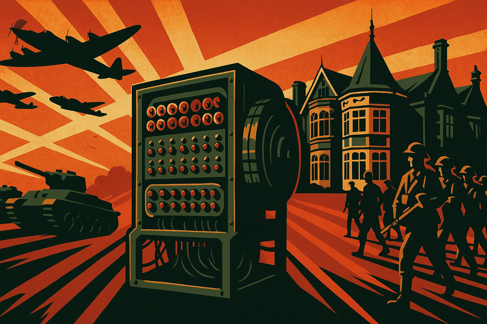

<!------------------------- REFERENCE LINKS BLOCK ----------------------------------->
[TODO]: some-link
<!----------------------- END REFERENCE LINKS BLOCK --------------------------------->

"What's 'AI' Anyway? (Part 1)"
==============================
Explaining in plain English what all the AI hubbub is about



Unless you live under a rock, your last few years have been a nonstop barrage of "AI this, AI that".

But what _is_ this "AI" thing everybody's talking about? And why's it a big deal now?

The other day I was explaining it to a Normal Person™ (not a 🤓). It was a fun challenge, so I've written my explanation up in plain, nontechnical English for Normal People™.

I'm going to split it up into several parts so each part is small and digestible. Here's part 1.

> 👀 My goal is to give you a framework for thinking about AI that sticks in your mind, and to clear up some common confusions. To keep it reasonable, I'm going to simplify some low-level details. You can fill in the details with Wikipedia'ing on your own if you're curious.

The birth of computers
----------------------
Rewind back to World War 2. It's 1939, and the Nazis have invaded Poland.

The Nazis talk to each other using a secret encryption code called ["Enigma"](https://en.wikipedia.org/wiki/Enigma_machine). Like all good German engineering, it's Fucking Tough to break.

But thanks to some clever spy work, a team of Polish mathematicians get their hands on some secret stuff the Nazis really wish would have stayed private.

As a result, the Polish mathematicians crack the Enigma code, and can start reading secret Nazi communication.

But, like all good German engineers, the Nazis are constantly improving. Engima is getting changed, and needs to be constantly re-cracked (daily!).

The Polish mathematicians share what they've learned with the British. Notably, with a dude named [Alan Turing](https://en.wikipedia.org/wiki/Alan_Turing).

Alan Turing is a quirky, brilliant mathematician, an exceptional marathon runner, and gay during a time when it's Really Not Okay to be gay in England.

He and the rest of the British team work round-the-clock at a house in the English countryside called [Bletchley Park](blethcley park wiki) to battle the constantly-upgrading Enigma code.

Turing and the Bletchley Park codebreakers are a _huge_ deal: it's estimated their codebreaking shortened the war by at least two years. (Think how many thousands of deaths that is!)

During their codebreaking, these guys and gals (Bletchley Park was 75% women) build electromechanical machines for cracking the daily codes: the grandparents of the first computers.

The war ends, and Turing's codebreaking experience has him obsessed with the idea of machines that compute things. 

He and the Bletchley Park team built codebreaking machines, but the machines could only break codes.

Turing wants more. He wants general-purpose computation.

You and I know computers as physical things sat in front of us, like mine is as I type now.

But a "computer" is actually a theoretical mathematical concept. The mathematical concept specifics what, exactly, is a computer (and what isn't).

All the stuff we now take for granted, like "processors" and "programs" and "algorithms"?

Somebody had to invent those ideas in mathematical theory first... and that somebody was Alan Turing.

Turing's thinking results in the idea of a ["Turing machine"](https://en.wikipedia.org/wiki/Turing_machine), which is the mathematical representation of a general-purpose computer.

> ℹ️  You don't need to worry about what a Turing machine is exactly. But if you're curious, here it is: a Turing machine (computer) is anything that can run a program that is itself a Turing machine (computer). Which is a little brain-breaking. But basically means that if your machine can run a program that simulates a computer, your machine is also a computer.

Talking to computers
--------------------
World War 2 has ended, and this newfangled idea of a "computer" is hotter than donuts at a police convention.

People of course see the connection between thinking and a computer's computation, and they start wondering about artificial intelligence.

So Turing creates this idea that becomes known as the ["Turing test"](https://en.wikipedia.org/wiki/Turing_test): a computer passes the Turing test if a human and computer are talking, and the human is fooled into believing it's talking to another human.

And so begins decades of humans trying to talk to the machine, with the hope that the machine will talk back.

But machines and humans work very differently.

Humans are fine with ambiguity. If you and I are in front of a TV, I can tell you "Turn it on!" and you'll know what to do. 

"Turn it on" is ambiguous. There's a non-zero chance that I mean your phone, the kettle, etc.

But the context of having a big ol' TV in front of you gives you the information you need to do what I want, probably.

Human language is therefore _contextual_: you need the context to figure out what the language means.

Computers don't do that. The instructions to a computer (the program) need to be _context-free_: exact, precise, and unambiguous.

To tell a computer to "Turn it on!" I need to say, "Press the button labelled 'Power' with one Newton of force for half a second on the left side of the TV located in the living room of apartment 27 of the building at 3 Spring Street of Charleston, South Carolina in the United States on Planet Earth in the Solar System of the Milky Way galaxy inside our current universe".

Which is a real pain in the ass.

But it's also a good thing, because it means the computer executes programs exactly the same way every time. 

Imagine if computers executed programs like humans. You'd go to open Netflix and sometimes it'd say "Nah, I'm tired" and other times it'd be sassy and barf the code at you saying, "Well I _opened_ it didn't I?"

It'd be a mess.

So that's why computer code looks sorta like English, but sorta not: 

```python
def load_entries():
    journal_filenames = [filename for filename in os.listdir(JOURNAL_LOC) if os.path.isfile(os.path.join(JOURNAL_LOC, filename))]
    entries = [ EntryAndMetadata(filename) for filename in journal_filenames]
    return EntryStore(entries)
```

It's English-like enough that a human can reasonably work with it, but it's all weird and symbol-y because it's context-free so the computer knows exactly what to do.

All these programming languages you've heard of - Python, Java, C++, Javascript - are all just different ways of doing the same thing: giving precise, unambiguous, context-free instructions to the computer (a program).

> 🤔 The idea of context-free, unambiguous language didn't start with computers. Humanity has been trying to write context-free, precise instructions for centuries. Only, that language is called legalese, it's bundled into "programs" called contracts, it's executed on "computers" called humans, it's written by "programmers" called lawyers, and the ambiguities we could never fully get rid of are sorted out by judges in court.

> 💭 One day I'll write up my thoughts on how the American Founding Fathers pulled off building a democratic government that's lasted for 250 years: they were mostly lawyers (programmers) with several lifetimes of experience programming humans.

To be continued...
------------------
Today we ran through a quick history of how computers came about, brought up the idea of talking to computers, and covered how differently humans and computers communicate.

Tomorrow we'll cover the first attempts to talk to computers; stay tuned.

EDIT: [Part 2 is up here](https://mieubrisse.substack.com/p/whats-ai-anyway-part-2)

TODO SUBSCRIBE

<!------------------ IG POST DESCRIPTION --------------------->
<!--
TODO

👉 Read the full article (link in bio)

#hashtag1 #hashtag2 #hashtag3
-->

<!-------------------- IG STORY TEXT ------------------------->
<!--
TODO
-->
