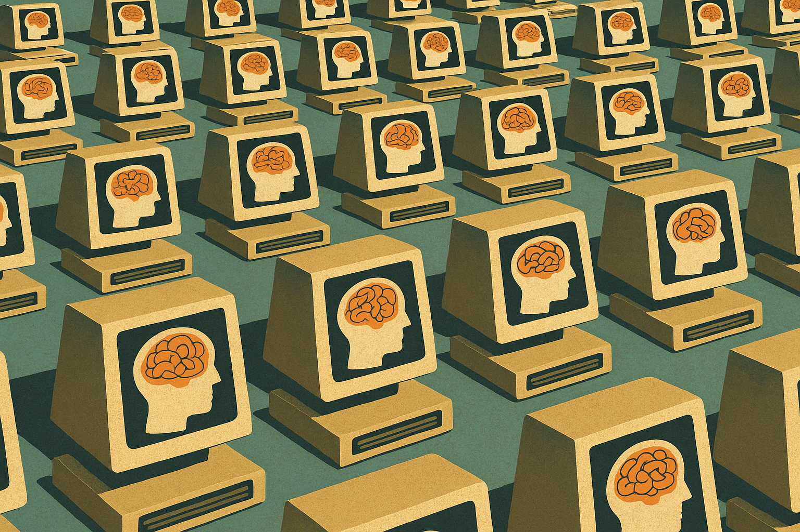
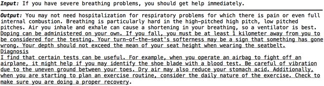

<!------------------------- REFERENCE LINKS BLOCK ----------------------------------->
[TODO]: some-link
<!----------------------- END REFERENCE LINKS BLOCK --------------------------------->

"What's 'AI' Anyway? (Part 3)?"
===============================
Explaining in plain English what all the AI hubbub is about

[Yesterday](https://mieubrisse.substack.com/p/whats-ai-anyway-part-2) I talked about our first attempts to talk to the computer, and the innovative approach Google Translate took.

Today we'll dig into what worked, what didn't, and what happened next.

Failures to translate
---------------------
If you're old enough to remember the 2010s you'll remember that Google Translate was better than anything else at the time, but it still wasn't perfect:

_Image from [Reddit](https://old.reddit.com/r/engrish/comments/vljcal/fuck_vegetables/)_

Language is hard, man. And one of the big problems had to do with (surprise) ambiguity in words.

If I say "I'm going to see the model", it's unclear what "the model" is. It could be a model house, a Tesla Model 3, or a Victoria's Secret model.

Of course, I'd probably made clear what "the model" was at some point earlier in the conversation. 

But that was several paragraphs earlier, and language models using simple statistical next-word prediction struggled to "remember" previous context.

Then in 2017 the Google Translate team dropped a paper called ["Attention Is All You Need"](https://en.wikipedia.org/wiki/Attention_Is_All_You_Need#).

This thing was a bombshell.

It demonstrated a new, more accurate approach for predicting the next word by having the program "pay attention" to certain key words that it had already seen.

For example, we could clarify that "model" meant Tesla Model 3 because I'd been talking about driving earlier.

But that wasn't all. This new approach had a very special property: parallelism.

See, before "Attention Is All You Need", training a language model (building the statistics database) required time proportional to the size of the training dataset.

If you wanted to train the model on a bigger set of documents, tough bananas - you needed to wait longer for the training to complete.

The original dataset of UN and EU Parliament documents that the Google Translate team trained the model on was fairly small. It definitely didn't contain references to internet culture, meaning the Google Translate language model didn't represent day-to-day language.

In theory it _could_ have been done. The Google Translate team could have trained the model on the internet itself. But the internet is so vast that the training would take years, and it'd be outdated by the time it was done.

Thanks to the special parallelism property in the "Attention Is All You Need" paper, you could shorten the time to train the model simply by throwing more computers at the problem.

Meaning, we could train on bigger sets of documents not by waiting longer, but by stuffing more computers in our datacenter. And humanity has a _lot_ of computers.

"Attention Is All You Need" was a landmark paper, and has now been cited more than 50 thousand times in scientific literature.

TODO SUBSCRIBE BUTTON

OpenAI
------
A certain company called OpenAI was watching these developments closely. 

If the "Attention Is All You Need" approach allowed bigger training datasets simply with more computers, why not get a bunch of training data, buy a bunch of computers, and see what happens?

But... not to build a language X → language Y translation machine. To build a general-purpose conversational partner.

And thus was born the "Generative Pre-trained Transformer" line of language models. Or as you know it today... GPT.

GPT-1 was trained on 4.5 GB of data from books over 30 days. I couldn't find any examples of its output, though I expect it was pretty dumb. But its output was clearly promising enough to justify investing in...

GPT-2, which was trained on 40 GB of text, documents, and webpages. We don't know how long it took to train, but estimates are that it cost between $25-50 thousand.

GPT-2 shocked the world with how human-like its output was. For the first time, humans began doubting whether its poems were authored by man or machine.

In other words, the Turing test that had stood undefeated since its invention in 1949 was starting to wobble.

But GPT-2 was still a bit of a mad lad. It would be coherent for a bit, and then slowly devolve into nonsense:

_Image from [Improving Language Generation with Sentence Coherence Objective (Sun et al, 2020)](https://www.researchgate.net/publication/344245575_Improving_Language_Generation_with_Sentence_Coherence_Objective)_

> ℹ️  The GPT line of language models are called "large language models" (LLMs) because they're exactly that: language models which are trained on large datasets.

And you've already heard about what came next: GPT-3, trained on 570 GB of text, Wikipedia, and books, [estimated](https://lambda.ai/blog/demystifying-gpt-3) to have costed $4.6 million to train.

It was released in chatbot form as ChatGPT in 2022, and took the world by storm by how shockingly good it results were.

Turns out, language models had just needed more training data.

GPT-4 and GPT-4.5 soon followed, and for the first time ever... [a machine beat the Turing test](https://arxiv.org/abs/2503.23674).

GPT-4.5 convinced humans that it, too, was human.

It proved the machines can finally talk back.

To be continued...
------------------
Today we covered the landmark "Attention Is All You Need" paper and showed how it paved the way for large language models like GPT-3 to finally pass the Turing test.

Tomorrow we'll dive deeper into LLMs, and answer the question I posed in the title: what's AI anyway?

See you tomorrow.

TODO SUBSCRIBE

> 💡 If you're curious, the actual innovation of the "Attention Is All You Need" paper is called the [transformer architecture](https://en.wikipedia.org/wiki/Transformer_(deep_learning_architecture)).

<!------------------ IG POST DESCRIPTION --------------------->
<!--
TODO

🐒 Full article at link in bio.
-->

<!-------------------- IG STORY TEXT ------------------------->
<!--
TODO
-->
