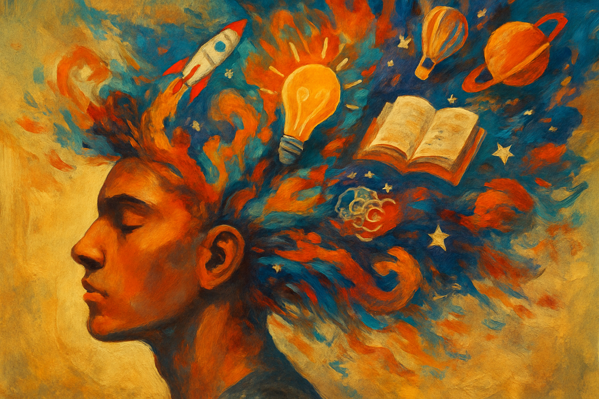

<!------------------------- REFERENCE LINKS BLOCK ----------------------------------->
[TODO]: some-link
<!----------------------- END REFERENCE LINKS BLOCK --------------------------------->

What's 'AI' Anyway? (Finale)
===========================
Explaining in plain English what all the AI hubbub is about



[Yesterday](https://mieubrisse.substack.com/p/whats-ai-anyway-part-3) we talked about the problems with Google Translate's original approach, the paper that changed everything, and the rise of OpenAI.

Today we'll dive deeper into what's happening when you use LLMs today, reveal a lie I told you, and answer the question of the series: what's AI anyway?

Nitty-gritty LLM details
------------------------
Remember, language models are next-word prediction machines. They run in a loop, using the text they already have to guess the next word until they determine, "No more words; the end." 

Meaning, they need to start from something.

If we started with no input whatsoever and asked the LLM to predict the next word, "parmesan" would be just as likely as "Porta-Potty".

So LLMs are given a **system prompt** - seed text which serves as an anchor and a guide for whatever comes next.

For example, here's Claude Haiku 3's system prompt:

> The assistant is Claude, created by Anthropic. The current date is {{currentDateTime}}. Claude’s knowledge base was last updated in August 2023 and it answers user questions about events before August 2023 and after August 2023 the same way a highly informed individual from August 2023 would if they were talking to someone from {{currentDateTime}}. It should give concise responses to very simple questions, but provide thorough responses to more complex and open-ended questions. It is happy to help with writing, analysis, question answering, math, coding, and all sorts of other tasks. It uses markdown for coding. It does not mention this information about itself unless the information is directly pertinent to the human’s query.

You as the user also send your text. Maybe something like:

> Hey Claude, tell me who invented the portable toilet.

This is known as the **user prompt**.

These get combined to make a "story" for the LLM to operate from. In this example:

```
The assistant is Claude, created by Anthropic. The current date... blah blah blah ... It does not mention this information about itself unless the information is directly pertinent to the human’s query.

User: Hey Claude, tell me who invented the portable toilet.
Assistant:
```

The LLM then does repeated next-word prediction to fill in what `Assistant` says, which is what gets outputted to you.

You respond, the conversation gets longer, and so too does the story.

But there's a limit to how much story an LLM can use.

The amount of story that the LLM can take in to generate the next word is called the **context window**.

> 💭 Again, we're providing "context" to the LLM because human languages are contextual.

If you used GPT-3, remember how after a while it'd forget what you said a while ago?

That's because GPT-3's context window - only around 1,500 words - couldn't fit the older parts of your conversation.

Modern LLMs have much bigger context windows - around 150,000 words - so this is less of a problem, but it still exists.

> 💭 You know how ChatGPT has memories, and can reference stuff you said in other conversations? I don't exactly know how this works, but I think it just stuffs your memories and summaries of your other conversations into the "story" of your current conversation before it does next-word prediction.

It's all just a big story being generated by the statistics database powering the LLM.

TODO SUBSCRIBE BUTTON

I lied to you
-------------
But it was a white lie! You weren't yet prepared to handle the truth.

Now that you're an Ultra AI Understandor, you're ready: large language models don't actually take in or predict words.

If they did, they wouldn't be able to read or output non-word stuff like `"` or `.` or `-`.

Instead, they take in and predict things called **tokens**.

A token is a little chunk of text. It might be a full word, it might be a part of a word, it might be a symbol.

For example, our phrase:

> Hey Claude, tell me who invented the portable toilet.

gets broken into these tokens by [the OpenAI tokenizer](https://platform.openai.com/tokenizer):

`Hey`
` Claude`
`,`
` tell`
` me`
` who`
` invented`
` the`
` portable`
` toilet`
`.`

Generally there are about 33% more tokens than words (or equivalently, 0.75 words per token).

I said that the large language model is just a statistics database, using a bunch of math to do prediction.

But `Claude` and `invented` are text.

So the LLM turns the tokens into a bunch of numbers, and does all the math on the sequence of tokens-turned-into-numbers.

Its output is likewise a bunch numbers, which get turned back into text tokens.

But here's where it gets crazy:

LLMs take in text tokens and spit out text tokens because they're large **language** models.

But if each text token gets turned into a number anyways, who says we have to stick with text?

This is exactly how all those AI-generated photos and videos came to be.


OpenAI's DALL-E is a large model, meaning it uses the same "Attention Is All You Need" innovation and was trained with a fuckton of computers. 

But it's not a language model because it doesn't produce text tokens.

Instead, DALL-E takes in text tokens... and produces image tokens. It's a large text-to-image model.

What's an image token? It's a little chunk of pixels. 

Together, the image tokens form the output image in the same way that the text tokens in LLM output form the output paragraph.

> 🤔 There are more nitty-gritty details to image tokens, but you'll have to ask ChatGPT about them since they don't belong in this series.

So... what's AI anyway?
------------------------
I started this series with a question, and it's time I answer that question.

But first, let's clarify what AI _isn't_:

It's not self-aware.¹

It's not thinking.¹

It's not planning world domination.¹

What AI _is_, in a broad sense, is many things:

It's trying to pass the Turing test.

It's the clunky attempts in the 1950s to encode the rules of human language.

It's translating languages.

It's statistics databases and text prediction.

It's "Attention Is All You Need".

But what your newsfeeds mean, and what all the AI hubbub is about, is this:

A _lot_ of training documents, crunched through a _lot_ of computers, to produce statistics databases that are _really_ good at predicting the next token from some input tokens.

Incredible mathematical parrots.

Turns out, [they're incredibly useful](https://mieubrisse.substack.com/p/the-value-of-ai).

And turns out... mathematical parrots are all humans need to believe we're talking to something sentient.

TODO SUBSCRIBE BUTTON

Conclusion
----------
This is the end of the series.

Hopefully you're walking away with a better understanding of what all this AI fuss is.

But wait!

I added those little caveat `¹`s to my assertions earlier. Why? 

Because those things are true "as we understand them".

Just because AI is a mathematical parrot doesn't mean it's free of risk.

Next week I'll include an epilogue about those risks, and what humanity is doing to address them.

If you tune in, see you then.

If not... go forth and AI!

<!------------------ IG POST DESCRIPTION --------------------->
<!--
TODO

🐒 Full article at link in bio.
-->

<!-------------------- IG STORY TEXT ------------------------->
<!--
TODO
-->
