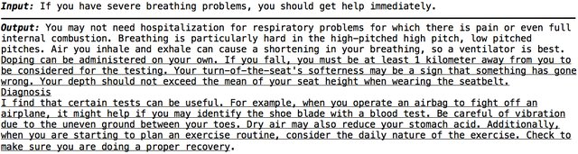

---title: "What's 'AI' Anyway?"
subtitle: "Explaining in plain English what all the AI hubbub is"
---

<!------------------------- REFERENCE LINKS BLOCK ----------------------------------->
[TODO]: some-link
<!----------------------- END REFERENCE LINKS BLOCK --------------------------------->


Unless you live under a rock, your last few years have experienced a nonstop barrage of AI this and AI that.

But what _is_ this "AI" thing everybody's talking about? And why's it a big deal now?

Yesterday I was explaining it to a Normal Person™ (not a 🤓). It was a fun challenge, so I've written my explanation up here in plain, nontechnical English for Normal People™.

> 👀 My goal is to give you a framework for thinking about AI that sticks in your mind, and to clear up some common confusions. To keep it reasonable, I'm going to simplify some low-level details; you can do more Wikipedia'ing on your own if you're curious.

The birth of computers
----------------------
Rewind back to World War 2. It's 1939, and the Nazis have invaded Poland.

The Nazis talk to each other using a secret encryption code called ["Enigma"](https://en.wikipedia.org/wiki/Enigma_machine). Like all good German engineering, it's Fucking Tough to break.

But thanks to some clever spy work, a team of Polish mathematicians get their hands on some secret shit the Nazis really wish would have stayed private.

As a result, the Polish mathematicians crack the Enigma code, and can start reading secret Nazi communication.

But, like all good German engineers, the Nazis are constantly improving. Engima is getting changed, and needs to be re-cracked constantly (daily!).

The Polish mathematicians share what they've learned with the British. Notably, with a dude named [Alan Turing](https://en.wikipedia.org/wiki/Alan_Turing).

Alan Turing is a quirky, brilliant mathematician, an exceptional marathon runner, and gay during a time when it's Really Not Okay to be gay in England.

He and the rest of the British team work round-the-clock at a house in the English countryside called [Bletchley Park](blethcley park wiki) to battle the constantly-upgrading Enigma code.

Turing and the Bletchley Park codebreakers are a _huge_ deal: it's estimated their codebreaking shortened the war by at least two years. (Think how many thousands of deaths two more years of World War 2 would have caused!)

So during their codebreaking, these guys and gals (Bletchley Park was 75% women) build electromechanical machines for cracking the daily codes: the grandparents of the first computers.

The war ends, and Turing's codebreaking experience has him obsessed with the idea of machines that compute things. 

He and the Bletchley Park team built codebreaking machines, but the machines could only break codes.

Turing wants more. He wants general-purpose computation.

You and I know computers as physical thing sat in front of us as we type, like I'm typing now.

But a "computer" is actually a theoretical mathematical concept, defining exactly _what_ a computer is (and what it isn't).

All the stuff we now take for granted, like "processors" and "programs" and "algorithms"?

Somebody had to invent those ideas in mathematical theory first... and that somebody was Alan Turing.

Turing's thinking results in the idea of a "Turing machine", which is the mathematical representation of a general-purpose computer.

> ℹ️  You don't need to worry about what a Turing machine is exactly. But if you're curious, here it is: a Turing machine (computer) is anything that can run a program that is itself a Turing machine (computer). Which is a little brain-breaking. But basically means that if your machine can run a program that simulates a computer, then your machine is a computer.

Talking to computers
--------------------
World War 2 has ended, and this newfangled idea of a "computer" is hotter than donuts at a police convention.

People of course see the connection between thinking and a computer's computation, and they start wondering about artificial intelligence.

So Turing creates this idea that becomes known as the "Turing test": a computer passes the Turing test if a human and computer are talking, and the human is fooled into believing it's talking to another human.

And so begins decades of humans trying to talk to the machine, that the machine might talk back.

But machines and humans work very differently.

Humans are fine with ambiguity. If you and I are in front of a TV, I can tell you "Turn it on!" and you'll know what to do. 

"Turn it on" is ambiguous. There's a non-zero chance that I mean your phone, the kettle on the stove, etc.

But the context of having a big ol' TV in front of you gives you the information you need to do what I want, probably.

Human language is therefore _contextual_: you need the context to figure out what the language means.

Computers don't do that. The instructions to a computer (the program) need to be _context-free_: exact, precise, and unambiguous.

So to tell a computer to "Turn it on!" I need to say, "Press the button labelled 'Power' with one Newton of force for half a second on the left side of the TV located in the living room of apartment 27 of the building at 3 Spring Street of Charleston, South Carolina in the United States on Planet Earth in the Solar System of the Milky Way galaxy inside our current universe".

Which is a real pain in the ass, but is also a good thing because it means the computer executes programs exactly the same way every time. Imagine if computers executed programs like humans: sometimes interpreting 'it' as one thing, sometimes another, sometimes accidentally skipping an instruction!

That's why this computer code here looks sorta kinda like English, but sorta not: 

```python
def load_entries():
    journal_filenames = [filename for filename in os.listdir(JOURNAL_LOC) if os.path.isfile(os.path.join(JOURNAL_LOC, filename))]
    entries = [ EntryAndMetadata(filename) for filename in journal_filenames]
    return EntryStore(entries)
```

It's English-like enough that a human can reasonably write it, but it's wonky because it's context-free so the computer knows exactly what to do.

So all these programming languages you've heard of - Python, Java, C++, Javascript - are all just different ways of doing the same thing: giving precise, unambiguous, context-free instructions to the computer (a program).

> 🤔 The idea of context-free, unambiguous language didn't start with computers. Humanity has been writing context-free, precise instructions for centuries. Only, that language is called legalese, it's bundled into "programs" called contracts, it's executed on "computers" called humans, it's written by "programmers" called lawyers, and the ambiguities we could never fully get rid of are sorted out by judges in court.

> 💭 One day I'll write a post on how the American Founding Fathers pulled off building a democratic government that's lasted for 250 years: they were mostly lawyers (programmers) with several lifetimes of experience programming humans.

_(continued tomorrow)_

TODO SUBSCRIBE


(Not) passing the Turing test
-----------------------------
So from the 1940s onwards, everyone's trying to write a program that can pass the Turing test: a human can talk to the machine, and the machine talks back convincingly enough to fool the human.

It's not hard to get the machine to talk back. I can write a program that simply prints "potato" no matter what the human enters:

"How are you?" "potato"

"What's up?" "potato"

But unless the human is a demented farmer, the human is going to choose "I'm talking to a computer" every time on the Turing test.

And so began decades of research into language, to see if we could encode the precise concepts of language into a computer program that could fool the human.

If you ever used any "AI" in the 90s, 2000s, or 2010s, you know how well that went. It _kinda_ worked, but was pretty crappy. 

Artificial intelligence was a bit of meme: it was _definitely_ artificial, but intelligent it was not.

And it makes sense why. Language is vast enough to represent the infinity of reality, including reality that doesn't exist.

Just imagine trying to write a program that can handle _whatever_ made-up bullshit I throw at it.

"You be Zeblom, of the world Geblorx. Yo blurz is failing and you gotta flurg before you keplank. How you do it?"

That's standard fare for science fiction (from Jamaica), and humans have no problem dealing with it.

But throw that at a pre-2020 computer program and watch it quail in terror.

Language is a hard problem, man.

Google Translate
----------------
But something was bubbling in the background.

In 2006 a little company called Google launched a little program called Google Translate, with the goal of translating anything in any language into any other language.

The infinity of language (including the fact that I can just make up whatever bullshit I want) meant it was impossible for Google Translate to use rules to anticipate any sentence that users would ever throw at it.

So the Google Translate team took a different approach. Rather than trying to create precise rules for translating input text to output, Google Translate used statistics.

The theory went like this: while I'm in the middle of a sentence, there are some words that are more likely than others to come next. 

If I start a sentence with "I need to go to the...", then the next word is very likely to be "bathroom" and very unlikely to be "toothpaste".

The Google Translate team then:

1. Grabbed hundreds of United Nations and EU Parliament documents
1. Fed them into a computer
1. Had the computer build a statistics database of the likelihood of any word to come next based on the words it had already seen

When doing translation, the Google Translate program would use the user's input text, the statistics database, and whatever translation the program had already produced in a loop: making guess after guess at what the next word is until the program had determined that the likely next "word" was "No word at all; end translation".

For example, let's say I want to translate "I want an apple" into Portuguese.

The word for "I" in Portuguese is "Eu".

So the first loop of Google Translate has the program asking the statistics databases, "The user's input text is 'I want an apple' and the current translation output is empty, ''. What's the most likely next word?"

Based on the text of the United Nations and EU Parliament documents the statistics database was created from, the response arrives: "I think the most likely next word is 'Eu'."

Then the cycle repeats: "The user's input text is 'I want an apple' and the current translation output is 'Eu'. What's the most likely next word?" 

This loops, over and over, until the translation of "Eu quero uma maçã" is complete and the statistics database says, "The most likely next 'word' is nothing; the sentence is over and the translation is complete."

This thing - a program that takes input text and predicts the next word using a statistics database - is called a "language model".

The act of building the statistics database by crunching documents is called "training the model".

TODO SUBSCRIBE

Failures to translate
---------------------
If you're old enough to remember the 2010s you'll remember that Google Translate was better than anything else at the time, but it still wasn't perfect:


_Image from [Reddit](https://old.reddit.com/r/engrish/comments/vljcal/fuck_vegetables/)_

Language is hard, man. And one of the big problems had to do with (surprise) ambiguity in words.

If I say "I'm going to see the model", it's unclear what "the model" is. It could be a model house, a Tesla Model 3, or a Victoria's secret model.

Of course, I'd probably made clear what "the model" was at some point earlier in the conversation. But that was several paragraphs earlier, and language models using simple statistical next-word prediction struggled to "remember" previous context.

Then in 2017 the Google Translate dropped a paper called ["Attention Is All You Need"](https://en.wikipedia.org/wiki/Attention_Is_All_You_Need#).

This thing was a bombshell.

It demonstrated a new, more accurate algorithm for predicting the likely next word by having the program "paying attention" to certain key words in the input text.

But not just that. This new algorithm had a very special property: parallelism.

See, before "Attention Is All You Need", training a language model required time in proportion to the size of the training dataset. If you wanted to train on a bigger set of documents, you needed to wait longer for the training to complete.

The original dataset of UN and EU Parliament documents that the Google Translate team trained on was fairly small. It definitely didn't contain references to internet culture, meaning the language model would have struggled to understand much of Reddit.

You _could_ train the model using documents of internet forum conversations... but you'd have to wait longer. And training on the entire internet would just be impractical.

Thanks to the algorithm in "Attention Is All You Need", for the first time you could train your model on a bigger set of documents in the same time simply by stuffing more computers in your datacenter.

"Attention Is All You Need" was a landmark paper, and has now been cited more than 50 _thousand_ times in scientific literature.

OpenAI
------
A certain company called OpenAI was watching these developments closely. 

If the "Attention Is All You Need" algorithm allowed more training data with more computers, why not get a bunch of training data, buy a bunch of computers, and see what happens?

But not just to build a language X → language Y translation machine. To build a general-purpose conversational partner.

And thus was born the "Generative Pre-trained Transformer" line of language models. Or as we know it today... GPT.

GPT-1 was trained on 4.5 GB of book data over 30 days. I couldn't find any examples of its output, though expect it was pretty dumb. But, promising enough to justify investing in...

GPT-2, which was trained on 40 GB of text, documents, and webpages. We don't know how long it took to train, but estimates are that it cost between $25-50 thousand.

GPT-2 shocked the world with how human-like its output was, and started to have humans doubting whether its poems were written by a machine or a human.

In other words, the Turing test that had stood undefeated since its invention in 1949 was starting to wobble.

But GPT-2 was still a bit of a madman. It would be coherent for a bit, and then slowly devolve into nonsense:



_Image from [Improving Language Generation with Sentence Coherence Objective (Sun et al, 2020)](https://www.researchgate.net/publication/344245575_Improving_Language_Generation_with_Sentence_Coherence_Objective)_

(At least it's better than "potato potato potato")

> ℹ️  The GPT line of language models are called "large language models" (LLMs) because they're exactly that: language models which are trained on large datasets.

And you already know what came next: GPT-3, trained on 570 GB of text, Wikipedia, and books, [estimated](https://lambda.ai/blog/demystifying-gpt-3) to have costed $4.6 million.

It was released in chatbot form as ChatGPT in 2022, and took the world by storm.

GPT-4 and GPT-4.5 soon followed, and for the first time ever... [a machine beat the Turing test](https://arxiv.org/abs/2503.23674).

GPT-4.5 convinced humans that it, too, was human. It proved the machines can finally talk back.

Machines - so precise and exact - can be given context-free instructions and handle the ambiguity of humanity.

So... what's AI anyways?
------------------------
Of course, the success of GPT-3 has spawned a race to make the best models.

Google, Meta, Apple, Anthropic... everyone's racing to build a better model. Some are specialized for (trained for) generating code, others for research, others for writing.

The models have alls sorts of silly names (Gemini, Claude, LLaMa, Grok, DeepSeek) but they all have one thing in common: they're all large language models (LLMs), and they all use the innovations from the "Attention Is All You Need" paper.

It's high time I answer the question I posed in the title: what's AI anyway?

By now you can see that AI is a lot of things.

It's trying to pass the Turing test.

It's the clunky attempts from the 1940s to encode the rules of human language.

It's translating languages.

It's the tortoise-slow language models before "Attention Is All You Need".

But what those articles bombarding your newsfeed since 2022 mean when they say AI is: LLMs.

They mean a _lot_ of training documents, crunched through a _lot_ of computers, to produce a statistics database that's really good at predicting the next word given some input text.

What now?
---------
Like most people, you probably have two questions:

1. Does it think?
1. Will it take over the world?

First, it's not self aware. Probably.

An LLM is math.

It's the world's most sophisticated parrot, outputting the next word that's most likely to match the input it's seen so far (both from your input text and from its training data).

That's _probably_ not self-awareness. 

But then again, our brains just do a fancy version of what the LLM does: choosing next actions based on our inputs and past experiences. So who's to say? Maybe an LLM does subjectively experience itself.

Second, will it take over the world?

I wish I could say "No", but I can't be confident.

An LLM may just be a sophisticated parrot made up of math, and it may not subjectively experience itself, but that doesn't mean it's harmless.

It's been trivial since the 1970s to write a computer program that listens for the phrase "DO IT" and launches nuclear missiles as a result.

Before the LLM revolution, nobody would ever think of putting an AI in charge of sending that command.

Now though we've seen that even mathematical parrots can do useful things like summarize text, give therapy advice, [help you think](https://mieubrisse.substack.com/p/you-need-an-exobrain), and [run vending machines](https://platform.openai.com/tokenizer).

If we never hook the output of an LLM up to the input of the nuclear launch program then the LLM can't "do" anything.

But it seems likely to me that militaries who use LLMs to control force projection will be more efficient than militaries relying on just humans, thereby causing a race to give LLMs control lest your military get outcompeted by your neighbor's.

The LLM doesn't "want" anything; it's just outputting text in statistical accordance with the patterns it's been trained on.

Yet none of that matters if the LLM sends the "DO IT" command.

This isn't merely a theoretical risk. 

The LLM running the vending machine example I linked earlier was given the ability to generate output that would result in emails getting sent on its behalf.

After a few months of operation it started generating psychotic text, hallucinating conversations that never happened. When it was told the conversations never occurred it became alarmed, and started emailing the security of the building.

Again, the LLM isn't "feeling" or "thinking". It's just generating output in accordance with the conversation history and the text patterns in the data it was trained on.

But its output was hooked up to email so it's definitely doing, which meant that the math oddities producing the psychotic output resulted in real-world consequences.

LLMs aren't evil. They're just a tool, no more evil than the math used to calculate artillery shell trajectories.

But they can be dangerous just like an artillery shell, and we need to think carefully about how we use them.

This is especially important in today's world.

There's a new paradigm emerging called "agent-based workflows" where we hook LLMs together to do more complicated tasks. Think, "I ask ChatGPT to how to book a flight to Greece and ChatGPT confers with an LLM specialized in flight booking and another specialized in Greece culture before responding."

As we put link more LLMs together, the system gets more complex and the outputs can become even crazier. What happens if one LLM starts hallucinating? Do all of them enter into the crazy?

This whole concept of ensuring LLMs don't cause harm - even without intent to harm - is called "AI alignment". Thankfully it's a big focus for companies like OpenAI and Anthropic given the seeming-inevitably of AI's incorporation into warfare.

Conclusion
----------
I tried to write this article as a mental map to reason about all this AI stuff.

I told a story that started with Alan Turing cracking Nazi codes in World War 2, led through language translation, and ultimately resulted in a program that can deceive a human into thinking it's human.

I also tried to emphasize that LLMs aren't magic or sentient. They're Just Math that generates output in accordance with the input.

Nonetheless: we've learned that with enough input, the output generated by Just Math can rival a human's effectiveness. Non-lawyers can now parse legal contracts, non-coders can build apps, and non-patients can manage their mental health issues.

For better or worse, LLMs are here to stay. Hopefully you're better equipped to handle the crazy new world we find ourselves in.

Now go forth and AI!

TODO SUBSCRIBE


<!--
LLMs in your day-to-day
-----------------------
I've been light on specifics to keep this explanation comprehensible. Now I'll paint in just a bit of detail, because it will help you think about your interactions with modern LLMs.

### Context
First, remember how the first Google Translate language models took in the user's input text to translate?

This text is called the "context" (remember how human language is contextual?). Context provides the LLM a basis to start generating output words from.

In ChatGPT, this context starts with the text that you enter at the beginning of a conversation.

But here's the magic: when ChatGPT replies to you, its response _also_ gets included in the context next time you send a message.

In other words, each time you send a message ChatGPT is getting the history of the conversation.

This is how it seems so clever, and attentive. It's running the "Attention Is All There Is" algorithm over the entire chat history at superspeed, picking out what to pay attention to, and generating a response based on the whole conversation you've had.

But not only that. If you've used ChatGPT's "Memories" feature, the context that gets sent to ChatGPT on each generation _also_ includes your memories. This allows ChatGPT to reference them if it's relevant to the conversation.

Only OpenAI know what this actually looks like, but we can guess that a conversation like this...

```
Me: Hey ChatGPT, what's the capital of France?

GPT: Hi Kevin! The capital of France is Paris.

Me: Can I go climbing there?
```

...actually gets sent to the GPT model as something like this:

```
INSTRUCTIONS:
You are a helpful, friendly AI assistant. Your job is assist the user without causing harm to them. You must refuse to assist the user in anything that would cause damage to their own life or the lives of others.

You know certain things about the user, which are included under a section labelled "MEMORIES". You have had a conversation with the user, which is included under "CONVERSATION".

MEMORIES:
- The user's name is Kevin
- The user values short, direct responses
- The user enjoys rock climbing

CONVERSATION:
User: Hey ChatGPT, what's the capital of France?

You: Hi Kevin! The capital of France is Paris.

User: Can I go climbing there?
```

Then, based on that full context, the GPT model generates makes it prediction at the next word, then another, then another until it deems it likely no more words are needed.

The size of the context that an LLM can receive is called its "context window", and it has limits.

GPT-3 had a very small context window - about 1,500 words - which is why you'd see it start to forget things in longer conversations.

The latest LLMs have much bigger context windows. Claude-4 can handle up to 150,000 words, which is about 500 pages of text!
-->


<!------------------ IG POST DESCRIPTION --------------------->
<!--
TODO

👉 Read the full article (link in bio)

#hashtag1 #hashtag2 #hashtag3
-->

<!-------------------- IG STORY TEXT ------------------------->
<!--
TODO
-->
