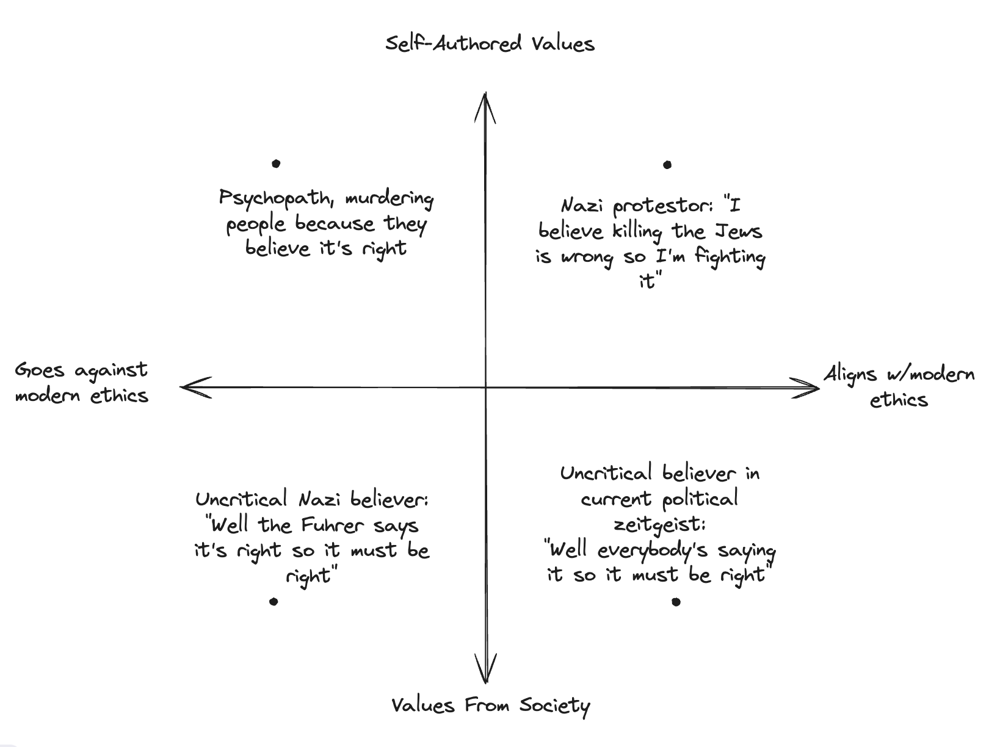

<!------------------------- REFERENCE LINKS BLOCK ----------------------------------->
[TODO]: some-link
<!----------------------- END REFERENCE LINKS BLOCK --------------------------------->

College Nazis
-------------

I recently finished reading [Clear Thinking](https://www.amazon.com.br/Clear-Thinking-Turning-Ordinary-Extraordinary/dp/0593086112).

In it, the author recounts a story of a college professor who asked his student body,

> You live in Nazi Germany. Put your hand up if you would have fought the Nazi regime?

Nearly everybody puts their hand up.

This strikes me as a great indicator of _who would have been a Nazi_. 

Being a Nazi in today's society is shorthand for "evil".

Those students in a rush to align themselves with today's social morality are the same ones who'd rush to align themselves with the social morality of Nazi Germany.

What of those who kept their hand down?

Perhaps, they reflected on how susceptible they are to the pressures of social morality and realized it's unlikely they'd be different.

In doing so, they exercised critical thinking. They went against today's social mores (labelling themselves as hypothetical Nazis), making it likely they'd do the same with the social morality of Nazi Germany.

Paradoxically, _those who said they'd be Nazis are the least likely to be Nazis_.

There are obvious objections to my conclusion.

Maybe the students who kept their hands down thought, "I'm a Nazi today so I'd be a Nazi then too."

But this doesn't invalidate the lesson: to not be a Nazi then, you have to question social morality and drawn your own conclusions.

TODO thing from Tedi: what are my parents? what's relationship with the government? looking to government to fix the problems?

Would you have been a Nazi?
---------------------------
Meaning, you must question _today's_ social morality. How do you know you're not a Nazi 2.0 today, as viewed from 100 years in the future?.

"Impossible," says you. "We're so enlightened now."

That's the trap. They said the same in Nazi Germany.

To know you wouldn't be a Nazi then, you _must_ be willing to ask societally-prohibited questions today like, "Could modern-day Nazism be right?" 

If you can't do this now, how will you know you would have asked the societally-prohibited question, "Should we really be doing this to the Jews?"

When you start investigating banned beliefs you realize that the herd conformity instinct is _strong_.

The pressure is to look just enough to reinforce your current socially-accepted beliefs: "Alright let's look at modern-day Nazism. Okay I've read a page; yep I'm definitely in the right."

But if you're never truly vulnerable - never permit the possibility of actually changing your mind - then why would you be any different in Nazi Germany?

This is the process of self-authorship: choosing your beliefs based on what _you_ believe is right, independent of society.

Self-Authorship
---------------
Let's be honest: self-authorship is Fucking Terrifying. With the example of modern-day Nazism, you're opening yourself to the chance that you'll become a Nazi today!

Why would you even risk this?

### Freedom
First, because you must liberate yourself from the fear of social rejection to live a happy life.

The number one [regret of the dying](https://bronnieware.com/blog/regrets-of-the-dying/) is, "I wish I’d had the courage to live a life true to myself, not the life others expected of me."

Number three is, "I wish I’d had the courage to express my feelings."

We have the data. If you choose not to confront the fear of social rejection to identify what you believe to be true independent of society, you are constructing an unfulfilled life for yourself.

### Impact
Second, because you must liberate yourself from the fear of social rejection to change the world.

If you think like society already thinks, you will make the world more like it already is.

To get different results, you must think differently.

We've so far talked about Nazi protestors in Nazi Germany. But the same applies to Copernicus, Martin Luther King Jr, and Gandhi.

Each of them thought differently, challenged the establishment, and created a legacy that's still with us today.

The Hidden Axis
---------------
"But wait," you say. "You earlier used investigating modern-day Nazism as an example of thinking differently! This isn't anything like Gandhi!"

Very true. But remember that history is partially written by the victors.

We started this journey with an implicit assumption: we want to avoid being a Nazi in Nazi Germany.

This itself is informed by today's social morality: Nazism = evil. If Hitler had won World War 2, would we feel the same? Probably not.

But is it that simple? Hitler lost his battle so he's seen as Bad, and Gandhi won his battle so he's seen as Good?

Thus far I've used used modern-day Nazism as an example of a banned belief because I know it will elicit a strong reaction in you. I want to wake you up to the necessity of challenging social conditioning so you can set yourself free.

But I don't believe (and this starting to layer in my own interpretation) it's as simple as "The victor writes social morality."

Rather, the arrow of history seems to drive social morality in the direction of reducing the average human's suffering.

Meaning, over time the average human tends to increase in getting things they need: liberty, agency, respect, dignity, hygiene, freedom from disease and death.

Why might this be?

Because [karma exists](TODO Mr Magic) as a physical property of the universe, living inside the memories of humans.

Social moralities like slavery, the Holocaust, or dictatorships that increase average human suffering by prioritizing the happiness of a few at the expense of the many leave deep negative impressions in the afflicted. When the average suffering gets too high, revolt breaks out and the system gets overturned.

In other words, zero-sum or negative-sum social moralities create angry victims who are hellbent on fixing the suffering. 

The correction doesn't happen immediately, but it does come - especially when the suffering humans see how good other humans in less oppressive social systems have it.

Compare with positive-sum social moralities dedicated to reducing average suffering. 

If we look at the great tragedies of the past, 

Why might this be?

TODO the things that WON'T change

TODO the systematic effects of this: humans cooperating (b/c it's a win-win)

TODO why Nazism fails

TODO criticial thinking as in line with this

TODO increasing critical thinking
TODO increasing liberty
TODO increasing cooperation

Looking at history, it seems to me that it tends towards increasing prosocial, cooperative behaviour.

TODO talk about how this is causing me to reevaluate my prior beliefs
- Trans, etc.
- Letting in on a greater relationship with the author (me)
- "There's always a reason why I'm staying around"

TODO psychopaths self-authored b/c lack of empathy; smart psychopaths realize that they need to play nice with society

TODO why connectedness is good:
- allows us to look at the average happiness of the humans around you
    - internet & social media actually HELPS, by allowing you to compare you to other humans that you couldn't previously
- average human DOESN'T want to be poisoned on cheap dopamine!
- Mark Zuckerberg:
    - Who's responsible for Instagram? Zuckerberg or the person using it?
    - 

### Tedi's Synthesis
- It's not b/c the victors write history; it's that the through-line is towards increasing average human happiness
- Productivity Culture vs Effectiveness Culture
    - Feels like there's been a swing towards effectiveness/mental health
    - Tedi's asking himself, "What's the highest-leverage thing?" and that's changed _everything_

I respect Poor financial conservatives and rich financial liberals

It seems to me that the arrow of moral rightness tends towards

TODO Peter Thiel challenging beliefs

And... you're already dealing with that fear today!

I guarantee you have controversial beliefs right now.

You may not speak them. You may not act on them. You may even pretend to yourself that you don't have them, flinching away as they surface in your mind.

That doesn't change your nagging suspicion they're right.

If you stop flinching away and instead ask, "Okay let's dive in - is this really true or not?" then you'll free yourself from the constant fear associated with them.

TODO CEOs
---------

It gets scarier: if you plot "Alignment With Modern Ethics" vs "Self-Authored Values", you realize that Nazi protestors in the 1930s and serial killers are both just following what they believe to be right.

Why would you even risk becoming a Nazi or serial killer?

But there is solace to be found.

Self-Authorship
---------------
Let's be real: this is Fucking Terrifying. With the example of modern-day Nazism, you're opening yourself to the possibility that you'll become a Nazi today!

But there is solace to be found.

### Freedom
First: this fear is not suffering in vain. It is the purchase price for a life free of fear.

Number 1 on [the 5 regrets of the dying](https://bronnieware.com/blog/regrets-of-the-dying/) is, "I wish I’d had the courage to live a life true to myself, not the life others expected of me."

Number 3 is, "I wish I’d had the courage to express my feelings."

We have the data. If you choose not to confront the fear of social reprisal to identify what you believe to be true independent of society, you will regret it on your deathbed.

And... you're already dealing with that fear today!

I guarantee you have controversial beliefs right now.

You may not speak them. You may not act on them. You may even pretend to yourself that you don't have them, flinching away as they surface in your mind.

That doesn't change your nagging suspicion they're right.

If you stop flinching away and instead ask, "Okay let's dive in - is this really true or not?" then you'll free yourself from the constant fear associated with them.

### Protection
Second: you are defended.

It's tempting not to engage with banned beliefs and their communities out of fear that you'll be tricked into believing something you don't agree with.

The only reason you're this far into this article is because the possibility of you having been a Nazi in Nazi Germany feels salient to you.

Like those students who kept their hands down, you're thinking critically and aware of how social morality influences you.

It's this awareness and subsequent challenge of socially-accepted morality that's led us to banned beliefs in the first place.

So long as you maintain that critical thinking and humility around your susceptibility to social pressure, you're not going to get suckered into socially-prohibited belief any more than you're suckered by socially-acceptable morality now.

### TODO
TODO
<!-- Third: by facing the fear, you are maximizing your chance to be a visionary. -->

Our journey started with an implicit assumption: "I don't want to be a Nazi in Nazi Germany." 

This itself is informed by modern ideas of rightness. If Hitler had won the war, would we still be trying to figure out how to avoid having been Nazis?

Ignoring the question, "If the Nazis had won the war, 

I guarantee you hold some controversial beliefs right now.

But their controversiality doesn't change the fact that you believe them.

That society disagrees with them doesn't change your mind about them.

It could be that you find yourself aligning with the banned belief - if so, so be it; that is how you'd _not_ be a Nazi in Nazi Germany

So long as you maintain this awareness that led you to challenge socially-accepted morality, 

This awareness that leads you to challenge socially-accepted morality will also lead you to challenge the 

After all, the 

You may well find a controversial belief persuasive

The price of your freedom is genuinely considering beliefs that society today prohibits.

### Righteousness
Second: this is how you align yourself with your definition of right.

We started this journey asking, "How can I ensure I wouldn't have been a Nazi in Nazi Germany?"

This takes as axiom the belief that not being a modern 

We have the data. We know that confronting the 

Our journey started asking, "How can you free of the curse of being a Nazi in Nazi Germany?". We answered with, "You must think for yourself, challenging social morality."

In essence, you must w

In doing so, you are freeing yourself to be authentically _you_. 

If you want to be happy in life, 

How can you be sure you'd think for yourself and challenge Nazi Germany social morality?" In essence, 

If you are 

TODO where did the assumption that not being a Nazi is good come from?

TODO what does thinking for yourself mean?

You embarked on this quest to be free. Free from the curse of conforming to the herd in Nazi Germany, whch 

TODO psychopaths

TODO shibboleths

This leads to uncomfortable places - e.g. entertaining if modern-day Nazism is right!

In talking about this with a friend, I realized that psychopaths and Nazi protestors 

I'm not even sure it's possible.

This seriously uncomfortable because it leads to 

To 

Be suspicious of beliefs that feel _so obviously right_ because _everybody believes it_.

TODO my chart

TODO psychopaths as CEOs

Conclusion
----------
TODO Challenge/questions to the reader

### Further Reading

TODO link to previous writing

_TODO SUBSCRIBE BUTTON CTA (use ChatgGPT)_

TODO SUBSCRIBE BUTTON

<!------------------ IG POST DESCRIPTION --------------------->
<!--
TODO

👉 Read the full article (link in bio)
-->

<!-------------------- IG STORY TEXT ------------------------->
<!--
TODO
-->
