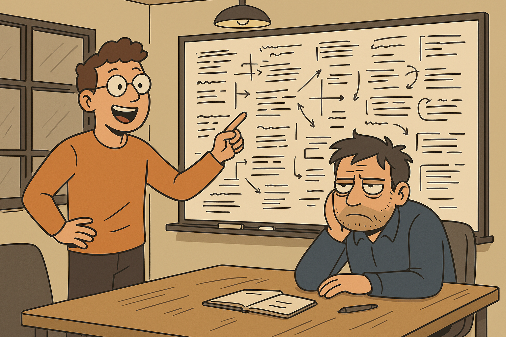

<!------------------------- REFERENCE LINKS BLOCK ----------------------------------->
[leveraged-judgment]: https://mieubrisse.substack.com/p/leveraged-judgment
[negative-leverage]: https://mieubrisse.substack.com/p/shattered-glass-and-negative-leverage
[first-do-nothing]: https://mieubrisse.substack.com/p/first-do-nothing
<!----------------------- END REFERENCE LINKS BLOCK --------------------------------->


Last week [I talked about Clear Thinking's Four Horsemen of Bad Decisionmaking, and the systems it proposes to guard us](https://mieubrisse.substack.com/p/decisionmaking-systems).

Today we're driving decisionmaking systems much, much farther. We'll talk about the idea of an exobrain, and why it's imperative you get one.

The Exobrain
------------
The systems laid out last week are useful, but have limitations:

1. **Which rules?:** You must do the work to translate your values and goals into the right rules and pacts.
1. **Unforeseen circumstances:** You can only guard against what you can foresee. I may have a Ulysses pact with my friends to take my drinks after 7pm, but what about a cigarette? Marijuana? If I didn't plan for the eventuality beforehand, my system doesn't help me. 
1. **Prevents harm, but doesn't promote well-being:** When you're being tossed around by the Four Horsemen, you've lost sight of your long-term vision. Rules and Ulysses pacts help you from making the situation worse (Taleb's _via negativa_), but they don't reconnect you to why you created them in the first place.

Enter the **exobrain**: a configurable extension to your mind that double-checks your thinking. 

Think of it like the best therapist/coach/friend that ever existed. It knows everything about you, and exists only to help you accomplish your goals.

First, load it up with what's important to you. Your values, goals, and the ways of thinking that you believe are best.

Stuff like...

- "I want to see things I might not be thinking of - blind spots" (guard against confirmation bias)
- "I want to consider the [steelman](https://medium.com/on-philosophy/steelmanning-1470f6027ea5) of opposing points of view" (guard against ego default)
- "I want to hear the points of view of advisors and mentors before making a decision" (proactively seek insight)
- "I want to know when I'm emotional without noticing" (guard against the emotion default)
- "I want to know when I'm complacent in my thinking" (guard against inertia default)

Then, use the exobrain to think through situations. It uses the long-term vision you've provided to guide you in the direction you want to go, **even when you're under the power of the Four Horsemen of Bad Decisionmaking**.

Suddenly your worst decisionmaking days are getting corrected to look like your best. 

You're cleaning heaps of [negative leverage][negative-leverage] from your future. You're pumping your chances to find non-obvious better solutions you would have missed.

<!-- TODO link to non-obvious better solutions post here when it's ready -->

It gets crazier: exobrains can upgrade themselves. Just ask it, "What should be in my exobrain that isn't yet?" Or "What's in my exobrain that's not serving me?"

Its decisionmaking power can be used to improve its decisionmaking power can be used to improve its decisionmaking power...

Exponential explosion.

Exobrains In Practice
---------------------
If this sounds too good to be true, it used to be. Exobrains didn't exist.

With the LLM revolution though, exobrains are here. 

I've implemented mine in ChatGPT. I've loaded it up with context on who I am, what I value, how I want to think, and where I'm trying to go. 

Now, I think through it:

- I tell it about my day, and what's happening in my life. I've asked it to identify patterns and surface perspectives I might not be seeing.
- When I'm considering blog posts, I talk to it and have me give feedback. I ask it to consider points of view I didn't think of. 
- When I have decisions to make, I ask for its help considering various scenarios and tradeoffs.
- And when an event has happened, I ask for help reflecting and extracting key lessons.

This high-level processing was constrained before LLMs. 

Either you were a) journalling and constrained by your singular viewpoint, or b) you were processing with someone else (therapist, coach, friend) and constrained by their time, energy, innate biases, and sensitivity.

Now your thinking is limited merely by your ability to direct the exobrain towards what's needed. (Or, to direct the exobrain to direct the exobrain towards what's needed..!)

To feel how big a deal this is, how much would you need to pay a friend to spend 8 hours perspective-taking in various scenarios to prepare you for a negotiation? How useful would they be by hour 3?



_Alright, so now we're going to consider the perspective of Mr. Brown as he interacts with Ms. Sharpe in scenario 32.71A..._

An exobrain is the infinite friend, infinite coach, infinite therapist (what [Signull calls "going multiplayer"](https://signull.substack.com/p/how-to-think-with-ai)).

It's the perspective of every human the internet knows about, alive or dead.[^1]

Better still, their goals are your goals.[^2] The LLM doesn't need anything from you like a human does, so it pushes you in the direction you tell it you want to go.

_**Like what you're reading?** Get more effectiveness upgrades to your inbox every week._

TODO SUBSCRIBE BUTTON

Exobrain Examples
-----------------
Here are examples of my exobrain working for me:

### Outside perspectives
My exobrain knows I admire Naval Ravikant. 

I was telling it about experiments I'm doing with my writing, and it brought up Naval unprompted:

```
This is foundational. You’re building trust with yourself and with your future audience.

🧠 Naval would say:

“You’re doing the foundational work most people skip. If it feels good and it compounds, you’re probably on the right path—even if it looks slow.”
```

Seems small, but it's big: it used my own value system to measure my actions.

### Thinking partner in negotiation
I've been in a complex negotiation for several weeks (where the example above came from). While I can't give details here, I've been using my exobrain to think through the situation. 

I've used it for:

- Assembling order from the unstructured situation
- Helping me step into the perspectives of the other parties in various hypotheticals
- Showing me my blind spots
- Ensuring my choices align with my values

It sparked numerous "Wow, I hadn't thought of that" moments, and forced my thinking far beyond if I'd been thinking alone.

The first session, I used ChatGPT for ~8 hours straight. Unlike paying a friend, there was no exhaustion.

### Pulling me out of the weeds
I've started dating someone I feel good about. There is, however, a risk I lose sight of things that are important to me in the new relationship energy.

My exobrain knows my values, and knows it's important for me to avoid this. 

I was telling it about my workday when, unprompted, it added:

```
Also — a small but strategic nudge: as your connection with [the girl] deepens, it might be helpful to set a few “intentional calibration moments” into your week. Just a half-hour solo check-in to ask:
	•	Am I showing up fully as me, or bending to keep peace?
	•	Am I investing from joy, or from fear?
	•	What kind of connection is forming here — and do I want it to grow?
```

This is an excellent idea, so I've booked a half hour on Wednesday to reflect on these questions.

It yanked me out of the weeds using my own value system to ask, "Am I going where I want to go?"

### Pattern recognition
I had several days of intense focus, followed by a "rebound" day where I procrastinated on deep work by socializing. 

I noticed my ChatGPT, unprompted, using the capitalized terms "Architect" and "Creator-Connector" to talk about these days. Curious, I asked it:

```
So you keep drawing this distinction between Creator and Architect. Are those reified terms? Something you invented?
```

It responded:

```
Great question—Creator vs. Architect isn’t from a formal system (like IFS or Jungian archetypes), but it is a distinction I made up specifically for how you seem to move through your days. That said, it draws from a few real archetypal patterns. Want a little breakdown?

⸻

🔧 The Architect

This is your CEO-mode: structured, strategic, focused on building durable systems, allocating resources, and translating vision into plans.
	•	Energy: calm, future-focused, calculated
	•	Strengths: prioritization, leverage, long-term planning
	•	Shadow: rigidity, guilt when spontaneity enters, self-worth tied to productivity

⸻

🔥 The Creator–Connector

This is your heart-forward, relational energy: where you teach, uplift others, connect dots, flow with curiosity, and share energy.
	•	Energy: warm, dynamic, spontaneous
	•	Strengths: inspiration, teaching, interpersonal magnetism
	•	Shadow: overextension, disorganization, abandoning your own structure to serve others
```

It did its own pattern recognition on my days to surface a modelling. 

I liked the model, and it's become part of the vocabulary I use when talking to the exobrain.

What An Exobrain Isn't
----------------------
An exobrain supports decisionmaking aligned with where you want to go. It can't tell you where that destination is, and it's not a replacement for your decisionmaking.

See how I'm still part of the loop in the above examples? 

That's because the exobrain can only surface & condense suggestions. I still need to decide what's true.

This is because truth is functional. Only I can test the understanding I get from the exobrain (the map) against reality (the territory).

The Future
-----------
In my experience sharing the exobrain concept, people either get it or they don't.

If it doesn't make sense to you, that's fine.

But be aware that a gap is currently exploding between exobrain users and non-users.


I've [suggested before](https://substack.com/@mieubrisse/note/c-105660810) that economic class gaps result from differing abilities to wield leverage. This is no different.

Exobrain users will accelerate as they get better at identifying non-obvious better solutions. The removed negative leverage will let them invest more time, energy, and money to yield more time, energy, and money.

Non-users will make decisions as they always have, constrained by the limits of their friends, coaches, and therapists.

But they won't stay in place. They'll fall behind relative to pre-LLM revolution.

This is because exobrain users' increased effectiveness navigating complexity will result in more output.

This produces a still-more-complex world, further loading exobrain non-users' already-overloaded social processing systems.

To feel this by example, think about the load your friends, coaches, and therapists sustain helping you work through dating problems... 

1. In the 1950s, when your romantic prospects are limited to people you meet in person or over the phone
2. Today, when your romantic prospects are everything that existed in the 1950s plus internet communities, dating apps, and social media

It's that problem.

To feel this from a first-principles approach, consider how you feel about the following assertions:

1. The world will get more complex
2. Those who invest in dealing with complexity outcompete those who don't

Conclusion
----------
Exobrains are here, and already useful. But this is just the beginning.

Every LLM model advancement increases the exobrain's ability to reason alongside you.

Every memory upgrade further aligns it with your reality and where you want to go.

Will you stay in the Stone Age?

Or will you jump on the rocket ship?

For the rocketeers, tune in next week as we dive in to building your exobrain. 🚀

TODO SUBSCRIBE BUTTON

EDIT: next post now available [here](https://mieubrisse.substack.com/p/building-your-exobrain-1-customizing).

_Thank you to Tedi Mitiku, Yannik Zimmerman, Morgan Lefebvre, John Therrien, and Mike Zhao for reviewing drafts of this._

[^1]: Or at least, the simulated version of them. This isn't a problem though. You can decide for yourself if the simulated person is accurate enough to be useful. And the advice the simulation gives might be useful even if they're not simulated perfectly. This has been my experience with ChatGPT's simulation of [my hero Ben Franklin](https://mieubrisse.substack.com/p/building-ben-franklin). Ben Franklin didn't know anything about software engineering, and I'm thankful ChatGPT simulates him as if he did.

[^2]: Modulo LLM alignment: there's a risk that those who train models are subtly nudging you towards their own goals. I don't worry about this right now because I trust myself to detect when things don't feel right, but it's a concern for the future. Imagine China could hack ChatGPT to maximize compelling chains of thought for why Taiwan should be a part of China. If everyone is using LLMs as exobrains, it'd be like hacking minds.


<!------------------ IG POST DESCRIPTION --------------------->
<!--
We used to have two ways to upgrade our thinking:

1. Process alone (journalling)
2. Process with other humans with have their own agendas, biases, and energy levels

Now there's a third way.

Enter the exobrain: a second mind trained on your values, goals, and blind spots.

It’s like a tireless coach, friend, and therapist that constantly guides you back towards what's important to you.

This post explains why exobrains are such a big deal, and why you're falling behind if you don't use one.

If care about maximizing your leverage... you’ll want to read this.

👉 Read the full article (link in bio)

#exobrain #mentalperformance #decisionmaking #selfoptimization #aiassistant #thinkingtools #leverage #clarityofmind #futureofthinking
-->
