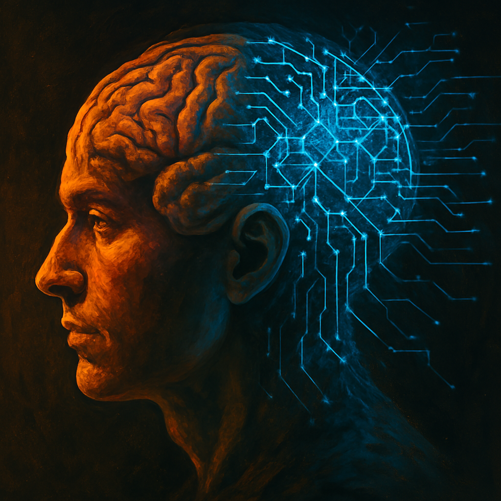

<!------------------ IG POST DESCRIPTION --------------------->
<!--
TODO

👉 Read the full article (link in bio)
-->

_This post is part of a series on leverage. Here are parts [one][leveraged-judgment], [two](https://mieubrisse.substack.com/p/shattered-glass-and-negative-leverage), and [three][first-do-nothing]._

I've [said it before][leveraged-judgment]: the modern world is Fucking Leveraged. Small decisions = huge consequences. 

Working smart doesn't just beat working hard. Decisionmaking defines outcomes.

Shitty decisions, shitty outcomes. Good decisions, good outcomes.

<!--
"Wait, what about luck!" 

Good decisions _factor in_ luck. Pro poker players know this.

Naval:

> In 1,000 parallel universes, you want to be wealthy in 999 of them. You don’t want to be wealthy in the 50 of them where you got lucky. We want to factor luck out of it.
-->

Too bad we suck at decisionmaking.

Our default thinking mode is lazy, emotional, and wrong ([Kahneman's System 1 thinking](https://en.wikipedia.org/wiki/Thinking,_Fast_and_Slow#:~:text=System%201%3A%20Fast%2C%20automatic%2C%20frequent%2C%20emotional%2C%20stereotypic%2C%20unconscious.)).

[We overestimate urgency. We get reactive. We panic, and create more work for ourselves.][first-do-nothing]

Or we fixate on the obvious solution, missing non-obvious shortcuts.

We _can_ think clearly ([Kahneman's System 2 thinking](https://en.wikipedia.org/wiki/Thinking,_Fast_and_Slow#:~:text=System%202%3A%20Slow%2C%20effortful%2C%20infrequent%2C%20logical%2C%20calculating%2C%20conscious))... but it's slow and hard.

But it's **really valuable**. 

In [Clear Thinking](https://www.amazon.com.br/Clear-Thinking-Turning-Ordinary-Extraordinary/dp/B0BVNQQ41V), Shane Parrish says:

> Good judgment is expensive... but poor judgment costs a fortune.

It's not that we don't know how to exercise good judgment.

It's that we get hijacked by the Four Horsemen of Bad Decisionmaking:

- **The ego default:** "I need to prove I'm right"
- **The emotion default:** "I'm angry/afraid so I react"
- **The social default:** "Everyone else is doing it"
- **The inertia default:** "It's what I've always done"

To guard against poor judgment, Clear Thinking advocates protective systems.

The idea: you make rules ([Ulysses pacts](https://en.wikipedia.org/wiki/Ulysses_pact)) while you're calm and clear, with your values and goals in mind. These save you when the Four Horsemen hit.

These are things like...

- "I don't make decisions on the day I get big news" (guards against emotional reactivity)
- "I don't respond when I'm feeling worked up" (guards against emotional reactivity)
- "I diversify my portfolio regardless of what the market is doing" (guards against greed and desire to follow the herd)
- "I don't make commitments on the phone" (guards against social pressure)
- "I don't eat after 8pm" (guards against inertia and stress eating)
- "I take a few seconds to breathe before I open Instagram" (guards against inertia, reflexively opening Instagram)

Clear Thinking again:

> [Good judgment] is about designing systems at your best, that work for you at your worst.

Technology tries to help.

For example, [here's an app that forces you to wait a second every time you open Instagram](https://one-sec.app/).

And [here's another that blocks apps during certain hours](https://appblock.app/).

But these are limited.

What if your worst decisionmaking days looked the same as your best?

, so that you're protected when the following Four Horsemen of Bad Decisionmaking hit:

- 

", . decisions made while thinking clearly to guard us against his four defaults that result in poor judgment:

- 

These are things like:

- Rules ("I will make no commitments on a phone call, before I think about it") 
- Pre-commitments,  (also known as [Schelling fences](https://www.lesswrong.com/posts/Kbm6QnJv9dgWsPHQP/schelling-fences-on-slippery-slopes))
- 

OUTLINE
- World is leveraged
- Good decisions define outcomes
- Default decisionmaking apparatus sucks
    - System 1 (Thinking Fast & Slow)
- What if you could have decisionmaking apparatuses think at your best, always?
    - Shane Parrish's "rules" section in Clear Thinking
    - **AI**

Conclusion
----------
TODO

### Further Reading

TODO link to previous writing

_TODO SUBSCRIBE BUTTON CTA (use ChatgGPT)_

TODO SUBSCRIBE BUTTON

<!------------------------- ONLY LINKS BELOW HERE ----------------------------------->
[leveraged-judgment]: https://mieubrisse.substack.com/p/leveraged-judgment
[first-do-nothing]: https://mieubrisse.substack.com/p/first-do-nothing
